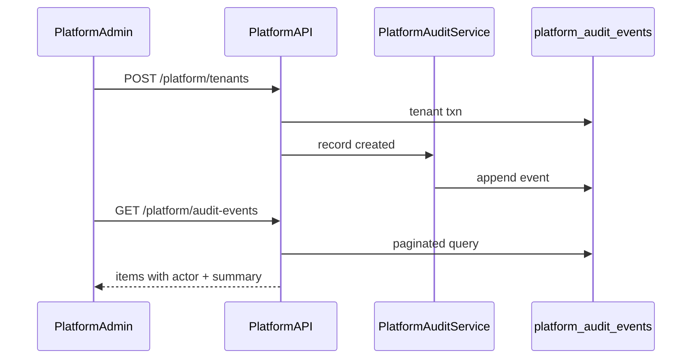

# SaaS-F16 — Platform audit log (no impersonation)

## Context

F15 delivered platform mutations in [`platform-tenants.service.ts`](apps/api/src/modules/platform/application/platform-tenants.service.ts) (`createTenant`, `updateTenant`, `suspendTenant`) but controllers discard the actor (`@CurrentPlatformUser() _user`). F16 adds an append-only audit trail and surfaces it to ops.

**Canonical spec:** [SAAS_PLATFORM_PLAN.md § F16](docs/architecture/SAAS_PLATFORM_PLAN.md)  
**Decision D13:** Platform staff never impersonate tenants — workspace-admin impersonation via `/auth/impersonate` stays; no `/platform/*` impersonation routes.

**Explicitly out of scope (defer):**
- Automated GDPR tenant export API ([F23](docs/architecture/SAAS_PLATFORM_PLAN.md))
- Hard `DELETE` on tenants
- Platform-user MFA
- H1 workspace-wide audit UI ([P3-04](docs/architecture/KLOQRA_FUTURE_PLAN.md)) — reuse patterns only

---

## Research gate resolutions (close at kickoff)

| Gate | Decision |
| --- | --- |
| Event catalog | `platform.login`, `platform.tenant.created`, `platform.tenant.updated`, `platform.tenant.suspended`, `platform.tenant.churned` |
| Payload shape | JSON summary only — org name/slug, `tenantId`, `planId`, status deltas, `limitsOverride` keys; **never** temp passwords or password hashes |
| Retention | **Indefinite** in Postgres (same compliance posture as [`TimeLogAuditEvent`](apps/api/prisma/schema.prisma)); ops may archive rows older than 24 months via future cron — document in runbook, no purge in F16 |
| Support without impersonation | Runbook: use platform-admin metadata + ask tenant owner to screen-share or run workspace export; escalate to engineering with audit event IDs |
| Churn path | Manual runbook stub from F15 handoff — Stripe cancel → suspend → owner/export handoff → `PATCH` churned |

---

## Architecture



**Pattern:** Mirror [`TimelogAuditService`](apps/api/src/modules/timelogs/application/timelog-audit.service.ts) — dedicated table + service, not a generic `@Audit()` decorator (keeps F16 small; generic module remains future H1 work).

---

## Delivery split (2 PRs)

### PR1 — F16a: contracts, schema, API, mutation wiring, tests

**1. Contracts** ([`packages/contracts`](packages/contracts))

- New [`dto/platform-audit.dto.ts`](packages/contracts/src/dto/platform-audit.dto.ts):
  - `platformAuditActionSchema` — enum above
  - `platformAuditEventSchema` — `id`, `actorPlatformUserId`, `actorEmail`, `actorName`, `action`, `tenantId?`, `summary` (record), `ipAddress?`, `userAgent?`, `createdAt`
  - `listPlatformAuditEventsQuerySchema` — `page`, `limit`, optional `tenantId`, `action`, `from`, `to`
  - `listPlatformAuditEventsResponseSchema` — paginated `items` + `total`
- Add route in [`routes.ts`](packages/contracts/src/routes.ts):

```typescript
PLATFORM: {
  // existing...
  AUDIT_EVENTS: "/platform/audit-events"
}
```

- Specs in `platform-audit.dto.spec.ts`; export from [`index.ts`](packages/contracts/src/index.ts)

**2. Prisma migration**

New model in [`schema.prisma`](apps/api/prisma/schema.prisma):

```prisma
model PlatformAuditEvent {
  id                 String   @id @default(uuid())
  actorPlatformUserId String  @map("actor_platform_user_id")
  action             String
  tenantId           String?  @map("tenant_id")
  summary            Json
  ipAddress          String?  @map("ip_address")
  userAgent          String?  @map("user_agent")
  createdAt          DateTime @default(now()) @map("created_at")

  actor PlatformUser @relation(fields: [actorPlatformUserId], references: [id])
  tenant Tenant?     @relation(fields: [tenantId], references: [id], onDelete: SetNull)

  @@index([createdAt(sort: Desc)])
  @@index([tenantId, createdAt(sort: Desc)])
  @@index([actorPlatformUserId, createdAt(sort: Desc)])
  @@map("platform_audit_events")
}
```

No partitioning in F16 (low volume; unlike `time_log_audit_events`).

**3. API module**

New files under `apps/api/src/modules/platform/`:

| File | Responsibility |
| --- | --- |
| `application/platform-audit.service.ts` | `recordEvent()`, `list()` with pagination + filters |
| `interface/http/platform-audit.controller.ts` | `GET ROUTES.PLATFORM.AUDIT_EVENTS` behind `PlatformGuard` |
| `application/platform-audit.service.spec.ts` | record + list + redaction helpers |

Register in [`platform.module.ts`](apps/api/src/modules/platform/platform.module.ts).

**4. Wire audit into mutations**

Update [`platform-tenants.controller.ts`](apps/api/src/modules/platform/interface/http/platform-tenants.controller.ts) to pass `PlatformRequestUser` + request metadata (`ip`, `user-agent`) into service methods.

Extend [`platform-tenants.service.ts`](apps/api/src/modules/platform/application/platform-tenants.service.ts):

| Method | Audit action | Summary highlights |
| --- | --- | --- |
| `createTenant` | `platform.tenant.created` | org name, slug, owner email, planId, firstWorkspace name |
| `updateTenant` | `platform.tenant.updated` | changed fields only (status, planId, limitsOverride, name, slug) |
| `suspendTenant` | `platform.tenant.suspended` | tenantId, prior status |
| churn via `updateTenant` | `platform.tenant.churned` | when `dto.status === "churned"` |

Inject `PlatformAuditService`; call **after** successful transaction (failed mutations must not log).

**5. Platform login audit**

In [`auth.service.ts`](apps/api/src/modules/auth/application/auth.service.ts) `loginPlatform()` — after successful auth, record `platform.login` with actor id. Pass optional `{ ipAddress, userAgent }` from [`auth.controller.ts`](apps/api/src/modules/auth/interface/http/auth.controller.ts) login handler (platform scope branch only).

Use lazy injection or move audit call to controller post-login to avoid circular `AuthModule` ↔ `PlatformModule` deps (prefer **controller-level** audit call for login).

**6. D13 guardrail test**

Add to [`apps/api/test/platform-audit.e2e.ts`](apps/api/test/platform-audit.e2e.ts) (new):

- Create tenant → assert audit row exists with correct actor + action
- Suspend → assert `platform.tenant.suspended`
- Plan override PATCH → assert summary contains plan change
- Platform login → assert `platform.login`
- `GET /platform/audit-events` returns paginated results; tenant JWT rejected
- Static assertion: `ROUTES.PLATFORM` has no impersonation paths; grep guard in spec that no `platform` controller registers `/impersonate`

Extend [`platform-tenants.service.spec.ts`](apps/api/src/modules/platform/application/platform-tenants.service.spec.ts) — mock audit service, verify `recordEvent` called with expected action.

---

### PR2 — F16b: platform-admin UI, runbooks, docs

**1. platform-admin UI** ([`apps/platform-admin`](apps/platform-admin))

| Piece | Path |
| --- | --- |
| Audit page | `(platform)/audit/page.tsx` → `audit-log-page.tsx` |
| Table | Paginated list: time, actor, action, tenant (link to detail), summary JSON collapsed/tooltip |
| Filters | Action dropdown, tenant id search, date range (reuse list pagination patterns from [`tenant-list-page.tsx`](apps/platform-admin/src/features/tenants/tenant-list-page.tsx)) |
| Nav | Add "Audit log" to [`platform-shell.tsx`](apps/platform-admin/src/components/platform-shell.tsx) |

**2. web-shared** — `usePlatformAuditEvents(query)` hook calling `ROUTES.PLATFORM.AUDIT_EVENTS`

**3. Runbooks**

| Doc | Content |
| --- | --- |
| [`docs/runbooks/superadmin-support.md`](docs/runbooks/superadmin-support.md) | No impersonation policy; triage flow; how to use audit log; owner screen-share / export handoff |
| [`docs/runbooks/tenant-churn.md`](docs/runbooks/tenant-churn.md) | Manual Stripe cancel → suspend → export handoff (link F23 for future API) → `PATCH` churned |

**4. Spec updates**

- [`docs/specs/platform-admin.md`](docs/specs/platform-admin.md) — audit route + UI
- [`docs/architecture/SAAS_PLATFORM_PLAN.md`](docs/architecture/SAAS_PLATFORM_PLAN.md) — F16 research gate checkboxes
- [`TASK_BOARD.json`](TASK_BOARD.json) — `SaaS-F16` → `done`

**5. Tests (PR2)**

- Playwright `apps/platform-admin/e2e/platform-audit.spec.ts` — login, create tenant (if F15 UI ready) or seed data, open audit page, see event row
- Minimal Vitest on audit page empty/loading states if needed

---

## Dependency note

F16 mutation wiring assumes F15a API is merged (already present). F15b UI is **not** blocking F16 audit page — audit e2e can use API helpers from [`platform-auth.ts`](apps/api/test/helpers/platform-auth.ts) to seed events.

---

## Exit criteria (from master plan)

- Every `POST /platform/tenants*` and `PATCH /platform/tenants/:id` success path logged with actor + payload summary
- Platform login success logged
- `GET /platform/audit-events` works for superadmin only
- platform-admin audit page lists events with filters
- No platform impersonation endpoints exist (D13)
- Runbooks published
- `pnpm format:check && pnpm lint && pnpm typecheck && pnpm test && pnpm build` green
