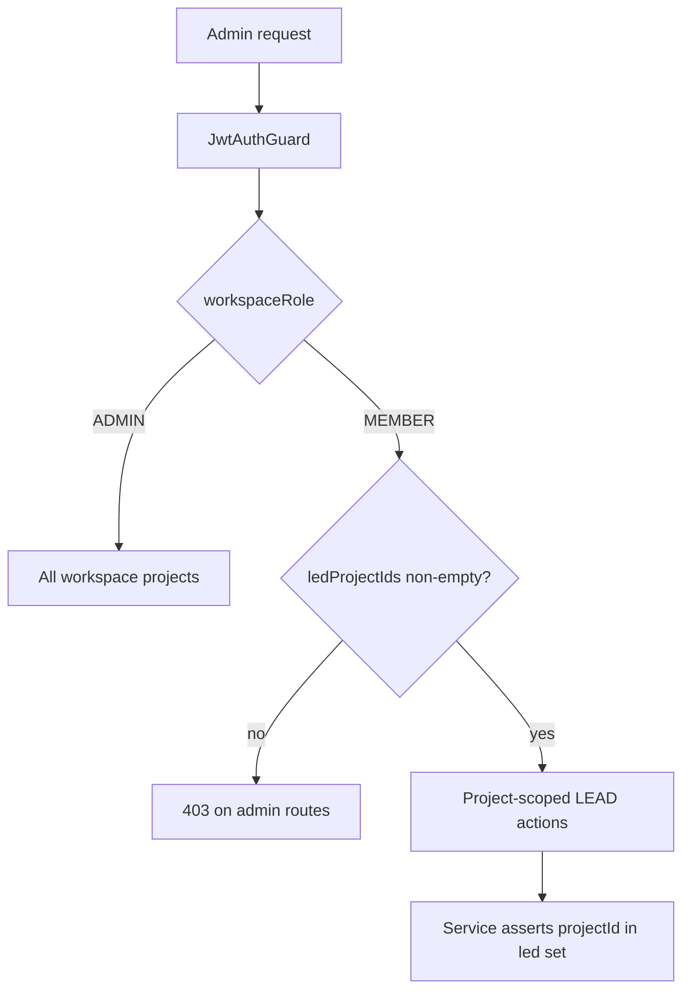

# SaaS-F17 — Project lead (PM) role

## Context

F03 decided D06: project-scoped `LEAD` on `team_members`; same user may lead multiple projects. JWT stays `workspaceRole: ADMIN | MEMBER` — **LEAD is not a JWT claim**; resolve from DB per request.

**Canonical spec:** [SAAS_PLATFORM_PLAN.md § F17](docs/architecture/SAAS_PLATFORM_PLAN.md)  
**Matrix:** [TENANT_RBAC.md §7](docs/architecture/TENANT_RBAC.md) — rows marked **F17** today

### Current gaps

| Area | Today | F17 target |
| --- | --- | --- |
| [`TeamMember`](apps/api/prisma/schema.prisma) | No `role` column | `role` `LEAD` \| `MEMBER`, default `MEMBER` |
| [`ProjectAccessService`](apps/api/src/common/access/project-access.service.ts) | ADMIN = all projects; MEMBER = team membership | + `ledProjectIds`, `assertCanManageProject` (ADMIN or LEAD) |
| Controllers | `@Roles("ADMIN")` on tasks, team, approvals, exports, reporting | ADMIN **or** LEAD with project scope in services |
| [`admin-shell.tsx`](apps/admin/src/components/admin-shell.tsx) | Blocks anyone except `workspaceRole === "ADMIN"` | Allow MEMBER with `ledProjectIds.length > 0`; filter nav |
| Contracts [`team.dto.ts`](packages/contracts/src/dto/team.dto.ts) | No `role` on team member | `teamMemberRoleSchema`; assign via PATCH |
| Admin UI | No LEAD assignment | Workspace admin sets role on project team |



---

## Research gate resolutions (close at kickoff)

| Gate | Decision |
| --- | --- |
| LEAD can | Tasks CRUD, team invites/add member, timesheet approve/reject/amendments **for led projects only** |
| LEAD cannot | Projects/categories CRUD, workspace team management, billing rates, export wizard, public API keys, account |
| Multi-project | Union of `team_members` rows where `role = LEAD` drives nav + list filters |
| JWT v1 | No LEAD in token; optional `ledProjectIds` on **session DTO** from `/auth/me` for UI only |
| Assign LEAD | Workspace **ADMIN** only via `PATCH` team member `role` |
| Admin app entry | MEMBER + ≥1 LEAD project may use admin app (filtered nav); timer/logs still available in client |

---

## Single PR — implementation order

### 1. Contracts + schema

**Contracts** ([`packages/contracts`](packages/contracts))

- Extend [`team.dto.ts`](packages/contracts/src/dto/team.dto.ts): `role: teamMemberRoleSchema` on `teamMemberSchema`; `updateTeamMemberSchema` adds optional `role` (workspace admin only)
- Extend [`auth.dto.ts`](packages/contracts/src/dto/auth.dto.ts): `ledProjectIds: z.array(uuidSchema).optional()` on `authSessionSchema` (UI hint, not JWT)
- Specs in `team.dto.spec.ts`, `auth.dto`/`contracts.spec.ts`

**Prisma** — migration `team_members.role`:

```prisma
role String @default("MEMBER") // LEAD | MEMBER
```

Backfill existing rows → `MEMBER`. Index `(user_id)` already exists for lead lookups.

---

### 2. Project access layer (core)

Extend [`project-access.service.ts`](apps/api/src/common/access/project-access.service.ts):

| Method | Purpose |
| --- | --- |
| `ledProjectIds(workspaceId, userId)` | Active `team_members.role = LEAD` in workspace |
| `assertCanManageProject(ws, userId, wsRole, projectId)` | ADMIN or LEAD on that project |
| `manageableProjectIds(ws, userId, wsRole)` | All project IDs user may manage |
| Update `accessibleProjectIds` | MEMBER+LEAD sees led projects **plus** team membership for read/log |

Add [`project-access.service.spec.ts`](apps/api/src/common/access/project-access.service.spec.ts) cases for LEAD vs MEMBER vs ADMIN.

**Request context** — after JWT auth, enrich `RequestUser` (optional `ledProjectIds: string[]`) in [`jwt-auth.guard.ts`](apps/api/src/common/guards/jwt-auth.guard.ts) or a thin `ProjectLeadContextInterceptor` to avoid N+1 (one query per request).

**Session** — in [`auth.service.ts`](apps/api/src/modules/auth/application/auth.service.ts) `buildSession`, attach `ledProjectIds` when `workspaceRole === "MEMBER"`.

---

### 3. New guard: admin or project lead

Add [`admin-or-project-lead.guard.ts`](apps/api/src/common/guards/admin-or-project-lead.guard.ts) (or extend [`roles.guard.ts`](apps/api/src/common/guards/roles.guard.ts) with `@Roles("ADMIN", "PROJECT_LEAD")`):

- `ADMIN` → pass
- `MEMBER` with non-empty `ledProjectIds` → pass controller gate; **services** still assert per-`projectId`

Use on routes currently `@Roles("ADMIN")` that matrix marks **F17** for project lead.

---

### 4. API enforcement (by domain)

| Domain | Files | Change |
| --- | --- | --- |
| **Tasks** | [`tasks.controller.ts`](apps/api/src/modules/tasks/interface/http/tasks.controller.ts), [`tasks.service.ts`](apps/api/src/modules/tasks/application/tasks.service.ts) | CREATE/PATCH/DELETE: `assertCanManageProject` on task's `projectId` |
| **Team** | [`projects.controller.ts`](apps/api/src/modules/projects/interface/http/projects.controller.ts), [`projects.service.ts`](apps/api/src/modules/projects/application/projects.service.ts) | Team list/invite/add/patch: ADMIN or LEAD on `:id`; `updateTeamMember.role` ADMIN-only; LEAD cannot demote another LEAD |
| **Timesheets** | [`timesheets.controller.ts`](apps/api/src/modules/timelogs/interface/http/timesheets.controller.ts), [`timesheets.service.ts`](apps/api/src/modules/timelogs/application/timesheets.service.ts), [`timesheet-amendments.service.ts`](apps/api/src/modules/timelogs/application/timesheet-amendments.service.ts) | Pending/approve/reject/remind/amendments: guard + filter `listPending`/`listApproved` by `manageableProjectIds`; `approve(period)` checks `period.projectId` |
| **Reporting** | [`reporting.controller.ts`](apps/api/src/modules/reporting/interface/http/reporting.controller.ts), [`reporting.service.ts`](apps/api/src/modules/reporting/application/reporting.service.ts) | Dashboard/summary routes: scope queries to led projects when not ADMIN |
| **Export** | [`export.controller.ts`](apps/api/src/modules/export/interface/http/export.controller.ts) | Full wizard stays `@Roles("ADMIN")`; `POST /export/me` already member-accessible |
| **Presence** | presence controller/service | Team live: scope to led project teams |
| **Unchanged ADMIN-only** | categories, billing, workspace members, projects CRUD, reporting API keys | Keep `@Roles("ADMIN")` |

---

### 5. Admin app (FE)

**Login / shell**

- [`admin-shell.tsx`](apps/admin/src/components/admin-shell.tsx): replace hard `workspaceRole !== "ADMIN"` check with `canAccessAdmin = ADMIN \|\| ledProjectIds?.length`
- [`bootstrap-session.ts`](packages/web-shared/src/auth/bootstrap-session.ts): add `allowProjectLead?: boolean` for admin bootstrap
- [`workspace-switcher.tsx`](packages/web-shared/src/components/workspace-switcher.tsx): show workspaces where user is ADMIN **or** has LEAD projects

**Nav filter** — new [`project-lead-nav.ts`](apps/admin/src/config/project-lead-nav.ts):

| Nav item | ADMIN | LEAD-only MEMBER |
| --- | --- | --- |
| Dashboard | Y | Y (scoped data) |
| Projects | Y | Y (led only) |
| Approvals | Y | Y |
| Time Tracker | Y | Y |
| Team Live | Y | Y |
| Exports | Y | N (use client export-me) |
| Team Management | Y | N |
| Categories | Y | N |
| Billing | Y | N |

**LEAD assignment UI** — extend project team UI (projects detail / team tab) with role select; calls `PATCH` team member with `role: "LEAD" | "MEMBER"`.

**web-shared** — optional `useLedProjects()` from session `ledProjectIds`.

---

### 6. Docs + tests

**Spec:** [`docs/specs/project-lead.md`](docs/specs/project-lead.md) — persona, matrix subset, API routes, admin nav rules.

**Docs updates:** [TENANT_RBAC.md](docs/architecture/TENANT_RBAC.md) §7 F17 cells → implemented; [SAAS_PLATFORM_PLAN.md](docs/architecture/SAAS_PLATFORM_PLAN.md) F17 gates; [`TASK_BOARD.json`](TASK_BOARD.json) `SaaS-F17` → `done`.

**Tests (required in same PR)**

| Layer | File |
| --- | --- |
| Contracts | `team.dto.spec.ts`, session shape |
| Unit | `project-access.service.spec.ts`, `timesheets.service.spec.ts` (approve denied cross-project), `projects.service.spec.ts` (role patch) |
| API E2E | `apps/api/test/project-lead.e2e.ts` — seed MEMBER+LEAD on project A; approve A OK; approve B → 403; task create on A OK |
| Extend | [`timesheets.e2e.ts`](apps/api/test/timesheets.e2e.ts) LEAD path |
| Admin Playwright | `apps/admin/e2e/project-lead.spec.ts` — LEAD sees filtered nav, approvals page |

---

## Exit criteria

- `team_members.role` migrated; all existing rows `MEMBER`
- Matrix F17 rows enforced in services (not controller-only)
- LEAD approves led project; denied on other project (E2E green)
- Workspace ADMIN regression: full nav + all projects unchanged
- No LEAD in JWT payload
- `pnpm format:check && pnpm lint && pnpm typecheck && pnpm test && pnpm build` green

---

## Risk notes

- **Large single PR** (~25–40 files): implement in the order above; run `project-lead.e2e.ts` early after access layer lands.
- **Admin/client dual app**: LEAD users may use both apps; document in `project-lead.md`.
- **Impersonation**: existing workspace-admin impersonation unchanged; no platform impersonation (D13).
