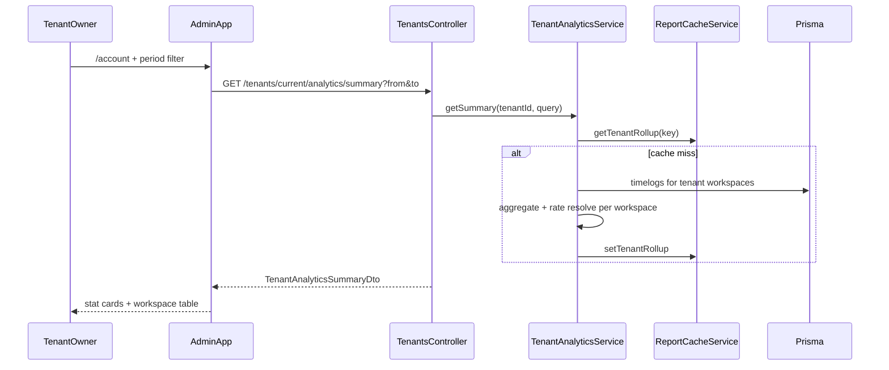
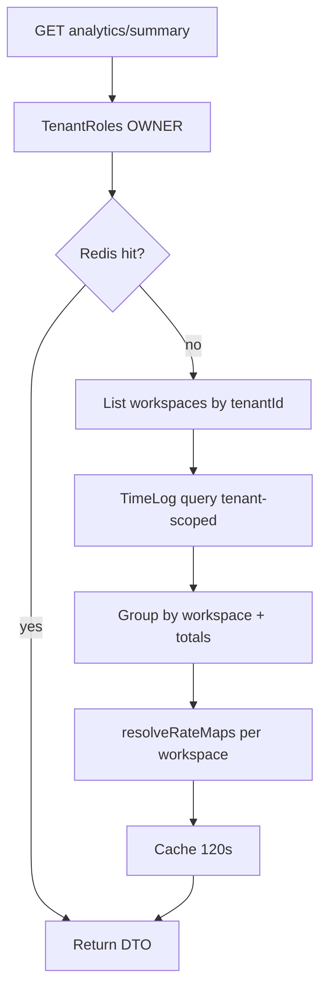

# SaaS-F18 — Tenant rollup dashboard (read-only)

## Context (post-F08 / F15)

| Done | Gap for F18 |
| --- | --- |
| [`ROUTES.TENANTS.ANALYTICS_SUMMARY`](packages/contracts/src/routes.ts) reserved | No DTO, no handler |
| [`GET /tenants/current/overview`](apps/api/src/modules/tenants/application/tenants.service.ts) — plan/seats/workspaces | No time/revenue rollup |
| [`account-overview-page.tsx`](apps/admin/src/features/account/account-overview-page.tsx) — 3 stat cards | No hours/billable/active-member metrics |
| [`ReportingService`](apps/api/src/modules/reporting/application/reporting.service.ts) + [`TimeAggregationService`](apps/api/src/common/time/time-aggregation.service.ts) | Workspace-scoped only |
| [`ReportCacheService`](apps/api/src/common/cache/report-cache.service.ts) — 120s dashboard TTL | No tenant rollup keys |
| [TENANT_RBAC.md](docs/architecture/TENANT_RBAC.md) — owner sees rollup (F18) | Not implemented |

**User intent:** Owner who is not in every workspace still sees org-wide utilization. **Read-only** — no export wizard, no drill-down into member PII beyond aggregates.

**Out of scope (v1):** Materialized views, tenant CSV export (H3 export stays separate), superadmin analytics, tenant `ADMIN` delegate access, real-time charts beyond simple period + workspace breakdown.

---

## Research gate resolutions

| Gate | Decision |
| --- | --- |
| Aggregates | **Period totals:** `totalHours`, `billableHours`, `billableAmount`, `billablePercent`, `activeMembers` (distinct `userId` with timelogs in range), `activeWorkspaces` (workspaces with ≥1 log). **Breakdown:** `byWorkspace[]` with same metrics per workspace. |
| Query strategy | **On-demand** single timelog query filtered by `task.project.workspace.tenantId` + date range; group in memory; resolve billable rates **per workspace** via existing `TimeAggregationService.resolveRateMaps` (same precedence as dashboard). No materialized view in F18. |
| Access | **`tenant_members.role = OWNER` only** (`@TenantRoles("OWNER")`). Workspace admins without owner role → 403. Matches exit criteria in [SAAS_PLATFORM_PLAN.md § F18](docs/architecture/SAAS_PLATFORM_PLAN.md). |
| H3 cross-workspace export | **Separate concern.** F18 delivers API + Account widgets only. Future export can call same service internally; do not add export routes in F18. |
| Date range | Reuse [`reportQuerySchema`](packages/contracts/src/dto/reporting.dto.ts) `from`/`to` + [`MAX_REPORT_RANGE_DAYS`](packages/contracts/src/dto/common.dto.ts) (366). Default UI: last 30 days (client-computed `from`/`to`). |
| Currency | Use tenant/workspace default from first workspace with logs or workspace settings; if mixed currencies across workspaces, return per-workspace currency in breakdown and `currency` on totals as primary workspace currency with `mixedCurrency: true` flag when they differ. |
| Cache | Extend `ReportCacheService`: key `report:tenant-rollup:{tenantId}:{from}:{to}`, TTL **120s** (match dashboard). Invalidate on workspace timelog writes via existing `invalidateWorkspace` (scan also matches tenant keys) or add `invalidateTenant(tenantId)` hook from timelog create/update if needed. |

---

## Architecture





---

## Delivery split (2 PRs)

### PR1 — F18a: contracts + API + cache + tests

**1. Contracts** ([`packages/contracts/src/dto/tenant.dto.ts`](packages/contracts/src/dto/tenant.dto.ts) or new `tenant-analytics.dto.ts`)

- `tenantAnalyticsQuerySchema` — `from`, `to` (reuse `reportQuerySchema` fields / `superRefine` for max range)
- `tenantAnalyticsWorkspaceRowSchema` — `workspaceId`, `workspaceName`, `totalHours`, `billableHours`, `billableAmount`, `activeMembers`, `currency?`
- `tenantAnalyticsSummarySchema` — `period`, `totals` (hours, amounts, `activeMembers`, `activeWorkspaces`, `billablePercent`, `currency`, `mixedCurrency?`), `byWorkspace[]`
- Export from [`packages/contracts/src/index.ts`](packages/contracts/src/index.ts); specs in `tenant-analytics.dto.spec.ts`

**2. API service** — new [`tenant-analytics.service.ts`](apps/api/src/modules/tenants/application/tenant-analytics.service.ts)

- `getSummary(userId, tenantId, query)` — `requireTenantOwnerInTenant` then aggregate
- Inject `PrismaService`, `TimeAggregationService`, `ReportCacheService`
- Query pattern: `workspace.findMany({ where: { tenantId } })` then `timeLog.findMany` with `task.project.workspaceId in workspaceIds` (or join filter on `workspace.tenantId` if indexed path is cleaner)
- Reuse `roundExport` / `resolveEffectiveCurrency` from contracts where reporting does

**3. Controller** — extend [`tenants.controller.ts`](apps/api/src/modules/tenants/interface/http/tenants.controller.ts)

```typescript
@TenantRoles("OWNER")
@Get(ROUTES.TENANTS.ANALYTICS_SUMMARY)
getAnalyticsSummary(@Query(...) query, @CurrentUser() user) {
  return this.tenantAnalytics.getSummary(user.userId, user.tenantId, query);
}
```

Register service in [`tenants.module.ts`](apps/api/src/modules/tenants/tenants.module.ts); import `ReportCacheService` (already global via redis module) or reporting module exports if needed.

**4. Cache** — extend [`report-cache.service.ts`](apps/api/src/common/cache/report-cache.service.ts)

- `tenantRollupKey(tenantId, from, to)`, `getTenantRollup`, `setTenantRollup`
- Optional: `invalidateTenant(tenantId)` called from timelog write paths (minimal: rely on TTL for v1; document in spec)

**5. Tests (PR1)**

- `tenant-analytics.service.spec.ts` — aggregation math, empty tenant, mixed workspace
- `tenant-analytics.e2e.ts` — owner gets summary across 2 workspaces; workspace-only admin (no owner) gets 403; cross-tenant isolation (wrong tenant JWT)
- Extend [`tenants.e2e.ts`](apps/api/test/tenants.e2e.ts) smoke if lighter

---

### PR2 — F18b: Account UI + web-shared + docs

**1. web-shared** — [`use-tenant-analytics-summary.ts`](packages/web-shared/src/features/tenant/use-tenant-analytics-summary.ts)

- Accept `from`/`to`; call `ROUTES.TENANTS.ANALYTICS_SUMMARY` with `workspaceId` header (owner still has a workspace in session)
- Export from [`packages/web-shared/src/index.ts`](packages/web-shared/src/index.ts)

**2. Admin UI** — enhance [`account-overview-page.tsx`](apps/admin/src/features/account/account-overview-page.tsx)

- Keep existing plan/workspaces/seats cards from `useTenantOverview`
- Add period filter (reuse [`DashboardPeriodFilter`](packages/web-shared/src/components/dashboard-period-filter.tsx) or account-appropriate preset: 7d / 30d / 90d / custom)
- New stat row: Total hours, Billable amount, Active members, Active workspaces
- Table: **Hours by workspace** (name, hours, billable %, amount) — read-only, links optional to `/dashboard` with workspace switch (stretch; v1 table only)
- Loading/error states consistent with existing account pages

**3. Docs**

- New [`docs/specs/tenant-analytics.md`](docs/specs/tenant-analytics.md) — query params, response shape, owner-only, cache TTL
- Update [`docs/specs/tenants.md`](docs/specs/tenants.md) — add analytics route to API table
- Update [TENANT_RBAC.md §2 OWNER](docs/architecture/TENANT_RBAC.md) — mark rollup implemented
- [`TASK_BOARD.json`](TASK_BOARD.json): `SaaS-F18` → `done`

**4. Tests (PR2)**

- Vitest smoke on query schema / hook mock
- Playwright `account-rollup.spec.ts` — owner on `/account` sees rollup stat labels after seed data (or skip with API e2e coverage note if flaky)

---

## Key implementation notes

1. **Reuse reporting math** — Extract a small internal helper from `ReportingService.buildDashboard` aggregation loop (~`addHours`) only if duplication exceeds ~40 lines; otherwise duplicate minimally in `TenantAnalyticsService` to avoid coupling reporting module into tenants.

2. **Performance guard** — Cap range at 366 days (contract). Log warn if tenant has >50 workspaces and range >90 days (operational note only).

3. **Owner without workspace membership** — Owner always has at least one workspace from F15 provision; session still requires `X-Workspace-Id` for API client — use any owner workspace (existing pattern in `useTenantOverview`).

4. **F17 independence** — LEAD/MEMBER roles irrelevant; endpoint is owner-only, not workspace-role gated.

5. **No Prisma schema changes** — Ensure `workspaces.tenant_id` index exists (already from F02); add composite index only if e2e shows slow queries (defer unless profiling demands).

---

## Exit criteria (from master plan)

- [ ] Owner sees cross-workspace rollup on Account overview for a selected period
- [ ] Workspace admin without `tenantRole: OWNER` cannot call analytics summary (403)
- [ ] Totals match sum of `byWorkspace` rows for seeded multi-workspace tenant
- [ ] `pnpm format:check && pnpm lint && pnpm typecheck && pnpm test && pnpm build` green

---

## Explicitly deferred

- Cross-workspace CSV/PDF export (H3; may reuse aggregator later)
- Tenant `ADMIN` delegate access to rollup
- Superadmin viewing customer time aggregates
- Materialized views / nightly rollups (F22 observability may revisit)
- Charts beyond simple table + stat cards (optional sparkline in follow-up)
