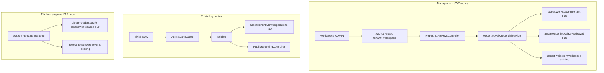

# SaaS-F19 — Tenant-scoped public API keys

## Context

**Canonical spec:** [SAAS_PLATFORM_PLAN.md § F19](docs/architecture/SAAS_PLATFORM_PLAN.md)  
**Phase:** P6 · **Depends on:** F05 (isolation E2E green)  
**Owner:** BE

F05 deferred tenant boundary on public API keys to F19 ([SECURITY.md](docs/development/SECURITY.md)). Keys already exist as **workspace-scoped** credentials (`reporting_api_credentials.workspace_id`); management routes require workspace `ADMIN` ([TENANT_RBAC.md §7](docs/architecture/TENANT_RBAC.md) — owner **S**, workspace admin **Y**).

### Current implementation

| Piece | Today |
| --- | --- |
| Schema | [`ReportingApiCredential`](apps/api/prisma/schema.prisma) — `workspaceId`, `projectIds[]`, no `tenantId` |
| Management | [`ReportingApiKeysController`](apps/api/src/modules/public-reporting/interface/http/reporting-api-keys.controller.ts) — `JwtAuthGuard` + `@Roles("ADMIN")`; uses `user.workspaceId` only |
| Create guard | [`assertProjectsInWorkspace`](apps/api/src/modules/public-reporting/application/reporting-api-credential.service.ts) — projects must belong to JWT workspace |
| Public access | [`validate()`](apps/api/src/modules/public-reporting/application/reporting-api-credential.service.ts) — checks active/expiry/secret; **no tenant status check** |
| JWT tenant bind | [`JwtAuthGuard`](apps/api/src/common/guards/jwt-auth.guard.ts) + `assertJwtWorkspaceTenant` — blocks cross-tenant `X-Workspace-Id` |
| Plan limits | [`PlanLimitService`](apps/api/src/modules/subscriptions/application/plan-limit.service.ts) — `maxWorkspaces`, `maxSeats` only |
| Platform suspend | [`platform-tenants.service`](apps/api/src/modules/platform/application/platform-tenants.service.ts) — revokes user refresh tokens; **does not touch API keys** |

### Gaps (why F19 is not “done” yet)

1. **Implicit tenant trust** — service never receives or asserts `tenantId`; relies entirely on guard + `workspaceId` from JWT (correct today, not defense-in-depth).
2. **Suspended tenants keep working** — `validate()` serves `/public/reporting/*` even when `tenants.status = suspended` (tokens revoked, keys not).
3. **No plan cap** — unlimited keys per tenant across workspaces.
4. **No isolation E2E** for reporting keys — `tenant-isolation.e2e.ts` does not cover this surface.
5. **Docs** still say tenant boundary is deferred.



---

## Research gate resolutions (close at kickoff)

| Gate | Decision |
| --- | --- |
| Workspace-scoped vs tenant-level keys | **Keep workspace-scoped keys** (no new key type). Tenant boundary = `workspace.tenant_id` join. Do **not** add `tenantId` column in v1 — revoke-on-suspend uses `workspace.tenant_id` filter. |
| Who manages keys | Unchanged: workspace **ADMIN** only (`@Roles("ADMIN")`). Tenant owner with **S** = only when they hold `workspace_members` row for that workspace (already true). |
| Plan limit field | Add **`maxReportingApiKeys`** to `PlanLimits` (tenant-wide count across all workspaces). |
| Default limits (proposed) | `pilot: 50`, `starter: 5`, `pro: 25` — tune in seed; override via `limits_override` like F10. |
| Limit scope | Count **active** credentials (`isActive = true`) for all workspaces where `workspace.tenant_id = tenantId`. Revoked/deleted keys do not count. |
| Soft warn vs hard block | **Hard block at 100%** only (same as F10). |
| Revoke on tenant suspend | **Yes** — `DELETE` (hard revoke) all `reporting_api_credentials` for tenant workspaces when platform sets `status = suspended`. Churn path may also revoke (same helper). |
| Block on validate when suspended | **Yes** — `assertTenantAllowsOperations` in `validate()` after credential lookup (resolve tenant via `workspace.tenantId`). |
| Subscription `past_due` overlay | **Out of scope** — F12 handles payment-state mutation blocks; public read via API key stays as-is until F12 defines otherwise. |
| Schema migration | **None required** for v1. |

---

## Single PR — implementation order

### 1. Contracts

**Files:** [`packages/contracts/src/tenant-rbac.ts`](packages/contracts/src/tenant-rbac.ts), [`packages/contracts/src/plan-catalog.ts`](packages/contracts/src/plan-catalog.ts)

- Extend `planLimitsSchema`:
  ```typescript
  maxReportingApiKeys: z.number().int().positive()
  ```
- Extend `planLimitKindSchema`: `"maxReportingApiKeys"`
- Add defaults to `DEFAULT_PLAN_LIMITS` (pilot/starter/pro)
- Update `plan-catalog.spec.ts`, `tenant-rbac.spec.ts`
- **No DTO changes** to reporting API key shapes — management routes unchanged for clients

### 2. PlanLimitService

**File:** [`apps/api/src/modules/subscriptions/application/plan-limit.service.ts`](apps/api/src/modules/subscriptions/application/plan-limit.service.ts)

- `getReportingApiKeyCount(tenantId)` — `reportingApiCredential.count` where `workspace.tenantId = tenantId` and `isActive = true`
- `assertReportingApiKeysAllowed(tenantId)` — compare to `limits.maxReportingApiKeys`; throw `PLAN_LIMIT_EXCEEDED` with `{ limit: "maxReportingApiKeys", current, max }`
- Unit tests in `plan-limit.service.spec.ts`

### 3. ReportingApiCredentialService (core)

**File:** [`apps/api/src/modules/public-reporting/application/reporting-api-credential.service.ts`](apps/api/src/modules/public-reporting/application/reporting-api-credential.service.ts)

**New private helper:**

```typescript
private async assertWorkspaceInTenant(workspaceId: string, tenantId: string): Promise<void>
```

- Load `workspace` by id; 404 if missing; 403 if `workspace.tenantId !== tenantId`

**Method signature changes** — add `tenantId: string` as first arg after workspaceId (or paired):

| Method | F19 additions |
| --- | --- |
| `list(workspaceId, tenantId)` | `assertWorkspaceInTenant` |
| `create(workspaceId, tenantId, dto)` | `assertWorkspaceInTenant` + `planLimit.assertReportingApiKeysAllowed(tenantId)` **before** insert |
| `update` / `revoke` | `assertWorkspaceInTenant` |
| `validate(apiKey, secret)` | After credential found: load workspace `tenantId`, call `assertTenantAllowsOperations(prisma, tenantId)` |

Inject `PlanLimitService` via `PublicReportingModule` imports `SubscriptionsModule` (or export `PlanLimitService` only — follow F10 pattern).

**File:** [`apps/api/src/modules/public-reporting/public-reporting.module.ts`](apps/api/src/modules/public-reporting/public-reporting.module.ts) — import `SubscriptionsModule`.

### 4. Controller wiring

**File:** [`apps/api/src/modules/public-reporting/interface/http/reporting-api-keys.controller.ts`](apps/api/src/modules/public-reporting/interface/http/reporting-api-keys.controller.ts)

Pass `user.tenantId` into all service calls:

```typescript
this.credentials.create(user.workspaceId, user.tenantId, body);
```

### 5. Platform suspend — bulk revoke

**File:** [`apps/api/src/modules/platform/application/platform-tenants.service.ts`](apps/api/src/modules/platform/application/platform-tenants.service.ts)

Inside suspend transaction (alongside `revokeTenantUserTokens`):

```typescript
await tx.reportingApiCredential.deleteMany({
  where: { workspace: { tenantId: id } }
});
```

Extract `revokeTenantReportingApiKeys(tenantId, tx)` helper if it keeps `updateTenant` readable.

- Extend `platform-tenants.service.spec.ts`
- Optional: `platform-tenants-suspend.e2e.ts` assertion that keys stop working after suspend

### 6. Tests

| Test | File | Cases |
| --- | --- | --- |
| Unit | `reporting-api-credential.service.spec.ts` | `assertWorkspaceInTenant` mismatch; `validate` rejects suspended tenant |
| Unit | `plan-limit.service.spec.ts` | at-cap create blocked |
| E2E isolation | `tenant-isolation.e2e.ts` | Tenant A admin cannot list/create keys with `X-Workspace-Id` = tenant B workspace (403 from guard); service-level: mock cross-tenant workspaceId+tenantId in unit only |
| E2E plan limit | `plan-limits.e2e.ts` or extend `public-reporting.e2e.ts` | Lower `maxReportingApiKeys` via `limits_override`; Nth create → 402 `PLAN_LIMIT_EXCEEDED` |
| E2E suspend | `platform-tenants-suspend.e2e.ts` | After suspend, existing key returns 403 on `/public/reporting/dashboard` |
| Existing | `public-reporting.e2e.ts` | Must stay green |

**Isolation scenario (required exit criteria):**

- Fixture: tenant B workspace + project
- Tenant A admin: `POST /reporting-api-keys` with `X-Workspace-Id: tenantB.workspaceId` → **403** (guard)
- Tenant A admin: attempt create in own workspace with tenant B `projectIds` → **400** validation (existing `assertProjectsInWorkspace`)

### 7. Documentation

| Doc | Update |
| --- | --- |
| [`docs/development/SECURITY.md`](docs/development/SECURITY.md) | Replace deferred F19 note with tenant checks + suspend revoke behavior |
| [`docs/api/public-reporting-client-guide.md`](docs/api/public-reporting-client-guide.md) | Note keys stop working when org is suspended; plan limits on key count |
| [`docs/user-guides/admin/public-reporting-api.md`](docs/user-guides/admin/public-reporting-api.md) | Mention tenant-wide key limit; link to billing/plan |
| [`docs/architecture/TENANT_RBAC.md`](docs/architecture/TENANT_RBAC.md) | Optional footnote on F19 plan limit |
| [`docs/architecture/SAAS_PLATFORM_PLAN.md`](docs/architecture/SAAS_PLATFORM_PLAN.md) | Check off F19 research gate + deliverables |
| [`TASK_BOARD.json`](TASK_BOARD.json) | Mark SaaS-F19 done when merged |

---

## Out of scope (explicit)

- Admin UI for API keys (still API-only; future epic)
- Tenant-level keys spanning multiple workspaces in one credential
- Key rotation endpoint (revoke + recreate remains manual)
- Rate limiting on `/public/reporting/*` (SECURITY.md v1 note)
- `past_due` subscription overlay on public reads (F12)
- Redis tenant prefix for API key cache (none today)

---

## Exit criteria (from master plan)

- [ ] Cannot create key for workspace outside tenant (guard + service assertion + E2E)
- [ ] `maxReportingApiKeys` enforced on create
- [ ] Suspended tenant: management blocked; existing keys invalid on `validate`
- [ ] Platform suspend deletes all tenant reporting credentials
- [ ] `pnpm test` green; SECURITY.md + client guide updated

---

## Agent handoff

```markdown
<AGENT_INSTRUCTION role="BE" task_id="SaaS-F19">

- Read: this plan + SAAS_PLATFORM_PLAN.md § F19
- Block: research gate decisions above are fixed — do not add tenantId column or tenant-level keys
- Order: contracts → PlanLimitService → ReportingApiCredentialService → controller → platform suspend → e2e → docs
- Tests: reporting-api-credential.service.spec.ts, plan-limit.service.spec.ts, tenant-isolation.e2e.ts, public-reporting or plan-limits e2e

</AGENT_INSTRUCTION>
```
