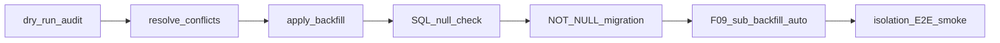
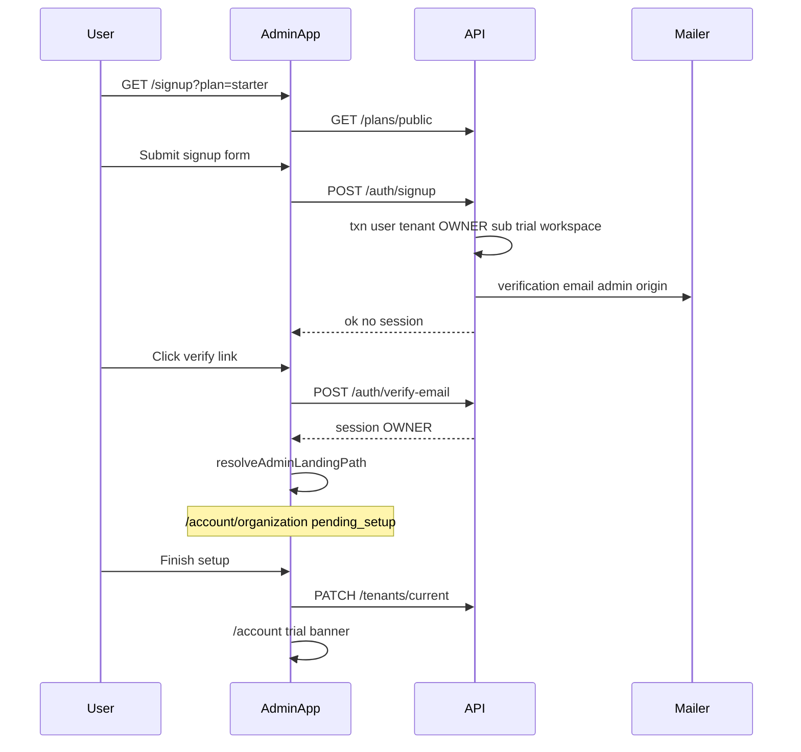
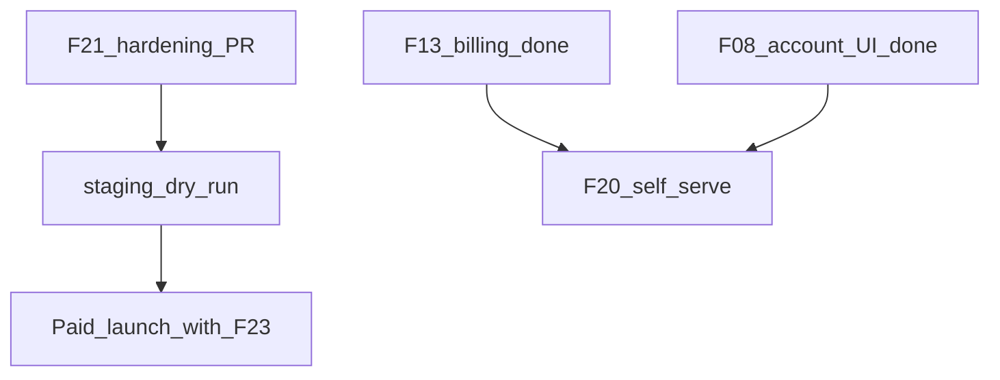

# SaaS F20 + F21 Plan

## Current state

| Epic | TASK_BOARD | Code status |
|------|------------|-------------|
| **F21** | `done` | Script, runbook, and NOT NULL migration shipped |
| **F20** | `pending` | `POST /auth/register` hard-disabled; sales-led path via [`platform-tenants.service.ts`](apps/api/src/modules/platform/application/platform-tenants.service.ts) only |

**F21 shipped artifacts**

- [`apps/api/scripts/migrate-pilots-to-tenants.ts`](apps/api/scripts/migrate-pilots-to-tenants.ts) — dry-run audit, mapping file, cross-tenant conflict gate (D08)
- [`docs/runbooks/tenant-migration.md`](docs/runbooks/tenant-migration.md)
- Migration [`20260623120100_workspaces_tenant_id_not_null`](apps/api/prisma/migrations/20260623120100_workspaces_tenant_id_not_null/migration.sql)
- Example mapping: [`pilot-tenant-map.example.json`](apps/api/scripts/pilot-tenant-map.example.json)

**F20 building blocks already in place**

- Owner provisioning transaction (tenant `pending_setup` → subscription trial → optional first workspace) in platform service
- Admin onboarding UI: [`account-organization-page.tsx`](apps/admin/src/features/account/account-organization-page.tsx) (`Finish setup`)
- Landing redirect: [`resolve-admin-landing-path.ts`](packages/web-shared/src/auth/resolve-admin-landing-path.ts)
- Billing checkout for existing tenants: [`subscription-billing.service.ts`](apps/api/src/modules/subscriptions/application/subscription-billing.service.ts)
- Email verification pages in admin (`/verify-email`) and auth mailer
- Public plans in seed: `starter`, `pro` (`isPublic: true`)

---

## F21 — Operational closure (not greenfield)

F21 implementation is done; remaining work is **hardening + pilot execution**, not new schema.

### Gaps to close

1. **No automated tests** for the migration script (conflict detection, mapping parse, owner pick, idempotent re-run).
2. **Pilot communication** — research gate still open in [SAAS_PLATFORM_PLAN.md § F21](docs/architecture/SAAS_PLATFORM_PLAN.md).
3. **Runbook completeness** — document migration ordering with F09 subscription backfill (migration `20260623130000` already inserts `tenant_subscriptions` for all tenants without a row).
4. **Skipped Playwright** — [`owner-setup.spec.ts`](apps/admin/e2e/owner-setup.spec.ts) is permanently skipped.

### Deliverables

| Item | File(s) | Notes |
|------|---------|-------|
| Script tests | `apps/api/scripts/migrate-pilots-to-tenants.spec.ts` | Vitest with Prisma test DB or extracted pure functions for `auditCrossTenantConflicts` / mapping load |
| Runbook addendum | [`docs/runbooks/tenant-migration.md`](docs/runbooks/tenant-migration.md) | Post-migration validation SQL (`tenant_subscriptions`, `tenant_members` OWNER), staging checklist, rollback decision tree |
| Pilot comm template | `docs/runbooks/pilot-migration-comms.md` | Email template: org model change, no action vs admin action, support contact |
| E2E un-skip | [`owner-setup.spec.ts`](apps/admin/e2e/owner-setup.spec.ts) | Mock `PATCH /tenants/current` + session fixture, or route mock like [`account-billing.spec.ts`](apps/admin/e2e/account-billing.spec.ts) |

### Production execution checklist (ops, no code)

1. Backup DB
2. Build real `pilot-tenant-map.json` from pilot workspace slugs (use example as template)
3. `--dry-run` until zero D08 conflicts
4. `--apply` during maintenance window
5. `SELECT COUNT(*) FROM workspaces WHERE tenant_id IS NULL` → 0
6. `prisma migrate deploy` (NOT NULL)
7. Smoke: tenant isolation E2E + owner login → Account
8. Send pilot comm from template

### F21 exit criteria (updated)

- [x] Backfill script + runbook + NOT NULL migration (already met)
- [ ] Script covered by tests
- [ ] Staging dry-run documented and executed once
- [ ] Pilot communication sent (or waived in writing)

**Suggested PR:** 1 small PR — tests + runbook + comm template + Playwright fix. Mark TASK_BOARD F21 `done` only after staging dry-run (checkbox in runbook).

---

## F20 — Self-serve signup (trial-first)

**User decision:** trial-first — verify email → org setup → Account; checkout optional in billing tab.

**Prod-grade surface (recommended):** **Admin app `/signup`** as the canonical entry. No new marketing app in v1 — external marketing links to `https://admin.<domain>/signup?plan=starter`. Keeps auth cookies, `X-Auth-Scope: admin`, and owner flows in one place.

Update **D03** from `DEFERRED` → `DECIDED`: self-serve enabled via env flag; superadmin provisioning remains for enterprise.

### End-to-end flow

### Research gate resolutions

| Question | Decision |
|----------|----------|
| Signup surface | Admin `/signup`; public plan list API; marketing deep-links later |
| Email before workspace | **Yes** — login already blocks unverified users; signup sends verification immediately |
| Default workspace | `{organizationName} Workspace` slugified; owner gets `workspace_members` ADMIN (required for login — see [`auth.service.ts`](apps/api/src/modules/auth/application/auth.service.ts) membership check) |
| Re-enable `POST /auth/register`? | **No** — add **`POST /auth/signup`** with tenant-scoped DTO; keep old register 403 for workspace-era clients |

### Contract-first ([`packages/contracts`](packages/contracts))

| Addition | Purpose |
|----------|---------|
| `signupSchema` + `SignupDto` in `dto/auth.dto.ts` | `email`, `password`, `name`, `organizationName`, `planSlug` (public plans only) |
| `signupResponseSchema` | `{ ok: true }` — no credentials in response |
| `publicPlanListSchema` | `{ items: Pick<PlanDto, id, name, slug, limits>[] }` |
| `ROUTES.AUTH.SIGNUP` | `/auth/signup` |
| `ROUTES.PLANS.PUBLIC` | `/plans/public` (unauthenticated) |
| `ErrorCodes` | `SIGNUP_DISABLED`, `EMAIL_ALREADY_REGISTERED`, `ALREADY_IN_ORGANIZATION` |

### API implementation

**1. Extract shared provisioning** — new `TenantProvisioningService` in `apps/api/src/common/tenant/` (or `modules/tenants/application/`):

- Extract core transaction from [`platform-tenants.service.ts` `createTenant`](apps/api/src/modules/platform/application/platform-tenants.service.ts) (lines ~166–228)
- Params: `mode: 'platform' | 'self_serve'` differences:
  - **self_serve:** user sets own password, `mustChangePassword: false`, `emailVerifiedAt: null`, send verification (not temp-password email)
  - **platform:** temp password, `emailVerifiedAt: now`, provisioning mailer (unchanged)
- Both: `tenant.status = pending_setup`, `subscriptionStatus = trial`, 30-day `trialEndsAt`, first workspace created

**2. `SignupService` / auth controller**

- `POST ROUTES.AUTH.SIGNUP` — guarded by `SELF_SERVE_SIGNUP_ENABLED=true` (pattern like [`ASSISTANT_ENABLED`](apps/api/src/modules/assistant/application/assistant-proxy.service.ts))
- Throttle: reuse `@Throttle({ auth: { limit: 5, ttl: 60_000 } })` on auth controller
- Validations: email unique; no existing `tenant_members` row (D08); `plan.isPublic === true`
- On success: `authMailer.sendEmailVerification` with **admin** verify URL (`adminClientOrigin()` — add `buildAdminVerifyEmailUrl` parallel to [`buildVerifyEmailUrl`](apps/api/src/common/mailer/auth.mailer.ts))

**3. Public plans endpoint**

- `GET ROUTES.PLANS.PUBLIC` — no auth; `plan.findMany({ where: { isPublic: true }, orderBy: sortOrder })`
- New thin `PlansModule` or add to `SubscriptionsModule`

**4. Fix admin verify-email landing**

- [`apps/admin/src/app/verify-email/page.tsx`](apps/admin/src/app/verify-email/page.tsx) currently routes to `/dashboard`; align with login page — use `resolveAdminLandingPath` so owners land on `/account/organization` when `pending_setup`

### Admin UI ([`apps/admin`](apps/admin))

| Route | Component |
|-------|-----------|
| `/signup` | `features/auth/signup-page.tsx` — `AuthShell`, plan cards from `usePublicPlans()`, form fields |
| `/login` | Add “Create an account” link when `NEXT_PUBLIC_SELF_SERVE_SIGNUP=true` |

Reuse: `AuthShell`, validation patterns from login/set-password, billing plan names from contracts `PLAN_SLUGS`.

Post-signup UX: redirect to `/verify-email?email=...` (same as login flow).

### Security / fraud

- Env kill switch: `SELF_SERVE_SIGNUP_ENABLED` (API) + `NEXT_PUBLIC_SELF_SERVE_SIGNUP` (UI)
- Rate limit on signup (existing throttler)
- No dev password in response (unlike platform provision)
- Block disposable-email domains — **defer** unless product asks; document as follow-up

### Tests (required per [chronomint-test-delivery](.cursor/skills/chronomint-test-delivery/SKILL.md))

| Layer | File |
|-------|------|
| Contracts | `packages/contracts/src/dto/auth.dto.spec.ts` — signup schema |
| Unit | `tenant-provisioning.service.spec.ts`, `signup` path in auth service spec |
| API E2E | `apps/api/test/self-serve-signup.e2e.ts` — signup → verify → PATCH tenant → GET subscription trial |
| Update | `auth.e2e.ts` — keep register 403; add signup disabled/enabled cases |
| Playwright | `apps/admin/e2e/signup.spec.ts` — mocked public plans + signup API |

### Docs

- `docs/specs/self-serve-signup.md` — flow, env vars, D03 update
- Update [SAAS_PLATFORM_PLAN.md § F20](docs/architecture/SAAS_PLATFORM_PLAN.md) research gate + exit criteria
- `apps/api/.env.example` — `SELF_SERVE_SIGNUP_ENABLED=false`

### Suggested PR split (2 PRs)

| PR | Scope |
|----|-------|
| **F20a** | Contracts, provisioning extraction, `POST /auth/signup`, `GET /plans/public`, verify-email admin URL, API tests |
| **F20b** | Admin `/signup` UI, login link, verify-email landing fix, Playwright, spec doc |

### F20 exit criteria

- New user: signup → verify email → finish org setup → lands on `/account` with one workspace and `trial` subscription
- Signup disabled when env flag off (403 `SIGNUP_DISABLED`)
- Cannot signup with email already in a tenant (D08)
- Upgrade path works via existing billing tab checkout (F13)

---

## Dependencies and ordering

- **F21 hardening** can merge immediately (no dependency on F20).
- **F20** depends on F11–F13 (done) and reuses F08/F15 provisioning patterns.
- Do **not** enable `SELF_SERVE_SIGNUP_ENABLED` in production until F23 legal sign-off (same gate as paid launch).

## Out of scope

- Separate marketing site / Stripe Pricing Table embed
- Card-required signup (user chose trial-first)
- Multi-step onboarding wizard beyond existing `pending_setup` org form
- F21 production execution itself (ops runbook step, not agent code)
