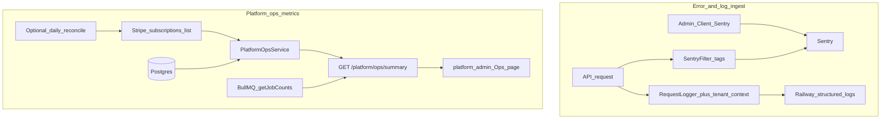

# SaaS F22 — Observability & tenant metrics

## What F22 is (and is not)

| | F18 (done) | F22 (this epic) |
|--|--|--|
| **Audience** | Tenant owner | Platform staff / on-call |
| **Data** | Hours, billable, active members per org | MRR, churn signals, subscription health, queue depth, error triage |
| **Surface** | Admin `/account` rollup | Platform-admin Ops page + Sentry/Railway logs |
| **API** | `GET /tenants/current/analytics/summary` | `GET /platform/ops/summary` (new) |

F22 does **not** replace F18 materialized views or customer analytics — it enables **operating** multi-tenant SaaS at scale per [SAAS_PLATFORM_PLAN.md § F22](docs/architecture/SAAS_PLATFORM_PLAN.md).

**Deferred from F05:** Sentry `tenantId` tagging ([§ F05 research gate](docs/architecture/SAAS_PLATFORM_PLAN.md) line ~648).

---

## Current state

| Area | Today | Gap |
|------|-------|-----|
| Sentry | Custom sender in [`sentry-filter.ts`](apps/api/src/common/http/sentry-filter.ts) + [`SentryInitializer`](packages/web-shared/src/components/sentry-initializer.tsx) | No `tenantId`, `subscriptionStatus`, or `requestId` tags |
| HTTP logs | [`request-logger.middleware.ts`](apps/api/src/common/logger/request-logger.middleware.ts) — `requestId`, status, duration | No `tenantId` / `userId` on authenticated routes |
| Health | [`health.controller.ts`](apps/api/src/modules/health/interface/http/health.controller.ts) — DB + Redis | No queue depth |
| Platform UI | [`tenant-list-page.tsx`](apps/platform-admin/src/features/tenants/tenant-list-page.tsx) — per-tenant plan/status/counts | No fleet-wide ops summary |
| MRR | Plans have `stripePriceId` only ([`schema.prisma`](apps/api/prisma/schema.prisma)) — no stored USD | Must pull from **Stripe API** for dollar MRR |
| Queues | BullMQ: `mail-queue`, `bulk-invite-queue`, `bulk-category-queue`, `export-queue` | Jobs carry `workspaceId`, not `tenantId`; v1 = **global** queue counts |
| Seats | [`plan-limit.service.ts`](apps/api/src/modules/subscriptions/application/plan-limit.service.ts) seat logic | Reuse for fleet `seatsUsed` aggregate |

---

## Research gate resolutions

| Question | Decision |
|----------|----------|
| Metrics: MRR, churn, active tenants, seats | **Platform ops summary** from DB + Stripe; not tenant-owner API |
| Stripe ↔ internal MRR | **Read-only reconcile** job/endpoint; flag drift when `stripeSubscriptionId` status ≠ `tenant_subscriptions.status` or missing Stripe row |
| Queue depth per tenant | **v1 global** per queue via `getJobCounts()`; per-tenant deferred (requires `tenantId` on job payloads) |
| Dashboards | **platform-admin Ops page** + existing Railway logs / Sentry; no self-hosted Grafana in v1 |

---

## Architecture



---

## Deliverables

### 1. Tenant context on errors (F05 closure)

**API** — extend [`SentryFilter`](apps/api/src/common/http/sentry-filter.ts):

- Read `request.user` (`tenantId`, `workspaceId`, `userId`) when present (post-JWT guard)
- Add Sentry `tags`: `tenantId`, `workspaceId`, `requestId`
- Add `extra.subscriptionStatus` via lightweight lookup when `tenantId` set (cache per request or skip on hot path if too heavy — prefer join in filter only for 5xx)

**Client** — optional v1.1: set Sentry user context in admin/client when session bootstraps (lower priority than API).

**Tests:** `sentry-filter.spec.ts` — assert tags present when `req.user` mocked.

---

### 2. Structured logging enrichment

Extend [`RequestLoggerMiddleware`](apps/api/src/common/logger/request-logger.middleware.ts) `res.on("finish")` meta:

```ts
{ requestId, tenantId?, workspaceId?, userId?, method, url, statusCode, durationMs }
```

`tenantId` available only after auth middleware runs — use a thin **post-auth interceptor** or read `req.user` in `finish` handler (Nest runs guards before route handler; for failed auth, tags stay absent — acceptable).

**Docs:** note in new runbook that Railway log search can filter `tenantId`.

---

### 3. Contracts + platform ops API

**Contracts** ([`packages/contracts`](packages/contracts)):

| Addition | Purpose |
|----------|---------|
| `ROUTES.PLATFORM.OPS_SUMMARY` | `/platform/ops/summary` |
| `platformOpsSummarySchema` | Fleet snapshot DTO |
| `platformMrrReconcileSchema` | Optional detail for drift rows |

**`PlatformOpsSummaryDto` (proposed fields):**

- `tenants`: `{ active, trial, suspended, churned, pendingSetup }`
- `subscriptions`: `{ active, trial, pastDue, canceled }`
- `usage`: `{ totalWorkspaces, totalSeats }` — seats = distinct users across tenant (reuse seat-count SQL from plan limits)
- `queues`: `{ [queueName]: { waiting, active, failed, delayed } }`
- `mrr`: `{ currency: "usd", amountCents, source: "stripe" }` — null when Stripe not configured
- `reconcile`: `{ driftCount, lastCheckedAt }`

**Service** — `PlatformOpsService` in [`apps/api/src/modules/platform/application/`](apps/api/src/modules/platform/application/):

- `getOpsSummary()` — DB aggregates + BullMQ counts + Stripe MRR
- `reconcileSubscriptions()` — compare `tenant_subscriptions` vs Stripe list (paginated); return drift list for superadmin detail endpoint or embed summary count only in v1

**Controller** — extend [`platform-tenants.controller.ts`](apps/api/src/modules/platform/interface/http/platform-tenants.controller.ts) or new `platform-ops.controller.ts` guarded by `PlatformGuard`.

**Stripe MRR:** sum `unit_amount * quantity` for active/trialing subscriptions via existing [`StripeClient`](apps/api/src/modules/subscriptions/stripe/stripe.client.ts). No new plan price columns in DB (D10 USD-only aligns).

**Tests:**

- `platform-ops.service.spec.ts` — mocked Prisma + Stripe + queues
- `apps/api/test/platform-ops.e2e.ts` — platform auth required; snapshot counts from seed

---

### 4. Platform-admin Ops UI

New route: **`/ops`** in [`apps/platform-admin`](apps/platform-admin)

| Component | Content |
|-----------|---------|
| `features/ops/ops-dashboard-page.tsx` | Stat cards: active tenants, trial, past_due, MRR (USD), total seats, failed queue jobs |
| `platform-shell.tsx` nav | Add "Ops" link |
| Hook | `usePlatformOpsSummary()` in web-shared (platform session) |

Reuse patterns from [`tenant-list-page.tsx`](apps/platform-admin/src/features/tenants/tenant-list-page.tsx) and admin account stat cards.

**Playwright:** `apps/platform-admin/e2e/ops.spec.ts` — mock `GET /platform/ops/summary`.

---

### 5. On-call runbook

New [`docs/runbooks/on-call-tenant-triage.md`](docs/runbooks/on-call-tenant-triage.md):

1. Find `tenantId` from Sentry tag or Railway log
2. Check subscription: platform-admin tenant detail or `GET /platform/tenants/:id`
3. Past due → billing runbook / Stripe portal
4. Suspend vs churn → [`tenant-churn.md`](docs/runbooks/tenant-churn.md)
5. Queue backlog → which queue, retry failed jobs
6. MRR drift → run reconcile, fix webhook gap

Link from [`docs/runbooks/superadmin-support.md`](docs/runbooks/superadmin-support.md) if it exists.

---

### 6. Docs + TASK_BOARD

- New [`docs/specs/platform-ops.md`](docs/specs/platform-ops.md)
- Update F22 gates + exit criteria in [SAAS_PLATFORM_PLAN.md](docs/architecture/SAAS_PLATFORM_PLAN.md)
- Mark [TASK_BOARD.json](TASK_BOARD.json) `SaaS-F22` done after merge

---

## Suggested PR split (3 PRs)

| PR | Scope |
|----|-------|
| **F22a** | Sentry tags, log enrichment, runbook, unit tests |
| **F22b** | Contracts, `PlatformOpsService`, Stripe MRR + reconcile, queue counts, E2E |
| **F22c** | platform-admin `/ops` page, web-shared hook, Playwright |

---

## Exit criteria (from master plan)

- On-call can identify **tenant + subscription status** from a 5xx in Sentry or Railway logs in under 2 minutes
- Platform-admin **Ops** page shows fleet health at a glance
- MRR displayed when Stripe configured; reconcile drift count visible

---

## Out of scope (v1)

- Per-tenant BullMQ depth (needs job payload `tenantId`)
- Prometheus `/metrics` endpoint / Grafana
- Customer-facing metrics (F18)
- Sentry performance monitoring / APM
- Automated paging (PagerDuty) — document manual Sentry alerts only
- Materialized rollup tables (F18 follow-up, separate from ops metrics)

---

## Dependencies

- **F02** tenants schema (done)
- **F11–F12** Stripe subscriptions (done) — required for MRR/reconcile
- **F14–F15** platform-admin (done) — hosts Ops UI
- Does **not** block F20/F23; can run in parallel with F24
