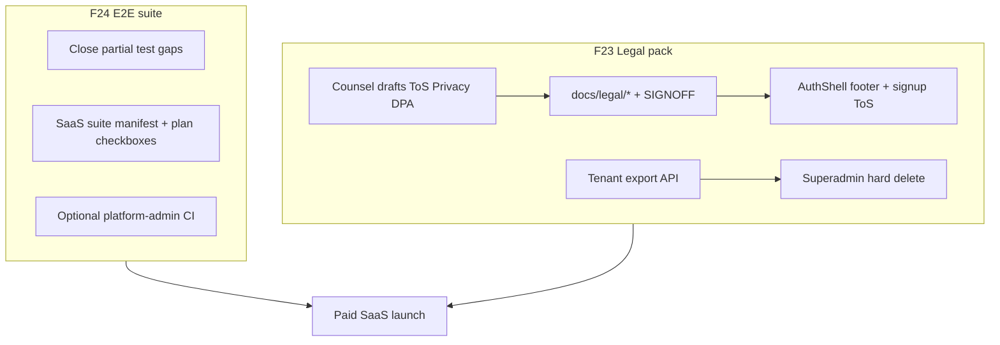
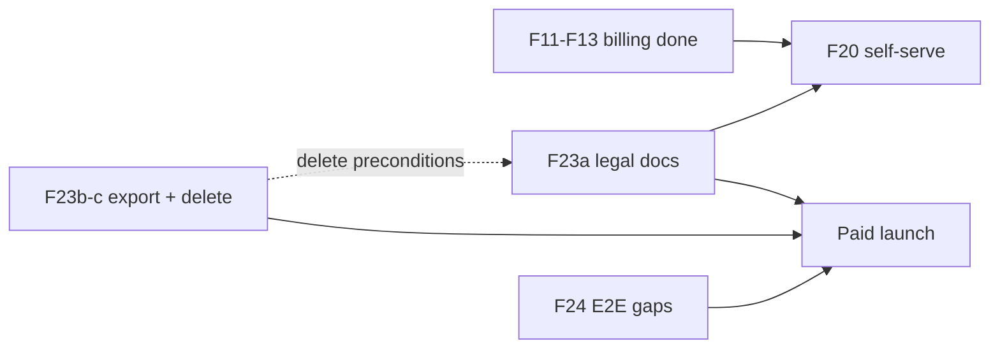

# SaaS F23 + F24 Implementation Plan

## Current state

| Epic | TASK_BOARD | Reality |
|------|------------|---------|
| **F23** | `pending` (LSA) | No `docs/legal/`, no GDPR tenant export/delete API, no legal footer links. Workspace export + churn runbook exist as partial groundwork. |
| **F24** | `pending` (QA) | ~70% of minimum cases already covered in [`apps/api/test/`](apps/api/test/); integration CI runs all `*.e2e.ts`. Gaps remain on D12 timelog, webhook status transitions, D08 breadth, D06 multi-project LEAD, and platform-admin Playwright. |

**Gates:** F23 blocks production `SELF_SERVE_SIGNUP_ENABLED`, Stripe live paid launch, and P3 exit per [SAAS_PLATFORM_PLAN.md §7.2](docs/architecture/SAAS_PLATFORM_PLAN.md). F24 can proceed in parallel—it hardens confidence for the same launch.



---

## F23 — Legal & compliance pack

**Goal:** Sell legally. **User decision:** ship **export API + superadmin hard-delete** (reverses prior “no hard delete” product stance—requires counsel retention review and doc updates).

### Research gate resolutions

| Item | Resolution |
|------|------------|
| ToS multi-tenant | B2B SaaS ToS: org as data controller for workspace content; Kloqra as processor for hosted service; subscription/billing terms; one-user-one-tenant (D08) |
| Privacy + DPA | Privacy policy + enterprise DPA template referencing subprocessors exhibit |
| Subprocessors | Consolidate Stripe, Railway, Vercel, Brevo, OpenAI from [ENVIRONMENT.md](docs/development/ENVIRONMENT.md) + runbooks into one public list |
| GDPR export | Async tenant-level export job aggregating all workspaces (reuse BullMQ pattern from [`export-job.service.ts`](apps/api/src/modules/export/application/export-job.service.ts)) |
| GDPR delete | **`DELETE /platform/tenants/:id`** — superadmin only; preconditions below; cascades via existing FK (`ON DELETE CASCADE` from F02) |
| Refund policy | Standalone doc; link from Account billing + Stripe Customer Portal copy alignment |
| ToS acceptance timing | Signup checkbox (F20) + first paid checkout; superadmin-provisioned tenants accept on first owner login (D16) |

**Precondition for hard delete** (update [tenant-churn.md](docs/runbooks/tenant-churn.md)):

1. `status === churned`
2. Stripe subscription absent or canceled
3. Tenant export job `completed` (or `exportWaivedAt` audit flag on platform record)
4. Retention period elapsed (configurable, e.g. `TENANT_DELETE_MIN_DAYS_AFTER_CHURN=30`) — counsel sets final value in SIGNOFF
5. Platform audit event `platform.tenant.deleted` recorded **before** cascade (retain audit rows without `tenantId` FK or use soft-retained summary JSON)

**Doc drift to fix:** [tenants.md](docs/specs/tenants.md) line 49 defers GDPR to “F16” → change to F23; [SAAS_PLATFORM_PLAN.md](docs/architecture/SAAS_PLATFORM_PLAN.md) D01 soft-delete decision needs addendum noting F23 superadmin delete path.

### Deliverables

#### Track A — Counsel / product (blocks UI copy, not API scaffolding)

| Artifact | Path |
|----------|------|
| Terms of Service | `docs/legal/terms-of-service.md` |
| Privacy Policy | `docs/legal/privacy-policy.md` |
| DPA template | `docs/legal/dpa-template.md` |
| Subprocessor list | `docs/legal/subprocessors.md` |
| Refund / cancellation policy | `docs/legal/refund-policy.md` |
| Sign-off record | `docs/legal/SIGNOFF.md` (date, reviewer, doc versions; optional Notion link) |
| Feature spec | `docs/specs/compliance.md` (export/delete flows, retention, churn integration) |

#### Track B — Contracts ([`packages/contracts`](packages/contracts))

| Addition | Purpose |
|----------|---------|
| `ROUTES.TENANTS.DATA_EXPORT`, `ROUTES.TENANTS.DATA_EXPORT_JOB` | Owner-triggered tenant export |
| `ROUTES.PLATFORM.TENANT_DELETE` | `DELETE /platform/tenants/:id` |
| `compliance.dto.ts` | `createTenantDataExportSchema`, `tenantDataExportJobSchema`, `deleteTenantResponseSchema` |
| `ErrorCodes` | `EXPORT_NOT_READY`, `TENANT_DELETE_PRECONDITION_FAILED`, `EXPORT_WAIVED_REQUIRED` |
| `platform-audit.dto.ts` | Add `platform.tenant.deleted` action |
| `legal-urls.ts` (optional) | Shared env key names for footer URLs |

#### Track C — API

New module **`apps/api/src/modules/compliance/`** (or extend `tenants` + `platform`):

**Tenant data export** (`TenantDataExportService`):

- `POST /tenants/current/data-export` — `TenantRolesGuard` OWNER only
- Enqueue BullMQ job; iterate tenant workspaces; call existing [`ExportService`](apps/api/src/modules/export/application/export.service.ts) per workspace; bundle into single ZIP (manifest JSON + per-workspace folders)
- `GET /tenants/current/data-export/:jobId` — poll status + signed download URL (reuse [`export-job-storage.util.ts`](apps/api/src/modules/export/application/export-job-storage.util.ts))
- Allow export when `suspended`/`past_due` (read-only GDPR); block when `churned` if counsel says post-churn export is ops-only—**default: allow until hard delete**

**Superadmin hard delete** (extend [`platform-tenants.service.ts`](apps/api/src/modules/platform/application/platform-tenants.service.ts)):

- `DELETE ROUTES.PLATFORM.TENANT_DELETE` — `PlatformGuard` + `PLATFORM_ADMIN` role
- `assertCanHardDelete(tenant)` — churned + export completed/waived + retention elapsed
- Record audit event with tenant slug/name snapshot, then `prisma.tenant.delete({ where: { id } })` (cascade)
- Platform-admin UI: “Delete permanently” on churned tenant detail with confirmation modal citing preconditions

#### Track D — UI

| Surface | Change |
|---------|--------|
| [`AuthShell`](packages/web-shared/src/components/auth-shell.tsx) | Footer: Terms · Privacy links via `NEXT_PUBLIC_LEGAL_TOS_URL`, `NEXT_PUBLIC_LEGAL_PRIVACY_URL` |
| Account → Organization or new “Data & privacy” section | Owner “Export all organization data” CTA |
| [`account-billing-page.tsx`](apps/admin/src/features/account/account-billing-page.tsx) | Refund/cancellation policy link |
| F20 `/signup` (when merged) | Required checkbox: accept ToS + Privacy |
| `platform-admin` tenant detail | Delete permanently (churned only) |

#### Track E — Tests ([chronomint-test-delivery](.cursor/skills/chronomint-test-delivery/SKILL.md))

| Layer | File |
|-------|------|
| Contracts | `packages/contracts/src/dto/compliance.dto.spec.ts` |
| Unit | `tenant-data-export.service.spec.ts`, `platform-tenants.service.spec.ts` (delete preconditions) |
| API E2E | `apps/api/test/tenant-data-export.e2e.ts`, extend `platform-tenants.e2e.ts` for delete happy/denied paths |
| Playwright | `apps/admin/e2e/compliance-footer.spec.ts` — footer links render on login |

### F23 suggested PR split (3 PRs)

| PR | Scope |
|----|-------|
| **F23a** | `docs/legal/*`, `docs/specs/compliance.md`, SIGNOFF, subprocessors, update churn runbook + tenants.md drift |
| **F23b** | Contracts, export API module, owner Account export UI |
| **F23c** | Superadmin delete endpoint + platform-admin UI + audit action + e2e |

### F23 exit criteria

- [ ] All five research-gate items checked in SAAS_PLATFORM_PLAN §F23
- [ ] `docs/legal/SIGNOFF.md` populated (or Notion link)
- [ ] Owner can request tenant-wide export; ops can hard-delete churned tenant after preconditions
- [ ] Legal links visible on auth surfaces; refund policy linked from billing
- [ ] P3 checklist “Legal minimum: ToS, Privacy, DPA (F23)” checked

---

## F24 — SaaS E2E test suite

**Goal:** CI blocks tenant regressions. **Good news:** [`tenant-isolation.e2e.ts`](apps/api/test/tenant-isolation.e2e.ts) and most billing/lead tests already run in the **`integration`** job ([`.github/workflows/ci.yml`](.github/workflows/ci.yml) → `pnpm test:integration`).

**Plan naming fix:** Canonical doc references `subscriptions.e2e.ts` which does not exist. Either rename [`subscription-lifecycle.e2e.ts`](apps/api/test/subscription-lifecycle.e2e.ts) + merge webhook cases into **`subscriptions.e2e.ts`**, or update SAAS_PLATFORM_PLAN to match actual filenames. **Recommend:** create `subscriptions.e2e.ts` as a thin re-export/suite file grouping lifecycle + webhook describe blocks for discoverability.

### Coverage matrix — gaps to close

| F24 case | Status | Action |
|----------|--------|--------|
| Cross-tenant IDOR | Covered | None — [`tenant-isolation.e2e.ts`](apps/api/test/tenant-isolation.e2e.ts) |
| D08 one tenant per user | Partial | Add to [`self-serve-signup.e2e.ts`](apps/api/test/self-serve-signup.e2e.ts): signup with seed admin email → 409; extend [`platform-tenants-provision.e2e.ts`](apps/api/test/platform-tenants-provision.e2e.ts): existing owner email → 409 |
| D14 workspace admin isolation | Covered | None |
| Plan limit workspace create | Covered | [`plan-limits.e2e.ts`](apps/api/test/plan-limits.e2e.ts) |
| D12 `past_due` blocks timer + timelog | Partial | Add `past_due` case for `POST /timelogs` in subscription lifecycle (today only `canceled` tested) |
| Webhook updates status | Partial | Extend [`stripe-webhook.e2e.ts`](apps/api/test/stripe-webhook.e2e.ts) using existing `fixtures/stripe/customer.subscription.updated.json` → assert DB `past_due` |
| D16 owner account + superadmin provision | Partial | API solid; add admin Playwright smoke without mocks for owner org setup OR add platform-admin to CI |
| D06 multi-project LEAD | Partial | Extend [`project-lead.e2e.ts`](apps/api/test/project-lead.e2e.ts): same user LEAD on 2 projects; matrix of allow/deny |
| D13 no platform impersonation | Partial | Add HTTP 404 scan for `/platform/**/impersonate` routes (complement contract string check in [`platform-audit.e2e.ts`](apps/api/test/platform-audit.e2e.ts)) |

### CI formalization

1. **SaaS suite manifest** — `apps/api/test/saas-suite.manifest.ts` (or `docs/development/SAAS_E2E_SUITE.md`) listing the 9 F24 cases → file mapping; referenced in SAAS_PLATFORM_PLAN §F24 exit criteria
2. **Optional `saas` vitest tag** — `@saas` on describe blocks; `vitest.e2e.config.ts` supports `pnpm test:e2e:saas` for fast local gate
3. **Platform-admin in CI** — add third Playwright step in `e2e` job: `pnpm --filter @kloqra/platform-admin test:e2e` (covers D16 browser path for `platform-create-tenant.spec.ts`)
4. **Flip checkboxes** — SAAS_PLATFORM_PLAN §F24 minimum cases + TASK_BOARD `SaaS-F24` → `done`

### F24 suggested PR split (2 PRs)

| PR | Scope |
|----|-------|
| **F24a** | API gap tests (D12 timelog, webhook status, D08, D06 multi-project, D13 route scan); `subscriptions.e2e.ts` suite file |
| **F24b** | SaaS manifest doc, optional vitest tag, platform-admin CI step, SAAS_PLATFORM_PLAN + TASK_BOARD updates |

### F24 exit criteria

- [ ] All 9 minimum cases green in `integration` CI
- [ ] `tenant-isolation.e2e.ts` + `subscriptions.e2e.ts` explicitly named in plan and manifest
- [ ] TASK_BOARD `SaaS-F24` marked `done`

---

## Dependencies and ordering



- **F24a** can start immediately (no F23 dependency).
- **F23a** (counsel docs) should start ASAP—it unblocks F20 prod flag and signup ToS copy.
- **F23b** (export API) can scaffold against spec while counsel drafts; legal URLs can use staging placeholders until SIGNOFF.
- **F23c** (hard delete) ships after counsel confirms retention period in SIGNOFF; do not enable in production until sign-off.
- **F20** should not enable `SELF_SERVE_SIGNUP_ENABLED` in production until F23a SIGNOFF + signup ToS checkbox (F23d/F20 overlap).

## Out of scope

- Marketing site hosting of legal pages (engineering provides markdown; product publishes to public URL)
- Automated erasure without hard delete (user chose hard-delete path)
- Stripe live-mode E2E (continue fixture-based webhooks)
- Full platform-admin regression suite beyond create-tenant + delete flows

## Pre-PR checklist (both epics)

```bash
pnpm format:check && pnpm lint && pnpm typecheck && pnpm test && pnpm build
```
