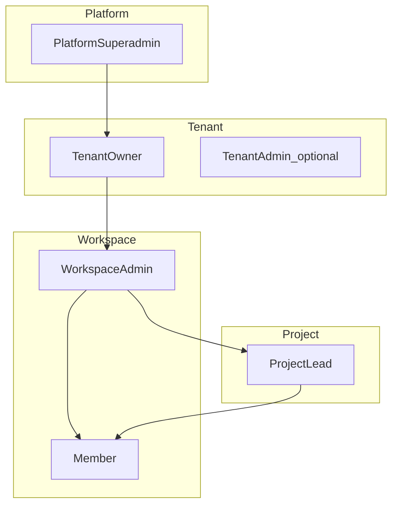

# SaaS Role Division & Diagrams Plan

## Goal

Deliver **complete role divisioning** for the B2B SaaS model (locked decisions in [SAAS_PLATFORM_PLAN.md](docs/architecture/SAAS_PLATFORM_PLAN.md) §7) as a **companion architecture doc** plus a **summary section** in the master plan—same visual/documentation standard as [AUTH.md](docs/architecture/AUTH.md) and [MULTI_DEVICE_SESSIONS.md](docs/architecture/MULTI_DEVICE_SESSIONS.md).

This fulfills epic **F03** deliverable (`TENANT_RBAC.md`) at the design/research layer—no implementation code yet.

---

## Document structure

### A. New file: [docs/architecture/TENANT_RBAC.md](docs/architecture/TENANT_RBAC.md)

Primary SSOT for roles, scopes, permissions, and flows.

| Section | Content |
| ------- | ------- |
| **1. Overview** | Why 4 role layers exist; link to §7 decisions D01–D16 |
| **2. Role catalog** | One subsection per role: purpose, app, DB binding, typical persona |
| **3. Scope model** | Platform → Tenant → Workspace → Project; what data each scope can see |
| **4. Diagrams** | See diagram list below (8–10 mermaid figures) |
| **5. Permission matrix** | Capability tables by domain (not 200 raw routes—grouped like AUTH.md) |
| **6. Combined personas** | Same user holding multiple hats (owner + workspace admin, admin + PM, member in 2 workspaces) |
| **7. Provisioning flows** | Sequence diagrams for superadmin → owner → workspace → admin/member/PM |
| **8. Deny rules** | Explicit “never” list (cross-tenant, auto-provision all workspaces, impersonation) |
| **9. Guard resolution** | How API resolves role on each request (JWT + membership lookups) |
| **10. Subscription overlay** | How `trial` / `past_due` / `suspended` restricts **new time entries** regardless of role |
| **11. Current vs target** | Today (`ADMIN`/`MEMBER` only) → target 5 roles + platform |
| **12. Implementation pointers** | Maps to F03–F07, F17; future `packages/contracts` enums |
| **13. Production-grade validation** | Sign-off checklist; link to [SAAS_PLATFORM_PLAN.md](./SAAS_PLATFORM_PLAN.md) §7.2 |

### B. Update: [docs/architecture/SAAS_PLATFORM_PLAN.md](docs/architecture/SAAS_PLATFORM_PLAN.md)

Insert **§3.3 Role architecture (summary)** after §3.2 (before §4), containing:

- Role stack diagram (compact)
- App × role table
- Link: *“Full matrix and flows → [TENANT_RBAC.md](./TENANT_RBAC.md)”*
- Retain §3.2 role layers bullet list but avoid duplicating full matrices

Update **F03** epic to reference `TENANT_RBAC.md` as primary deliverable and mark research items that the doc closes.

### C. Update: [docs/README.md](docs/README.md)

Add link under Architecture: `TENANT_RBAC.md` — SaaS roles & permissions.

Optional cross-link from [DOMAIN_MODEL.md](docs/architecture/DOMAIN_MODEL.md) §Roles → TENANT_RBAC.md (one line).

---

## Role catalog (to document in full)

| Role | Layer | App | DB / binding |
| ---- | ----- | --- | ------------ |
| **Platform superadmin** | Platform | `platform-admin` | `platform_users` or `users.platform_role` |
| **Tenant owner** | Tenant | `admin` → Account | `tenant_members.role = OWNER` |
| **Tenant admin** (optional delegate) | Tenant | `admin` → Account | `tenant_members.role = ADMIN` — document as optional v1 |
| **Workspace admin** | Workspace | `admin` → Workspace | `workspace_members.role = ADMIN` — **per workspace** |
| **Project lead (PM)** | Project | `admin` (filtered nav) | `team_members.role = LEAD` — **multi-project allowed** |
| **Member** | Workspace | `client` | `workspace_members.role = MEMBER` — **multi-workspace same tenant** |

Locked constraints from §7.1 to weave into every section:

- `UNIQUE(user_id)` on `tenant_members` — no cross-tenant users
- Per-workspace provisioning (D14, D15)
- No superadmin impersonation (D13)
- Owner creates workspace + assigns admin (D05)

---

## Diagrams to include in TENANT_RBAC.md

1. **Role hierarchy** — platform → tenant → workspace → project (flowchart above)
2. **Membership ER** — extend SAAS plan ER with role columns on `tenant_members`, `workspace_members`, `team_members`
3. **App routing** — which app each role uses; Account vs Workspace mode in admin
4. **Data visibility** — what each role can see (tenant boundary vs workspace vs project team)
5. **Superadmin provision** — sequence: create temp tenant → owner first login → complete org (D16)
6. **Owner provision** — sequence: create workspace → invite workspace admin (separate per workspace)
7. **Multi-workspace member** — one user, two `workspace_members` rows, same `tenant_id`
8. **Multi-project PM** — one user, multiple `team_members` LEAD rows
9. **Request authorization flow** — `JwtAuthGuard` → tenant check → workspace role → project LEAD check
10. **Subscription write gate** — overlay on timer/timelog mutations when `past_due` (D12)

Style rules: match existing docs (no node spaces, quoted edge labels, no custom colors).

---

## Permission matrix structure (grouped by domain)

Mirror [AUTH.md](docs/architecture/AUTH.md) §Role-based access but add columns for each role.

**Domains** (grep shows ~11 controller groups with `@Roles`):

| Domain | Workspace admin | Project lead | Member | Tenant owner | Platform superadmin |
| ------ | --------------- | ------------ | ------ | ------------ | ------------------- |
| Account / tenant | — | — | — | full | CRUD tenants |
| Workspaces | if member | — | switch only | create, list, assign admin | list all |
| Projects & teams | all in WS | assigned only | team projects | via WS membership | — |
| Categories | CRUD | read/use | read | — | — |
| Tasks | all / assigned | assigned projects | assigned | — | — |
| Timer & timelogs | own + team views | own + project team | own | — | — |
| Timesheet approvals | all in WS | assigned projects | submit own | — | — |
| Reporting & dashboard | workspace | project-scoped | member widgets | rollup F18 | — |
| Billing rates | workspace | deny | deny | subscription F13 | — |
| Exports | wizard | project-only TBD | `/export/me` | — | — |
| Presence / team live | yes | TBD | deny | — | — |
| Public API keys | workspace | deny | deny | — | — |
| Platform routes | deny | deny | deny | deny | allow-list |

Cells use: **Yes** / **No** / **Scoped** / **Account-only** / **TBD (F17)**.

Include a second table: **UI surfaces** (nav items in client vs admin Account vs admin Workspace vs platform-admin).

---

## Combined personas (examples for doc)

Document 5–6 real agency scenarios with diagrams:

- **Alex** — tenant owner only (Account UI; not auto-admin in every workspace)
- **Sarah** — workspace admin in Fabrikam + Contoso workspaces (two invites)
- **Mike** — PM on Project A + B; not workspace admin
- **Jane** — member in two workspaces; logs time in both
- **Sarah + Mike** — same person: workspace admin AND PM on one project (allowed)
- **Kloqra ops** — superadmin: tenant list, suspend; no impersonation

---

## What we will NOT do in this pass

- Implement guards, Prisma migrations, or contracts (F04+)
- Fill D11 tier numbers (workspaces per plan)
- Route-level OpenAPI export (optional F03 follow-up script later)
- Change [AUTH.md](docs/architecture/AUTH.md) body—only add a forward link to TENANT_RBAC for SaaS

---

## Files to create / edit

| File | Action |
| ---- | ------ |
| [docs/architecture/TENANT_RBAC.md](docs/architecture/TENANT_RBAC.md) | **Create** (~400–600 lines, diagrams + matrices) |
| [docs/architecture/SAAS_PLATFORM_PLAN.md](docs/architecture/SAAS_PLATFORM_PLAN.md) | **Edit** — add §3.3 summary + F03 cross-links |
| [docs/README.md](docs/README.md) | **Edit** — add link |
| [docs/architecture/DOMAIN_MODEL.md](docs/architecture/DOMAIN_MODEL.md) | **Edit** — one-line cross-link (optional) |
| [.cursor/plans/saas_platform_master.plan.md](.cursor/plans/saas_platform_master.plan.md) | **Edit** — note F03 doc deliverable |

---

## Verification

- All 6 locked rules in §7.1 reflected in deny rules and matrices
- Every role has: app, scope, can/cannot, provisioning path
- Diagrams render in GitHub/Cursor markdown preview
- SAAS_PLATFORM_PLAN stays navigable (summary only, not full duplicate)

---

## Production-grade validation (sign-off)

Canonical checklist: [SAAS_PLATFORM_PLAN.md §7.2](docs/architecture/SAAS_PLATFORM_PLAN.md). Summary for doc work:

**Architecture verdict:** Production-grade design; implementation pilot-grade until P1–P3 + isolation E2E.

| Gate | Key checks |
| ---- | ---------- |
| **P1 pilots** | Tenant isolation E2E; `tenant_id` migration; per-workspace provisioning |
| **P2 limits** | Account UI; `maxWorkspaces` / `maxSeats` enforced |
| **P3 paid** | Stripe idempotency; D12 write block; F23 legal |
| **P5 PM** | Matrix enforced in services; LEAD scoped E2E |

**Do not ship paid SaaS** without: isolation tests green, webhook tests, legal sign-off, payment-failure UX.

TENANT_RBAC.md §13 should mirror §7.2 deny rules and phase gates in role-specific language.
