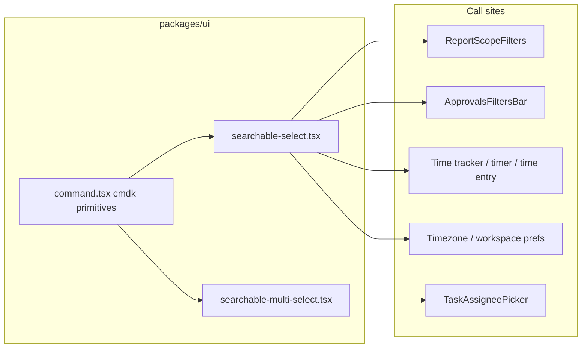

# Searchable dropdown rollout

## Problem

Long entity lists (members, tasks, categories, projects, timezones) use non-searchable Radix [`Select`](packages/ui/src/components/ui/select.tsx). The Approvals member filter (screenshot) and shared [`ReportScopeFilters`](packages/web-shared/src/components/report-scope-filters.tsx) are the worst offenders — scroll-only with no type-to-filter.

## Approach

Add **shadcn/cmdk Combobox** primitives to `@kloqra/ui` and expose a single high-level **`SearchableSelect`** API. Migrate every long-list picker in one pass; leave short enums (role, billability, group-by, week start) on existing `Select`.



## 1. Foundation in `packages/ui`

### Dependencies

- Add `cmdk` to [`packages/ui/package.json`](packages/ui/package.json) (only new dependency).

### New primitives

| File | Purpose |
|------|---------|
| [`packages/ui/src/components/ui/command.tsx`](packages/ui/src/components/ui/command.tsx) | shadcn-style wrappers: `Command`, `CommandInput`, `CommandList`, `CommandEmpty`, `CommandGroup`, `CommandItem`, `CommandSeparator` |
| [`packages/ui/src/lib/filter-options.ts`](packages/ui/src/lib/filter-options.ts) | `filterOptionsByQuery(options, query, getSearchText)` — reusable filter helper (label + optional keywords/email) |
| [`packages/ui/src/components/ui/searchable-select.tsx`](packages/ui/src/components/ui/searchable-select.tsx) | Single-select combobox |
| [`packages/ui/src/components/ui/searchable-multi-select.tsx`](packages/ui/src/components/ui/searchable-multi-select.tsx) | Multi-select with checkboxes (for assignee picker) |

Export all from [`packages/ui/src/index.ts`](packages/ui/src/index.ts).

### `SearchableSelect` API (key props)

- `value`, `onValueChange`, `options: { value, label, keywords?, disabled? }[]`
- `groups?: { label, options }[]` — for task lists grouped by category ([`time-entry-dialog.tsx`](apps/client/src/features/timesheet/time-entry-dialog.tsx), [`timer-page.tsx`](apps/client/src/features/timer/timer-page.tsx))
- `placeholder`, `searchPlaceholder`, `emptyMessage`, `disabled`, `id`, `aria-label`
- `renderOption` / `renderValue` — for [`ProjectColorDot`](packages/ui/src/components/project-color.tsx) in project pickers
- Trigger styling: reuse classes from existing `SelectTrigger` so filters look identical to today
- ARIA: `role="combobox"`, `aria-expanded`, listbox options with checkmark on selected (same visual language as `SelectItem`)

**cmdk note:** `CommandItem` filters on its `value` string — set `value` to `` `${label} ${keywords ?? ""}` `` so email/secondary text is searchable.

### `SearchableMultiSelect` API

- `value: string[]`, `onChange`, `options`, optional `selectAll`
- Used to upgrade [`TaskAssigneePicker`](packages/ui/src/components/task-assignee-picker.tsx) with an inline search field above the checkbox list

## 2. Migrate long-list call sites

### Shared filters (highest reuse)

| File | Fields to migrate |
|------|-------------------|
| [`packages/web-shared/src/components/report-scope-filters.tsx`](packages/web-shared/src/components/report-scope-filters.tsx) | Project, Category, Task, Member (4 fields) |
| [`apps/admin/src/features/approvals/approvals-filters-bar.tsx`](apps/admin/src/features/approvals/approvals-filters-bar.tsx) | Project, Member |

`exports-page.tsx` and both dashboard pages consume `ReportScopeFilters` — no extra work beyond that component.

### Client time tracking

| File | Fields |
|------|--------|
| [`apps/client/src/features/time-tracker/time-tracker-filters-panel.tsx`](apps/client/src/features/time-tracker/time-tracker-filters-panel.tsx) | Category, Task |
| [`apps/client/src/features/time-tracker/time-tracker-toolbar.tsx`](apps/client/src/features/time-tracker/time-tracker-toolbar.tsx) | Project |
| [`apps/client/src/features/timesheet/time-entry-dialog.tsx`](apps/client/src/features/timesheet/time-entry-dialog.tsx) | Project, Task (grouped) |
| [`apps/client/src/features/timer/timer-page.tsx`](apps/client/src/features/timer/timer-page.tsx) | Project, Task (grouped) |
| [`apps/client/src/features/tasks/tasks-page.tsx`](apps/client/src/features/tasks/tasks-page.tsx) | Project filter |

### Admin entity pickers

| File | Fields |
|------|--------|
| [`apps/admin/src/features/projects/project-tasks-panel.tsx`](apps/admin/src/features/projects/project-tasks-panel.tsx) | Category |
| [`apps/admin/src/features/exports/invoice-wizard.tsx`](apps/admin/src/features/exports/invoice-wizard.tsx) | Project |
| [`apps/admin/src/features/projects/project-team-tab.tsx`](apps/admin/src/features/projects/project-team-tab.tsx) | Refactor add-member modal to use `SearchableSelect` (replace bespoke Input + listbox) |
| [`packages/ui/src/components/task-assignee-picker.tsx`](packages/ui/src/components/task-assignee-picker.tsx) | Member multi-select via `SearchableMultiSelect` |

### Settings with long lists

| File | Fields |
|------|--------|
| [`packages/web-shared/src/features/account/settings/sections/time-settings-section.tsx`](packages/web-shared/src/features/account/settings/sections/time-settings-section.tsx) | Timezone |
| [`packages/web-shared/src/features/account/settings/sections/account-preferences-section.tsx`](packages/web-shared/src/features/account/settings/sections/account-preferences-section.tsx) | Timezone, default workspace |
| [`packages/web-shared/src/features/account/preferences-section.tsx`](packages/web-shared/src/features/account/preferences-section.tsx) | Timezone |
| [`apps/admin/src/features/workspace/workspace-page.tsx`](apps/admin/src/features/workspace/workspace-page.tsx) | Timezone only |

### Keep plain `Select` (short lists, no search needed)

- Role pickers ([`team-member-edit-dialog.tsx`](apps/admin/src/features/team-management/team-member-edit-dialog.tsx))
- Billability (2 options), week start, approval period, rounding
- Chart/report group-by toggles ([`report-charts.tsx`](apps/admin/src/components/report-charts.tsx), [`project-overview-charts.tsx`](packages/web-shared/src/components/project-overview-charts.tsx), dashboard widget group-by)
- Export layout mode ([`timesheet-export.tsx`](apps/client/src/components/timesheet-export.tsx))

## 3. Tests

Per [`chronomint-test-delivery`](.cursor/skills/chronomint-test-delivery/SKILL.md) and pre-commit gate:

| Test file | Coverage |
|-----------|----------|
| `packages/ui/src/components/ui/command.spec.tsx` | Renders input + items |
| `packages/ui/src/components/ui/searchable-select.spec.tsx` | Open combobox, type to filter, select option, empty state, disabled |
| `packages/ui/src/components/ui/searchable-multi-select.spec.tsx` | Filter + toggle selection |
| Update [`packages/ui/src/components/task-assignee-picker.spec.tsx`](packages/ui/src/components/task-assignee-picker.spec.tsx) | Search filters member list |

Optional: add one admin e2e step in [`apps/admin/e2e/approvals.spec.ts`](apps/admin/e2e/approvals.spec.ts) — open Member combobox, type a name, assert filtered result (combobox role instead of Radix select).

## 4. Verification

```bash
pnpm format:check && pnpm lint && pnpm typecheck && pnpm test && pnpm build
```

Manual smoke: Approvals member filter, ReportScopeFilters on dashboard, time entry task picker with category groups, timezone in settings.

## Migration pattern (example)

Replace this in [`approvals-filters-bar.tsx`](apps/admin/src/features/approvals/approvals-filters-bar.tsx):

```tsx
<Select value={filters.userId ?? "all"} onValueChange={...}>
  <SelectTrigger>...</SelectTrigger>
  <SelectContent>
    <SelectItem value="all">All members</SelectItem>
    {memberOptions.map(...)}
  </SelectContent>
</Select>
```

With:

```tsx
<SearchableSelect
  value={filters.userId ?? "all"}
  onValueChange={(v) => onChange({ ...filters, userId: v === "all" ? undefined : v })}
  options={[
    { value: "all", label: "All members" },
    ...memberOptions.map((o) => ({ value: o.value, label: o.label, keywords: o.keywords }))
  ]}
  placeholder="All members"
  searchPlaceholder="Search members…"
  disabled={loading}
/>
```

Sentinel values (`"all"`, `"__all__"`) stay at call sites — no API contract changes.
