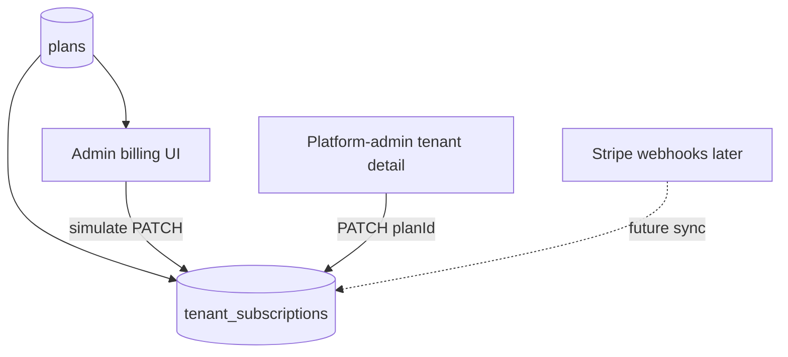

# Simulated plan change + DB SSOT

## Current state

| Concern | SSOT today | Gap |
|--------|------------|-----|
| Plan catalog (limits, marketing, display prices) | `plans` table, edited in platform-admin **Plans** | Already done |
| Owner pricing cards | `GET /plans/pricing` → [`public-plans.service.ts`](apps/api/src/modules/subscriptions/application/public-plans.service.ts) | Already done |
| Tenant entitlements | `tenant_subscriptions.plan_id` → `plans.limits` (+ `limits_override`) | Already done |
| Ops plan assignment | `PATCH /platform/tenants/:id` with `planId` in [`platform-tenants.service.ts`](apps/api/src/modules/platform/application/platform-tenants.service.ts) | Already works |
| **Owner self-serve upgrade** | `POST /tenants/current/subscription/checkout` → Stripe only in [`subscription-billing.service.ts`](apps/api/src/modules/subscriptions/application/subscription-billing.service.ts) | **Blocks local testing without Stripe** |



## Step 1 — Bootstrap local DB

From repo root (after Postgres is up):

```bash
pnpm prisma:migrate   # applies pending migrations incl. 20260624200000_plan_catalog_config
pnpm prisma:seed      # upserts SEED_PLANS marketing fields + demo tenant on pilot
```

Verify: platform-admin **Plans** shows Starter/Pro prices; demo tenant owner sees billing cards from API (not static fallback).

## Step 2 — API: simulated plan change (OWNER)

Add core logic in [`subscriptions.service.ts`](apps/api/src/modules/subscriptions/application/subscriptions.service.ts):

```typescript
async changePlan(tenantId: string, planSlug: PaidPlanSlug): Promise<TenantSubscriptionDto>
```

Behavior:
- Resolve plan by `planSlug` (`starter` | `pro` per [`paidPlanSlugSchema`](packages/contracts/src/dto/subscription.dto.ts))
- Reject if same `planId` already (idempotent-friendly 400 or no-op — prefer no-op + return current)
- Update `tenant_subscriptions`: `planId`, `status: "active"`, clear `trialEndsAt` when leaving trial
- Return `toSubscriptionDto` with updated limits from joined plan

**Gate** (new helper in subscriptions module, e.g. `billing-mode.util.ts`):

| Condition | Simulated checkout |
|-----------|-------------------|
| `BILLING_SIMULATE_CHECKOUT=true` | Yes |
| `BILLING_SIMULATE_CHECKOUT=false` | No (Stripe only) |
| Unset + no `STRIPE_SECRET_KEY` | Yes (auto dev default) |
| Unset + Stripe configured | No |

Expose only when simulated:

- **Route:** `PATCH ROUTES.TENANTS.SUBSCRIPTION` (add to [`routes.ts`](packages/contracts/src/routes.ts))
- **Body:** `changeSubscriptionPlanSchema = { planSlug: paidPlanSlugSchema }`
- **Controller:** new handler on [`subscription-billing.controller.ts`](apps/api/src/modules/subscriptions/interface/http/subscription-billing.controller.ts) (or extend [`tenants.controller.ts`](apps/api/src/modules/tenants/interface/http/tenants.controller.ts)) — `@TenantRoles("OWNER")`, returns `TenantSubscriptionDto`
- **403** when gate is off (production with Stripe)

Also expose mode on existing GET subscription so the UI does not need a separate public env flag:

- Add `billingMode: "stripe" | "simulated"` to [`tenantSubscriptionSchema`](packages/contracts/src/dto/tenant.dto.ts)
- Set in [`subscriptions.mapper.ts`](apps/api/src/modules/subscriptions/application/subscriptions.mapper.ts) via the same gate helper

## Step 3 — Admin billing UI

Update [`account-billing-page.tsx`](apps/admin/src/features/account/account-billing-page.tsx):

- Read `subscription.billingMode`
- When `simulated`: on upgrade click call new hook `useChangeSubscriptionPlan()` (in [`use-subscription-billing.ts`](packages/web-shared/src/features/tenant/use-subscription-billing.ts)) → `PATCH TENANTS.SUBSCRIPTION`
- On success: `reload()` from [`useTenantSubscription`](packages/web-shared/src/features/tenant/use-tenant-subscription.ts), toast e.g. "Plan updated to Pro"
- When `stripe`: keep existing `createCheckout` redirect
- Optional copy tweak when simulated: small note under cards — "Payments are simulated in this environment"

No change to pricing tier source — still `usePricingPlans()` with static fallback only when API empty.

## Step 4 — Docs + env

Update:
- [`docs/specs/subscriptions.md`](docs/specs/subscriptions.md) — document `PATCH` simulate route, `billingMode`, gate table
- [`docs/development/ENVIRONMENT.md`](docs/development/ENVIRONMENT.md) — `BILLING_SIMULATE_CHECKOUT` (optional; auto when Stripe unset)
- [`apps/api/.env.example`](apps/api/.env.example) — comment that omitting `STRIPE_SECRET_KEY` enables simulated billing

Clarify SSOT in [`docs/specs/plans.md`](docs/specs/plans.md): display prices and limits come from `plans`; **active plan for a tenant** is always `tenant_subscriptions.plan_id`; Stripe IDs are optional until real checkout.

## Step 5 — Tests

Per [`chronomint-test-delivery`](.cursor/skills/chronomint-test-delivery/SKILL.md):

| Layer | Test |
|-------|------|
| Unit | `subscriptions.service.spec.ts` — `changePlan` updates planId, sets active, clears trial |
| Unit | billing-mode helper — gate matrix |
| E2E API | New `subscription-plan-change.e2e.ts` — owner PATCH starter→pro, GET subscription reflects new planName/limits; 403 when `BILLING_SIMULATE_CHECKOUT=false` + Stripe configured |
| Playwright | Update [`account-billing.spec.ts`](apps/admin/e2e/account-billing.spec.ts) — mock PATCH or run against API with simulate; assert current-plan badge moves after upgrade click |

## Manual test script (your buddy flow)

1. `pnpm prisma:migrate && pnpm prisma:seed`
2. Start API + admin + platform-admin (`pnpm dev` or split serve)
3. **Platform-admin:** edit Starter price on **Plans** → reload admin billing → price updates (pricing SSOT)
4. Login as demo tenant **owner** → **Account → Billing** → click **Upgrade to Starter** (or Pro)
5. Confirm: toast, "Current plan" badge on new tier, `GET /tenants/current/subscription` shows new `planName` + limits
6. **Platform-admin → Tenant detail:** plan dropdown matches same plan
7. Later: set `STRIPE_SECRET_KEY` + `BILLING_SIMULATE_CHECKOUT=false` → upgrade redirects to Stripe again

## Out of scope (deferred)

- Stripe webhook sync / price alignment
- Yearly checkout
- Portal simulation (manage button stays disabled without `stripeCustomerId` — acceptable)

## Files to touch (primary)

- Contracts: [`subscription.dto.ts`](packages/contracts/src/dto/subscription.dto.ts), [`tenant.dto.ts`](packages/contracts/src/dto/tenant.dto.ts), [`routes.ts`](packages/contracts/src/routes.ts)
- API: [`subscriptions.service.ts`](apps/api/src/modules/subscriptions/application/subscriptions.service.ts), [`subscription-billing.controller.ts`](apps/api/src/modules/subscriptions/interface/http/subscription-billing.controller.ts), [`subscriptions.mapper.ts`](apps/api/src/modules/subscriptions/application/subscriptions.mapper.ts)
- FE: [`use-subscription-billing.ts`](packages/web-shared/src/features/tenant/use-subscription-billing.ts), [`account-billing-page.tsx`](apps/admin/src/features/account/account-billing-page.tsx)
- Tests + docs listed above
