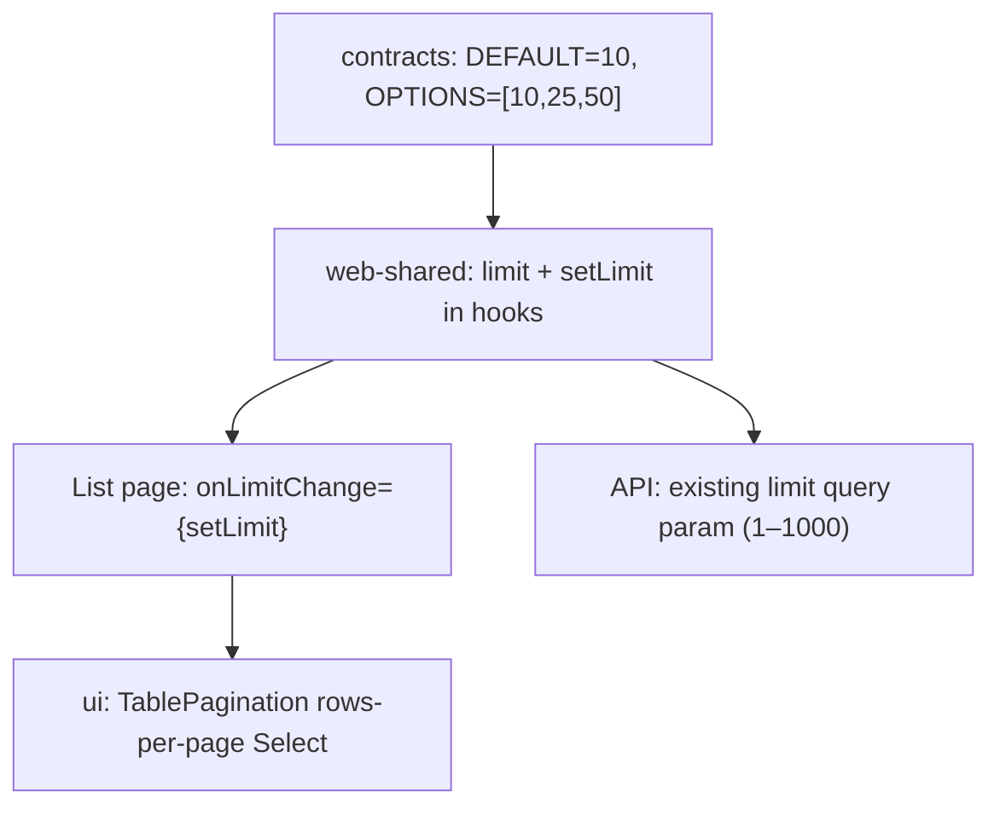

# Global table rows-per-page selector

## Problem

[`TablePagination`](packages/ui/src/components/data-table/data-table.tsx) only renders Previous/Next. Server and client list hooks hard-code `DEFAULT_TABLE_PAGE_SIZE` (currently **20**) via [`usePaginatedList`](packages/web-shared/src/hooks/use-paginated-list.ts) and [`buildTableQuery`](packages/web-shared/src/api/list-query.ts). There is no UI or state for changing page size.

## Approach

Treat rows-per-page as a **shared table contract**, not per-page copy-paste:



**Selector visibility:** show the dropdown only when `onLimitChange` is passed. List pages opt in; compact widgets (hourly rates, team utilization, report charts, share page) keep prev/next-only footers with no code changes.

**Default:** `DEFAULT_TABLE_PAGE_SIZE` changes from `20` → **`10`**. No localStorage; each visit starts at 10.

## 1. Contracts (source of truth)

File: [`packages/contracts/src/pagination.ts`](packages/contracts/src/pagination.ts)

- Change `DEFAULT_TABLE_PAGE_SIZE` to `10`
- Add `TABLE_PAGE_SIZE_OPTIONS = [10, 25, 50] as const` and `TablePageSize` type
- Update `tablePaginationQuery(page, search?, extra?, limit?)` to use the passed limit (default `DEFAULT_TABLE_PAGE_SIZE`)
- Update [`packages/contracts/src/pagination.spec.ts`](packages/contracts/src/pagination.spec.ts) for new default and options

No API module changes needed — endpoints already accept `limit` via `listPaginationQuerySchema` and `paginationSkipTake`.

## 2. UI component (global table footer)

File: [`packages/ui/src/components/data-table/data-table.tsx`](packages/ui/src/components/data-table/data-table.tsx)

Extend `TablePaginationProps`:

```ts
onLimitChange?: (limit: number) => void;
pageSizeOptions?: readonly number[]; // default TABLE_PAGE_SIZE_OPTIONS from contracts
```

Footer layout (left → right on `sm+`):

- `Showing X–Y of Z`
- **Rows per page** `Select` (10 / 25 / 50) — only when `onLimitChange` is set
- Previous | Page N of M | Next

Use existing `@kloqra/ui` `Select` primitives for consistency with other filters.

Tests: [`packages/ui/src/components/data-table/data-table.spec.tsx`](packages/ui/src/components/data-table/data-table.spec.tsx) — selector renders when `onLimitChange` provided, calls handler with new value, hides when omitted.

## 3. Shared data layer (web-shared)

### `usePaginatedList` — primary hook for 7 list pages

File: [`packages/web-shared/src/hooks/use-paginated-list.ts`](packages/web-shared/src/hooks/use-paginated-list.ts)

- Add `limit` state initialized to `DEFAULT_TABLE_PAGE_SIZE`
- Return `setLimit`
- Pass `limit` into `fetchPaginatedList`
- Reset `page` to `1` when `limit` changes (same as search/filter reset)
- Replace hard-coded `limit: DEFAULT_TABLE_PAGE_SIZE` in return value with live state

Tests: [`packages/web-shared/src/hooks/use-paginated-list.spec.ts`](packages/web-shared/src/hooks/use-paginated-list.spec.ts) — changing limit refetches with new `limit` and resets page.

### Query helpers

File: [`packages/web-shared/src/api/list-query.ts`](packages/web-shared/src/api/list-query.ts)

- `buildTableQuery(page, search?, filters?, limit?)` — pass `limit ?? DEFAULT_TABLE_PAGE_SIZE`

### Custom hooks / inline fetches

| File | Change |
|------|--------|
| [`use-team-members-overview.ts`](apps/admin/src/features/team-management/use-team-members-overview.ts) | Add `limit` / `setLimit` state; pass to `buildTableQuery`; reset page on limit change |
| [`project-team-tab.tsx`](apps/admin/src/features/projects/project-team-tab.tsx) | Init `limit` to `DEFAULT_TABLE_PAGE_SIZE` (10); pass user `limit` into `buildTableQuery` instead of API echo-only `setLimit(data.limit)`; wire `onLimitChange` |

`usePaginatedNotifications` in [`use-notifications.ts`](packages/web-shared/src/hooks/use-notifications.ts) inherits `setLimit` automatically via `usePaginatedList`.

## 4. List page rollout (admin + client)

Each page: destructure `setLimit` from hook and add `onLimitChange={setLimit}` to `TablePagination`.

**Admin (5)**
- [`team-management-page.tsx`](apps/admin/src/features/team-management/team-management-page.tsx)
- [`projects-list-page.tsx`](apps/admin/src/features/projects/projects-list-page.tsx)
- [`categories-page.tsx`](apps/admin/src/features/categories/categories-page.tsx)
- [`billing-page.tsx`](apps/admin/src/features/billing/billing-page.tsx)
- [`project-team-tab.tsx`](apps/admin/src/features/projects/project-team-tab.tsx)

**Client (3)**
- [`projects-page.tsx`](apps/client/src/features/projects/projects-page.tsx)
- [`tasks-page.tsx`](apps/client/src/features/tasks/tasks-page.tsx)
- [`member-project-tasks-tab.tsx`](apps/client/src/features/projects/member-project-tasks-tab.tsx)

**Shared (1)**
- [`notifications-page.tsx`](packages/web-shared/src/features/notifications/notifications-page.tsx)

## 5. Explicitly out of scope

No selector, no hook changes:

- [`hourly-rates-widget.tsx`](apps/admin/src/features/dashboard/widgets/hourly-rates-widget.tsx) — `WIDGET_PAGE_SIZE = 5`
- [`team-utilization-widget.tsx`](apps/admin/src/features/dashboard/team-utilization-widget.tsx)
- [`report-charts.tsx`](apps/admin/src/components/report-charts.tsx) — client-side slice, fixed 10
- [`share/[token]/page.tsx`](apps/admin/src/app/share/[token]/page.tsx) — fixed 15
- Client time tracker — cursor “Load more”, not `TablePagination`

## 6. Tests & verification

| Layer | What to add/update |
|-------|-------------------|
| Contracts | Default 10, options constant, `tablePaginationQuery` with custom limit |
| UI | Selector render + change handler |
| web-shared | `usePaginatedList` limit change behavior |
| E2E | [`team-management.spec.ts`](apps/admin/e2e/team-management.spec.ts): footer shows 10/25/50 options; switching to 25 updates “Showing …” range |
| Sweep | Fix any specs still assuming default 20 (e.g. `data-table.spec.tsx` page-range math can keep `limit={20}` explicitly in its fixture) |

Pre-PR gate: `pnpm format:check && pnpm lint && pnpm typecheck && pnpm test && pnpm build`

## Implementation order

1. Contracts constants + specs
2. `TablePagination` UI + specs
3. `buildTableQuery` + `usePaginatedList` + specs
4. Custom hooks (`useTeamMembersOverview`, `project-team-tab`)
5. Wire all 9 list pages (mechanical `onLimitChange={setLimit}`)
6. E2E on Team Management (reporter bug)

## Risk notes

- **Default 20 → 10** affects first-load row counts everywhere `DEFAULT_TABLE_PAGE_SIZE` is used; list pages will show fewer rows until user picks 25/50. This matches your preference.
- **project-team-tab** currently overwrites local `limit` from API response; after this change, user-selected `limit` must drive the request (API response `limit` should match and can still be synced for safety).
- Widgets remain unchanged because they omit `onLimitChange`.
