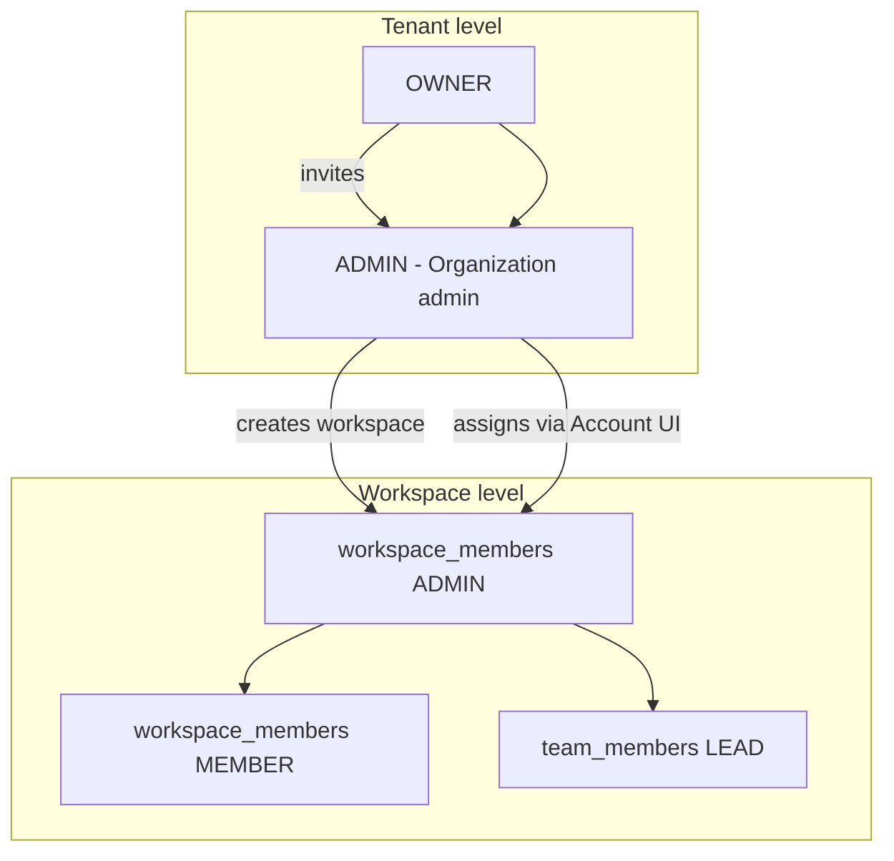

# Tenant admin role + workspace admin management

## Context

The schema already has `tenant_members.role = ADMIN` ([`tenant-rbac.ts`](packages/contracts/src/tenant-rbac.ts)). Today it is a **narrow API delegate** (can only `GET /tenants/current/members`). Your request maps to **expanding this role** into an **Organization admin** with operational powers, not adding a third tenant role.

Confirmed scope:
- **Organization admin** (`tenant ADMIN`): org profile, workspace creation, workspace-admin assignment + management UI
- **Organization owner** (`tenant OWNER`) only: subscription/billing, data export, inviting/managing other organization admins



---

## Phase 1 — Contracts and docs (contract-first)

### Update role matrix
- [`docs/specs/tenants.md`](docs/specs/tenants.md) and [`docs/architecture/TENANT_RBAC.md`](docs/architecture/TENANT_RBAC.md): document expanded Organization admin powers and OWNER-only exclusions (billing, data export, tenant-member invite).

### New DTOs — workspace admins overview (tenant-scoped)
Add [`packages/contracts/src/dto/workspace-admin.dto.ts`](packages/contracts/src/dto/workspace-admin.dto.ts) (mirror [`project-manager.dto.ts`](packages/contracts/src/dto/project-manager.dto.ts)):

| Field | Purpose |
|-------|---------|
| `workspaceMemberId`, `userId`, `userName`, `userEmail` | Row identity |
| `workspaceId`, `workspaceName` | Which workspace they admin |
| `isActive`, `status`, `weekHours`, `lastActiveAt`, `isTrackingNow` | Same activity model as team overview |
| `pendingCredentials` | Resend-email affordance |

Query schema: `search`, `workspaceId`, `status`, `membershipActive`, `page`, `limit`.

Summary: `totalAdmins`, `activeAdmins`, `workspacesWithAdmins`.

### New routes in [`packages/contracts/src/routes.ts`](packages/contracts/src/routes.ts)
- `ROUTES.TENANTS.WORKSPACE_ADMINS_OVERVIEW` → `GET /tenants/current/workspace-admins/overview`
- `ROUTES.TENANTS.WORKSPACE_MEMBER(workspaceId, memberId)` → tenant-scoped PATCH/DELETE for org admins acting without workspace JWT
- `ROUTES.TENANTS.WORKSPACE_MEMBER_RESEND(workspaceId, memberId)` → resend credentials

### RBAC decorator expansion (controller level)
Change `@TenantRoles("OWNER")` → `@TenantRoles("OWNER", "ADMIN")` on:
- `PATCH ROUTES.TENANTS.CURRENT` ([`tenants.controller.ts`](apps/api/src/modules/tenants/interface/http/tenants.controller.ts))
- `POST ROUTES.TENANTS.WORKSPACES`
- `POST ROUTES.WORKSPACES.ASSIGN_ADMIN`

Keep **OWNER-only**: overview, analytics, subscription, invite/patch tenant members, compliance routes.

### Service guards
Replace `requireTenantOwner` / `requireTenantOwnerInTenant` with `requireTenantOwnerOrAdmin` in:
- [`tenants.service.ts`](apps/api/src/modules/tenants/application/tenants.service.ts) `updateCurrent`
- [`workspace.service.ts`](apps/api/src/modules/workspace/application/workspace.service.ts) `create`, `assignAdminAsTenantOwner`

Rename `assignAdminAsTenantOwner` → `assignAdminAsTenantOperator` (or keep name, widen guard internally).

Add contract specs in `*.spec.ts` + update [`contracts.spec.ts`](packages/contracts/src/contracts.spec.ts).

---

## Phase 2 — API: workspace admins overview + tenant-scoped mutations

### New service
[`apps/api/src/modules/tenants/application/tenant-workspace-admins-overview.service.ts`](apps/api/src/modules/tenants/application/tenant-workspace-admins-overview.service.ts)

Pattern: copy enrichment approach from [`workspace-members-overview.service.ts`](apps/api/src/modules/workspace/application/workspace-members-overview.service.ts), but query:

```sql
workspace_members WHERE role = 'ADMIN' AND workspace.tenantId = :tenantId
```

Group is **one row per admin assignment** (same person in 2 workspaces = 2 rows). Filters applied in DB + in-memory status filter, then paginate.

### Tenant-scoped member mutations
Org admins cannot call existing `PATCH /workspaces/:id/members/:memberId` because [`assertWorkspaceRoute`](apps/api/src/modules/workspace/interface/http/workspace.controller.ts) requires JWT `workspaceId` match.

Add tenant-scoped wrappers on [`tenants.controller.ts`](apps/api/src/modules/tenants/interface/http/tenants.controller.ts):
- `PATCH` demote (`role: MEMBER`), deactivate (`isActive: false`)
- `DELETE` remove from workspace
- `POST` resend credentials

All guarded by `@TenantRoles("OWNER", "ADMIN")` + verify `workspace.tenantId === user.tenantId`. Reuse `WorkspaceService.updateMember` / `removeMember` / resend logic after tenant+workspace ownership check.

### Tests
- Unit: `tenant-workspace-admins-overview.service.spec.ts`
- E2E: extend [`apps/api/test/tenants.e2e.ts`](apps/api/test/tenants.e2e.ts) — org admin can PATCH tenant profile, create workspace, assign workspace admin, list overview; blocked on subscription + invite tenant admin

---

## Phase 3 — Account mode access model (admin shell)

Today [`admin-shell.tsx`](apps/admin/src/components/admin-shell.tsx) blocks all `/account/*` for non-OWNER (`tenantRole !== "OWNER"` → redirect `/dashboard`).

### Split account navigation
Refactor [`account-nav.ts`](apps/admin/src/config/account-nav.ts) into pools:

| Nav item | OWNER | Org admin |
|----------|-------|-----------|
| Overview (`/account`) | Yes | No |
| Workspaces | Yes | Yes |
| **Workspace admins** (`/account/workspace-admins`) | Yes | Yes |
| Organization | Yes | Yes |
| Subscription | Yes | No |
| Data & privacy | Yes | No |
| **Organization members** (`/account/members`) | Yes | No |

Add resolver similar to [`resolve-admin-shell-nav.ts`](apps/admin/src/lib/resolve-admin-shell-nav.ts): `resolveAccountNavItems(tenantRole)`.

### Shell changes
- Allow `tenantRole === "ADMIN"` into account mode for allowed paths only
- Redirect org admin away from OWNER-only routes (`/account`, `/account/billing`, `/account/data-privacy`, `/account/members`)
- Update [`resolve-admin-landing-path.ts`](packages/web-shared/src/auth/resolve-admin-landing-path.ts): org admin → `/account/workspaces` (or `/account/organization` if `pending_setup`)

### Labels (avoid “Admin” confusion)
Extend [`admin-access-label.ts`](packages/web-shared/src/auth/admin-access-label.ts):
- `tenantRole === "ADMIN"` → **Organization admin** (not workspace Admin)
- `tenantRole === "OWNER"` → **Organization owner**
- Workspace `ADMIN` stays **Workspace admin** where cross-role context matters

---

## Phase 4 — Admin UI pages

### A) Workspace admins management (primary ask)
New feature folder [`apps/admin/src/features/account/workspace-admins/`](apps/admin/src/features/account/workspace-admins/) patterned after [`project-managers-page.tsx`](apps/admin/src/features/project-managers/project-managers-page.tsx):

- `use-workspace-admins-overview.ts` → `GET TENANTS.WORKSPACE_ADMINS_OVERVIEW`
- `workspace-admins-page.tsx` with `AppBar` + `AppBarListToolbar`
- **Search**: name/email
- **Filters**: workspace, activity status, membership active/inactive
- **Pagination**: `TablePagination` + `DEFAULT_TABLE_PAGE_SIZE`
- **Summary cards**: total admins, active admins, workspaces with admins
- **Row action menu** (popover, like [`team-member-actions.tsx`](apps/admin/src/features/team-management/team-member-actions.tsx)):
  - View profile
  - Assign to another workspace (reuse [`workspace-admin-assign-dialog.tsx`](apps/admin/src/features/account/components/workspace-admin-assign-dialog.tsx))
  - Resend sign-in email
  - Deactivate / activate
  - Demote to member / remove
  - View as member (impersonate, if workspace membership exists)
- Route: [`apps/admin/src/app/(admin)/account/workspace-admins/page.tsx`](apps/admin/src/app/(admin)/account/workspace-admins/page.tsx)

### B) Open existing account pages to org admin
- [`account-workspaces-page.tsx`](apps/admin/src/features/account/account-workspaces-page.tsx): replace `isOwner` gate with `canManageOrganization(session)` for create + assign buttons
- [`account-organization-page.tsx`](apps/admin/src/features/account/account-organization-page.tsx): same gate for profile edit

### C) Organization members (OWNER-only — invite tenant admins)
New [`apps/admin/src/features/account/organization-members/`](apps/admin/src/features/account/organization-members/) page:
- List `GET /tenants/current/members`
- Invite dialog → `POST /tenants/current/members` with `role: "ADMIN"`
- Deactivate tenant admin delegates
- Route: `/account/members`
- Wire existing but unused [`use-tenant-members.ts`](packages/web-shared/src/features/tenant/use-tenant-members.ts)

### D) Enhance account workspaces table (light)
Show admin count per workspace (from overview summary or small field on workspace list) so owners/admins see coverage before opening Workspace admins page.

---

## Phase 5 — Tests and verification

| Layer | Tests |
|-------|-------|
| Contracts | `workspace-admin.dto.spec.ts`, route assertions |
| API | overview service spec + `tenants.e2e.ts` RBAC matrix |
| Admin unit | `resolve-account-nav.spec.ts`, access-label spec |
| Admin e2e | `account-workspace-admins.spec.ts` — org admin list/filter/assign; owner invite tenant admin on `/account/members`; org admin blocked from billing |
| Existing | Update [`account-nav-scope.spec.ts`](apps/admin/e2e/account-nav-scope.spec.ts) for org admin account chrome |

Pre-PR: `pnpm format:check && pnpm lint && pnpm typecheck && pnpm test && pnpm build`

---

## Out of scope (defer)

- Billing/subscription for org admin
- Org admin inviting other org admins
- Bulk workspace-admin import
- Renaming DB enum value `ADMIN` (keep schema; change UI copy only)
- Workspace-mode `/workspace-admins` alias (account-mode page is the right surface for cross-workspace roster)

---

## Implementation order

1. Contracts + failing specs
2. API RBAC widen + overview service + tenant-scoped mutations
3. Account nav resolver + shell access
4. Workspace admins page (main deliverable)
5. Organization members page (owner invite flow)
6. Label polish + e2e
