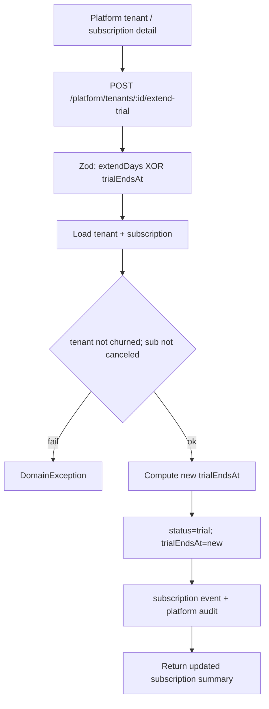

# Tenant-level trial extension (platform-admin)

## Decisions (locked)

- **Actor:** Platform SUPERADMIN only (not tenant OWNER self-serve)
- **UX:** Preset `+7` / `+14` / `+30` day buttons **and** optional custom end date
- **Storage:** Reuse existing [`TenantSubscription.trialEndsAt`](apps/api/prisma/schema.prisma) — no migration
- **Pattern:** Dedicated ops route mirroring grace-period ([`PLATFORM.TENANT_GRACE_PERIOD`](packages/contracts/src/routes.ts)), not a PATCH field on the general tenant update DTO

## Behavior

**Request body** (XOR — exactly one):

| Field | Rules |
|-------|--------|
| `extendDays` | int 1–90 |
| `trialEndsAt` | ISO datetime; must be strictly after now; max 365 days from now |

**Date math for `extendDays`:**

- `base = max(now, current.trialEndsAt ?? now)`
- `newEndsAt = base + extendDays`
- So an active (not-yet-expired) trial grows from its current end; an expired trial restarts from now + N

**Status side effects:**

- Always set `subscription.status = "trial"` after a successful extend (supports reopening a trial for support cases that were still trial with a past date, or converting an `active`/`past_due`/`suspended` sub back to trial for an explicit ops gift)
- Reject when tenant `status === "churned"` or subscription `status === "canceled"` or no subscription row

**Audit / timeline:**

- `SubscriptionLifecycleService.recordEvent` with `eventType: "trial_extended"` and metadata `{ previousTrialEndsAt, trialEndsAt, extendDays? }`
- Platform audit action `tenant.trial_extended` (same style as `tenant.grace_period_update`)

**Out of scope (this change):**

- Owner self-serve extend
- Auto-expiry cron that flips expired `trial` → blocked status (existing gap; leave unchanged)
- Stripe `trial_end` sync reverse-write (local DB is source of truth for simulated/manual trials; Stripe-billed tenants remain extendable in-app for ops; Stripe trial end is not patched in this pass)

## Contract-first ([`packages/contracts`](packages/contracts/src/))

1. Route: `PLATFORM.TENANT_EXTEND_TRIAL: (id) => /platform/tenants/${id}/extend-trial`
2. DTO: `extendPlatformTenantTrialSchema` + response returning updated subscription fields already used on detail (`trialEndsAt`, `status`, `billingAlert` if available)
3. Error code if useful: reuse validation/`NOT_FOUND` patterns; add `TRIAL_EXTEND_NOT_ALLOWED` only if existing codes are a poor fit
4. Update [`packages/contracts/src/contracts.spec.ts`](packages/contracts/src/contracts.spec.ts) / DTO specs
5. Note in [`docs/specs/subscriptions.md`](docs/specs/subscriptions.md): platform extend-trial route + `trial_extended` event type

## API ([`apps/api`](apps/api/src/modules/platform/))

1. Controller method on [`platform-operations-controls.controller.ts`](apps/api/src/modules/platform/interface/http/platform-operations-controls.controller.ts) (already `PlatformSuperadminGuard`)
2. Service method on [`platform-operations-controls.service.ts`](apps/api/src/modules/platform/application/platform-operations-controls.service.ts) — or a thin method on [`platform-tenants.service.ts`](apps/api/src/modules/platform/application/platform-tenants.service.ts) if subscription lifecycle injection is cleaner there; prefer **platform-tenants** if lifecycle is already wired, else extend ops-controls and inject `SubscriptionLifecycleService`
3. Unit tests: date math (active vs expired base), XOR validation, churned/canceled rejection, status forced to `trial`, audit + lifecycle called
4. Optional thin e2e in `apps/api/test/` if existing platform tenant e2e harness makes it cheap

## Platform-admin UI

Primary surface: [tenant-detail-page.tsx](apps/platform-admin/src/features/tenants/tenant-detail-page.tsx) — new “Trial” card under plan stats (shown when subscription exists and not `canceled`):

- Display current trial end (or “—” / “expired”)
- Buttons: **+7 days**, **+14 days**, **+30 days**
- Custom date input + **Set end date**
- Confirm copy: “New trial ends …” before submit; refresh detail on success

Secondary: [subscription-detail-page.tsx](apps/platform-admin/src/features/subscriptions/subscription-detail-page.tsx) — same controls next to the existing Trial Period block so ops working from the subscriptions console can extend without hopping to tenants.

Playwright: extend coverage in existing platform-admin tenant/subscription e2e (mock or API) so the buttons hit the route.

## Tests (required)

- Contracts: schema rejects both fields / neither / `extendDays` 0 / past `trialEndsAt`
- API unit: base-date math + status/guards + events
- Platform-admin e2e or feature spec: presets + custom date path

## Delivery order

1. Contracts + spec doc note
2. Failing API/contract tests
3. API implementation
4. Platform-admin UI + e2e
5. Pre-PR: `pnpm format:check && pnpm lint && pnpm typecheck && pnpm test && pnpm build`
