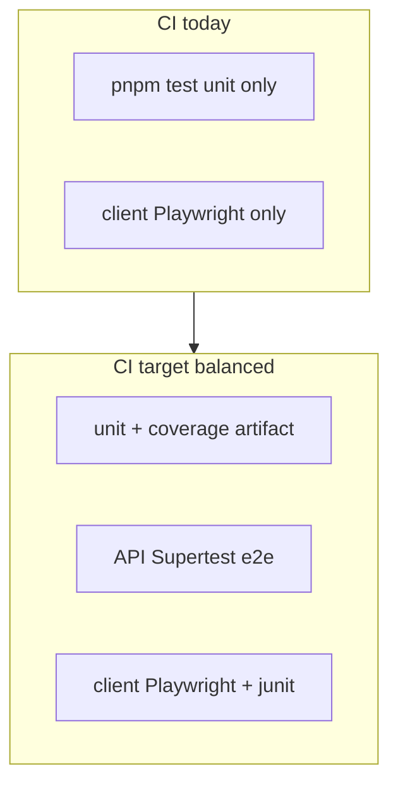

# Test coverage hardening (balanced)

## Current state (updated)

You already have more than the old plan assumed, but **no coverage tooling** and **uneven CI enforcement**.

| Layer               | Status                                                                                                                                                              | Gap                                                                                                    |
| ------------------- | ------------------------------------------------------------------------------------------------------------------------------------------------------------------- | ------------------------------------------------------------------------------------------------------ |
| **Unit (Vitest)**   | ~21 `*.spec.ts` files — API export utils, auth/users/tasks/categories/reporting/timelogs, contracts, `calendar-utils`                                               | **14 API services have no spec** (timer, projects, workspace, billing, timesheets, etc.)               |
| **API integration** | 3 Supertest specs: [`health.e2e.ts`](apps/api/test/health.e2e.ts), [`users.e2e.ts`](apps/api/test/users.e2e.ts), [`timelogs.e2e.ts`](apps/api/test/timelogs.e2e.ts) | **Not run in CI** — [`.github/workflows/ci.yml`](.github/workflows/ci.yml) only runs client Playwright |
| **Browser e2e**     | Client: smoke + impersonation ([`impersonation.spec.ts`](apps/client/e2e/impersonation.spec.ts))                                                                    | Admin has **no Playwright**; no junit/html artifacts                                                   |
| **Coverage**        | None — [`vitest.config.ts`](apps/api/vitest.config.ts) has no `coverage` block                                                                                      | `coverage/` is gitignored but never produced                                                           |
| **Frontend unit**   | Client: 1 spec; Admin: **`passWithNoTests`**                                                                                                                        | No RTL/component tests                                                                                 |



**Untested API services (priority order for balanced pass):**

1. [`timer.service.ts`](apps/api/src/modules/timer/application/timer.service.ts) + [`stale-timer.service.ts`](apps/api/src/modules/timer/application/stale-timer.service.ts) — Redis state, core product
2. [`projects.service.ts`](apps/api/src/modules/projects/application/projects.service.ts) — RBAC + workspace scoping
3. [`workspace.service.ts`](apps/api/src/modules/workspace/application/workspace.service.ts) — members, impersonation adjacency
4. [`timesheets.service.ts`](apps/api/src/modules/timelogs/application/timesheets.service.ts) — approval workflow
5. Lower priority (defer): billing, presence, export-share, export-schedule, invoice

---

## Phase 1 — Instrumentation and CI visibility (no fail gates)

**Goal:** Every run produces measurable coverage and test artifacts; API integration tests actually run in CI.

### 1.1 Vitest coverage + JUnit reporters

- Add `@vitest/coverage-v8` as a workspace devDependency (root or `apps/api`).
- Extend [`apps/api/vitest.config.ts`](apps/api/vitest.config.ts):

```ts
coverage: {
  provider: "v8",
  reporter: ["text", "lcov", "json-summary"],
  reportsDirectory: "./coverage",
  include: ["src/**/*.ts"],
  exclude: ["src/**/*.spec.ts", "src/main.ts"]
},
reporters: ["default", "junit"],
outputFile: { junit: "./test-results/unit-junit.xml" }
```

- Mirror JUnit output in [`apps/api/vitest.e2e.config.ts`](apps/api/vitest.e2e.config.ts) → `test-results/integration-junit.xml`.
- Add [`packages/contracts/vitest.config.ts`](packages/contracts/vitest.config.ts) with the same reporter pattern (schemas only — small surface).

### 1.2 Root scripts

In [`package.json`](package.json):

```json
"test:coverage": "pnpm --filter @kloqra/contracts build && pnpm --filter @kloqra/api test -- --coverage && pnpm --filter @kloqra/contracts test -- --coverage",
"test:integration": "pnpm --filter @kloqra/api test:e2e"
```

Keep existing `pnpm test` unchanged for speed; CI will call `test:coverage` on the unit job.

### 1.3 CI workflow split (same Postgres/Redis services)

Refactor [`.github/workflows/ci.yml`](.github/workflows/ci.yml) into parallel jobs:

| Job           | Steps                                                             | Artifacts                                             |
| ------------- | ----------------------------------------------------------------- | ----------------------------------------------------- |
| `quality`     | install, prisma generate, migrate, format, lint, typecheck, build | —                                                     |
| `unit`        | `pnpm test:coverage`                                              | `apps/api/coverage/**`, `**/test-results/*-junit.xml` |
| `integration` | seed + `pnpm test:integration` (Supertest, real DB)               | integration JUnit                                     |
| `e2e`         | existing Playwright flow (api + admin dev, client pw)             | Playwright HTML + junit                               |

Use `needs: [quality]` on test jobs. Upload artifacts via `actions/upload-artifact` (7-day retention).

**Critical fix:** Add `pnpm --filter @kloqra/api test:e2e` to CI — today [`users.e2e.ts`](apps/api/test/users.e2e.ts) and [`timelogs.e2e.ts`](apps/api/test/timelogs.e2e.ts) only run locally.

### 1.4 Playwright reporting

Update [`apps/client/playwright.config.ts`](apps/client/playwright.config.ts):

```ts
reporter: [["list"], ["junit", { outputFile: "test-results/playwright-junit.xml" }], ["html", { open: "never" }]],
use: { trace: "on-first-retry", screenshot: "only-on-failure" }
```

### 1.5 Docs

Update [`docs/development/TESTING.md`](docs/development/TESTING.md): coverage commands, artifact paths, which layers run in which CI job, baseline workflow (`pnpm test:coverage` locally before PR).

---

## Phase 2 — High-value tests (balanced scope)

**Goal:** Cover business-critical paths with **real service behavior** (mocked Prisma/Redis), not inline math only.

### 2.1 API unit tests (new specs)

| Module      | File to add                                                                                                            | Cases                                                                          |
| ----------- | ---------------------------------------------------------------------------------------------------------------------- | ------------------------------------------------------------------------------ |
| Timer       | `timer.service.spec.ts`                                                                                                | start/stop, active timer conflict, duration calc; mock `RedisService` + Prisma |
| Stale timer | `stale-timer.service.spec.ts`                                                                                          | stale warning threshold from workspace settings                                |
| Projects    | `projects.service.spec.ts`                                                                                             | list scoped to workspace; create; member vs admin gate                         |
| Workspace   | `workspace.service.spec.ts`                                                                                            | list members; add member; role validation                                      |
| Timesheets  | `timesheets.service.spec.ts`                                                                                           | submit → approve/reject state machine                                          |
| Categories  | extend existing [`categories.service.spec.ts`](apps/api/src/modules/categories/application/categories.service.spec.ts) | delete blocked when `taskCount > 0` (409)                                      |

Pattern: follow existing [`users.service.spec.ts`](apps/api/src/modules/users/application/users.service.spec.ts) — mock `PrismaService`, assert `DomainException` codes from contracts.

### 2.2 API integration tests (new `*.e2e.ts`)

Add under [`apps/api/test/`](apps/api/test/) using the same harness as `users.e2e.ts` (Nest `AppModule` + Supertest + seed data):

| File                | Endpoints                                                  | Why                          |
| ------------------- | ---------------------------------------------------------- | ---------------------------- |
| `auth.e2e.ts`       | login, `/me`, logout                                       | Session + RBAC foundation    |
| `categories.e2e.ts` | CRUD `/categories`, task requires `categoryId`             | New feature regression guard |
| `projects.e2e.ts`   | list/create projects, workspace isolation                  | Admin core flow              |
| `timer.e2e.ts`      | start/stop timer (needs Redis in CI — already provisioned) | Core client feature          |

Optional shared helper: `test/helpers/auth.ts` with `loginAs(email)` to DRY the 3 existing specs.

### 2.3 Client unit tests (minimal)

- Keep [`calendar-utils.spec.ts`](apps/client/src/features/timesheet/calendar-utils.spec.ts).
- Add 1–2 pure-helper specs (e.g. timesheet date grouping) — **no RTL yet** in balanced scope.
- Remove `--passWithNoTests` from [`apps/client/package.json`](apps/client/package.json) once a second spec exists.

Admin stays `passWithNoTests` for now (browser e2e covers admin impersonation).

### 2.4 Strengthen existing thin specs

Review [`timelogs.service.spec.ts`](apps/api/src/modules/timelogs/application/timelogs.service.spec.ts) and [`reporting.service.spec.ts`](apps/api/src/modules/reporting/application/reporting.service.spec.ts) — replace inline arithmetic tests with calls to the actual service methods where feasible.

---

## Phase 3 — Baseline metrics (no fail gate yet)

After Phase 1–2 land on green `main`:

1. Run `pnpm test:coverage` locally; record global % from `coverage/coverage-summary.json`.
2. Commit a **baseline snapshot** (e.g. `docs/development/coverage-baseline.json`) for team reference.
3. Optionally upload lcov to Codecov (free for public repos) for PR diff comments — **informational only**, no required check.

**Suggested future thresholds** (Phase 4, not in balanced pass):

- Global lines: 50% → 60% over time
- Per-module floor: 70% for `auth`, `timelogs`, `timer`, `export`, `reporting`

---

## What we are NOT doing in balanced pass

- Admin Playwright suite (projects/categories UI) — defer to full pyramid
- Coverage fail-gates in CI — defer until baseline is stable 2–3 sprints
- Turborepo remote cache / CI job splitting for speed — separate infra task
- `packages/ui` component tests

---

## Success criteria

- CI runs **unit + coverage artifact + API integration + client Playwright**
- New specs for timer, projects, workspace, timesheets, auth/categories/projects/timer integration
- `pnpm test:coverage` produces lcov + summary locally and in CI artifacts
- [`TESTING.md`](docs/development/TESTING.md) documents the pyramid and commands
- No coverage threshold failures until team agrees on baseline (Phase 3 → 4)

## Estimated effort

| Phase                          | Effort     |
| ------------------------------ | ---------- |
| Phase 1 (instrumentation + CI) | ~0.5–1 day |
| Phase 2 (balanced tests)       | ~2–3 days  |
| Phase 3 (baseline doc)         | ~0.5 day   |
