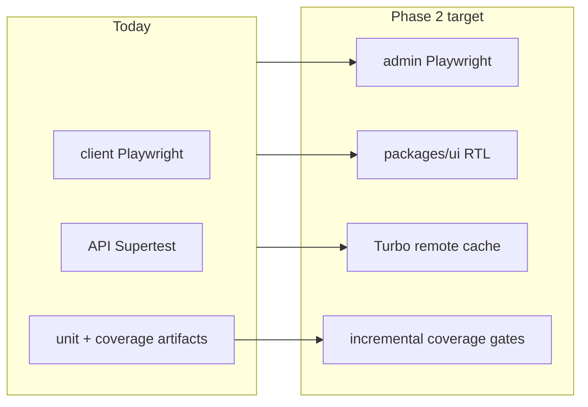

# Test pyramid phase 2

## Builds on

The [balanced hardening pass](test_coverage_hardening_e657c5ab.plan.md) delivered:

- CI split: `quality` → `unit` (coverage) → `integration` (API Supertest) → `e2e` (client Playwright)
- API unit specs: timer, stale-timer, projects, workspace, timesheets
- API integration: auth, categories, projects, timer + `test/helpers/auth.ts`
- Coverage baseline: API **17.5%** lines, contracts **95.09%** lines ([`coverage-baseline.json`](docs/development/coverage-baseline.json))

This plan covers the **deferred** items from that pass.



---

## Current gaps

| Area                | Today                                               | Gap                                           |
| ------------------- | --------------------------------------------------- | --------------------------------------------- |
| Admin browser e2e   | CI starts admin dev server; **no admin Playwright** | Projects/categories UI unguarded              |
| `packages/ui`       | 16 source files; `test` echoes "no tests"           | Shared primitives untested                    |
| Coverage gates      | Artifacts only; no thresholds                       | API too low (17.5%) for global gate           |
| Build orchestration | pnpm `-r` / `--filter`; **no Turborepo**            | Repeat CI builds lack task-level remote cache |

---

## Phase 1 — Admin Playwright (projects + categories)

**Goal:** Regression guard for admin CRUD flows that already have API e2e coverage.

**Effort:** ~1–2 days (thin slice); ~3–5 days (broader)

### 1.1 Harness (mirror client)

Add to `apps/admin`:

- `@playwright/test` devDependency
- `playwright.config.ts` — baseURL `http://localhost:3002`, same reporters as client (list + junit + html)
- `package.json` scripts: `test:e2e`, `test:e2e:ui` (optional)
- `e2e/helpers/auth.ts` — login as `admin@kloqra.dev` / `password123`, land on dashboard

Reuse patterns from [`apps/client/playwright.config.ts`](apps/client/playwright.config.ts) and [`apps/client/e2e/smoke.spec.ts`](apps/client/e2e/smoke.spec.ts).

### 1.2 Specs (thin, high-value)

| File                     | Flow                   | Assertions                                                                        |
| ------------------------ | ---------------------- | --------------------------------------------------------------------------------- |
| `e2e/smoke.spec.ts`      | `/login` loads         | Heading visible                                                                   |
| `e2e/categories.spec.ts` | Navigate `/categories` | Seeded categories table; create unique category; edit name; delete empty category |
| `e2e/projects.spec.ts`   | Navigate `/projects`   | Seeded projects list; create project with name + client; row appears              |

Use `data-testid` or role-based selectors only where headings/buttons are ambiguous. Prefer accessible roles (`getByRole('button', { name: /add/i })`) per existing client specs.

**Defer:** team invites, task panel, export wizard, dashboard widgets.

### 1.3 CI + root scripts

Update [`.github/workflows/ci.yml`](.github/workflows/ci.yml) `e2e` job:

```bash
pnpm --filter @kloqra/admin test:e2e
pnpm --filter @kloqra/client test:e2e
```

Upload `apps/admin/test-results/playwright-junit.xml` and `apps/admin/playwright-report/**`.

Root [`package.json`](package.json):

```json
"test:e2e": "pnpm test:integration && pnpm --filter @kloqra/admin test:e2e && pnpm --filter @kloqra/client test:e2e"
```

Update [`docs/development/TESTING.md`](docs/development/TESTING.md).

---

## Phase 2 — `packages/ui` component tests

**Goal:** RTL smoke tests for shared primitives before more admin UI grows.

**Effort:** ~0.5–1 day (thin); ~2–3 days (broad)

### 2.1 Harness

Add to `packages/ui`:

- `vitest`, `@vitest/coverage-v8`, `jsdom`, `@testing-library/react`, `@testing-library/jest-dom`
- `vitest.config.ts` — environment `jsdom`, include `src/**/*.spec.tsx`
- Replace `"test": "echo 'no tests'"` with `vitest run`
- Optional: add ui to root `test:coverage` (small surface; fast)

### 2.2 Initial specs (5 components)

| Component            | Cases                                             |
| -------------------- | ------------------------------------------------- |
| `button.tsx`         | renders children; disabled state; variant classes |
| `input.tsx`          | label association; controlled value               |
| `select.tsx`         | opens list; selects option (RTL userEvent)        |
| `confirm-dialog.tsx` | confirm/cancel callbacks                          |
| `project-color.tsx`  | picker renders palette; selection updates         |

**Defer:** chart wrappers, layout-shell, time-entry-audit-trail (heavier deps).

### 2.3 CI

`unit` job already runs `pnpm test:coverage` via `pnpm -r test` — ui tests run automatically once `packages/ui` has a real `test` script. No new CI job needed.

---

## Phase 3 — Coverage fail-gates (incremental)

**Goal:** Turn baseline into enforced floors without blocking the team on day one.

**Effort:** ~0.5 day wiring + 2–3 sprints raising API %

### 3.1 Gate contracts first (safe now)

In [`packages/contracts/vitest.config.ts`](packages/contracts/vitest.config.ts):

```ts
coverage: {
  thresholds: {
    lines: 90,
    statements: 90,
    branches: 70,
    functions: 25  // low today; raise over time
  }
}
```

Contracts at **95%** lines — gate should pass immediately.

### 3.2 API — module floors, not global

**Do not** set a global API lines gate at 17.5%. Instead:

1. Add targeted specs until these **per-path** floors pass (Vitest `coverage.include` + custom script or `istanbul` watermarks):
   - `src/modules/auth/**` → 70%
   - `src/modules/timer/**` → 70%
   - `src/modules/timelogs/**` → 70%
   - `src/modules/export/**` → 70%
   - `src/modules/reporting/**` → 70%

2. When API global lines ≥ **35%**, add soft global floor (30%) in `apps/api/vitest.config.ts`.

3. Refresh [`docs/development/coverage-baseline.json`](docs/development/coverage-baseline.json) each sprint.

### 3.3 CI enforcement

In `unit` job, `pnpm test:coverage` already runs — thresholds fail the job automatically once configured.

**Optional:** Codecov upload (informational PR comments only until team agrees on required check).

### 3.4 Suggested ramp (Phase 4 of gates — future)

| Sprint | Global API lines target |
| ------ | ----------------------- |
| +1     | 25%                     |
| +2     | 35%                     |
| +3     | 50%                     |

---

## Phase 4 — Turborepo + remote cache (infra)

**Goal:** Faster repeat CI and local builds; separate from product quality.

**Effort:** ~1–2 days setup; ~1 day CI secrets + tuning

### 4.1 Introduce Turbo locally

- Add `turbo` devDependency at root
- Create `turbo.json` with pipeline: `build`, `lint`, `typecheck`, `test`, `test:coverage`
- Map `dependsOn: ["^build"]` for apps consuming `contracts` / `ui`
- Replace selective root scripts: `turbo run build lint typecheck test`

Keep `pnpm` workspaces; Turbo orchestrates, does not replace pnpm.

### 4.2 Remote cache

- Vercel Remote Cache (free tier) or self-hosted S3-compatible backend
- CI env: `TURBO_TOKEN`, `TURBO_TEAM`
- Cache hits on: `packages/contracts` build, `packages/ui` build, Next.js compile inputs

### 4.3 CI job note

Jobs are already split (`quality`, `unit`, `integration`, `e2e`). Turbo helps **within** jobs (e.g. `turbo run test --filter=@kloqra/api`) and across PR rebuilds. Further splitting e2e/admin vs e2e/client into parallel jobs is optional (~0.5 day).

---

## What we are NOT doing in this pass

- Full admin UI pyramid (billing, exports, dashboard widgets, team management)
- Global API 50%+ coverage gate on day one
- Visual regression / Percy / Chromatic
- E2E for `packages/web-shared` (covered indirectly via app Playwright)
- Replacing pnpm with npm/yarn

---

## Success criteria

- Admin Playwright: categories + projects CRUD smoke in CI
- `packages/ui`: ≥5 RTL specs; `pnpm test` no longer no-op in ui package
- Contracts coverage gate ≥90% lines in CI
- API module floors documented with at least 2 modules at 70% (auth + timer already close)
- `TESTING.md` updated with admin e2e commands and gate policy
- Turbo remote cache optional but documented if deferred

---

## Recommended execution order

| Order | Phase              | Why                                             |
| ----- | ------------------ | ----------------------------------------------- |
| 1     | Admin Playwright   | Highest product ROI; API e2e already backs CRUD |
| 2     | `packages/ui` RTL  | Cheap; stabilizes shared components             |
| 3     | Contracts gate     | Immediate win at 95% baseline                   |
| 4     | API module floors  | Incremental; pairs with new specs each sprint   |
| 5     | Turbo remote cache | When CI duration becomes painful                |

---

## Estimated effort

| Phase                | Thin slice        | Full pass              |
| -------------------- | ----------------- | ---------------------- |
| Admin Playwright     | 1–2 days          | 3–5 days               |
| `packages/ui` RTL    | 0.5–1 day         | 2–3 days               |
| Coverage gates       | 0.5 day + ongoing | 2–3 sprints to 50% API |
| Turbo + remote cache | 1–2 days          | 2–4 days               |

**Total thin slice:** ~1 week. **Full pyramid extension:** ~2–3 weeks spread across sprints.
