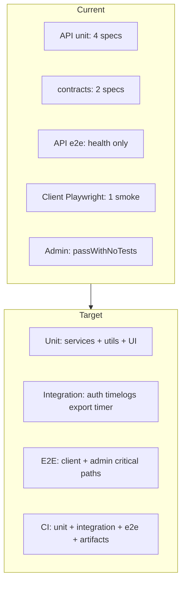
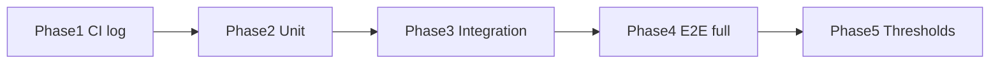

# Kloqra testing: current state and completion plan

## Answer: are tests written?

**Partially.** The repo has scaffolding and a small number of real tests—not a complete unit / integration / e2e suite.

| Layer                | Tooling                                    | Written?      | Where                                                                                                                                                                                                                                                                                    |
| -------------------- | ------------------------------------------ | ------------- | ---------------------------------------------------------------------------------------------------------------------------------------------------------------------------------------------------------------------------------------------------------------------------------------- |
| **Unit**             | Vitest                                     | **Partial**   | [apps/api/src/\*_/_.spec.ts](apps/api/src) (4 files), [packages/contracts/src/\*.spec.ts](packages/contracts/src) (2 files). Several specs test inline math, not service behavior (e.g. [timelogs.service.spec.ts](apps/api/src/modules/timelogs/application/timelogs.service.spec.ts)). |
| **Integration**      | Vitest + Nest + Supertest + Postgres/Redis | **Minimal**   | [apps/api/test/health.e2e.ts](apps/api/test/health.e2e.ts) only. No DB-backed module tests, no Redis/timer integration tests.                                                                                                                                                            |
| **E2E (browser)**    | Playwright                                 | **Minimal**   | [apps/client/e2e/smoke.spec.ts](apps/client/e2e/smoke.spec.ts) (login heading). **Admin: none.**                                                                                                                                                                                         |
| **CI run**           | GitHub Actions                             | **Unit only** | [.github/workflows/ci.yml](.github/workflows/ci.yml) runs `pnpm test`, not `pnpm test:e2e`.                                                                                                                                                                                              |
| **CI log/artifacts** | —                                          | **Missing**   | No JUnit/XML, HTML reports, coverage uploads, or Playwright traces.                                                                                                                                                                                                                      |
| **Docs**             | —                                          | **Missing**   | [docs/development/TESTING.md](docs/development/TESTING.md) is referenced in [docs/README.md](docs/README.md) but does not exist.                                                                                                                                                         |



**Naming in this repo (keep consistent):**

- **Unit** — `src/**/*.spec.ts`, no HTTP/DB (mock `PrismaService` / `RedisService`).
- **Integration** — `apps/api/test/**/*.e2e.ts` (Nest app + Supertest; may use real `DATABASE_URL` / `REDIS_URL`).
- **E2E** — `apps/*/e2e/**/*.spec.ts` (Playwright against running Next apps + API).

Root scripts already exist: `pnpm test` and `pnpm test:e2e` in [package.json](package.json).

---

## Phase 1 — Run, log, and document (foundation)

Goal: every test type runs locally and in CI with persisted logs; no coverage gates yet.

### 1.1 Shared Vitest reporters (unit + API integration)

Add `@vitest/coverage-v8` at workspace root (or api) and extend configs:

- [apps/api/vitest.config.ts](apps/api/vitest.config.ts) — `reporters: ['default', 'junit']`, `outputFile.junit: './test-results/unit-junit.xml'`, `coverage` → `coverage/` (lcov + json).
- [apps/api/vitest.e2e.config.ts](apps/api/vitest.e2e.config.ts) — same JUnit path `test-results/integration-junit.xml`.
- [packages/contracts](packages/contracts) — add `vitest.config.ts` with same reporter pattern.
- [apps/client/vitest.config.ts](apps/client/vitest.config.ts) / new [apps/admin/vitest.config.ts](apps/admin/vitest.config.ts) — `environment: 'jsdom'`, `include: ['src/**/*.spec.ts']`.

Root scripts (additive):

```json
"test:unit": "pnpm -r --filter '!@kloqra/ui' test",
"test:integration": "pnpm --filter @kloqra/api test:e2e",
"test:coverage": "pnpm --filter @kloqra/api test -- --coverage && pnpm --filter @kloqra/contracts test -- --coverage"
```

Remove `--passWithNoTests` from [apps/client/package.json](apps/client/package.json) and [apps/admin/package.json](apps/admin/package.json) once at least one spec exists per app (Phase 2).

### 1.2 Playwright logging (client + admin)

- [apps/client/playwright.config.ts](apps/client/playwright.config.ts) — `reporter: [['list'], ['junit', { outputFile: 'test-results/playwright-junit.xml' }], ['html', { open: 'never' }]]`, `use.trace: 'on-first-retry'`, `screenshot: 'only-on-failure'`.
- Add [apps/admin/playwright.config.ts](apps/admin/playwright.config.ts) — `testDir: ./e2e`, `baseURL: http://localhost:3002`, `webServer` runs admin dev on 3002.
- Add `test:e2e` to admin `package.json`; extend root `test:e2e` to run api integration + client + admin Playwright.

### 1.3 CI workflow split

Refactor [.github/workflows/ci.yml](.github/workflows/ci.yml) into jobs (same Postgres/Redis services for API jobs):

| Job           | Command                                                                   | Artifacts                                       |
| ------------- | ------------------------------------------------------------------------- | ----------------------------------------------- |
| `lint-build`  | lint + build                                                              | —                                               |
| `unit`        | `pnpm test` (workspace unit)                                              | `**/test-results/*-junit.xml`, `**/coverage/**` |
| `integration` | `pnpm --filter @kloqra/api test:e2e`                                      | integration JUnit                               |
| `e2e`         | `pnpm exec playwright install --with-deps` then client + admin `test:e2e` | Playwright HTML + JUnit + traces                |

E2E job must start **API** (port 3001 or whatever [apps/api](apps/api) uses) + seed/migrate, then Playwright `webServer` for each app—or use a composite `scripts/test-e2e.sh` that boots api + client + admin in order. Inspect [scripts/serve.sh](scripts/serve.sh) for reuse.

Upload artifacts via `actions/upload-artifact` (retention 7–14 days). Optionally publish JUnit to GitHub Checks with `dorny/test-reporter` or built-in `publish-unit-test-result` pattern.

### 1.4 Create [docs/development/TESTING.md](docs/development/TESTING.md)

Document: pyramid definitions, env vars (`DATABASE_URL`, `REDIS_URL`, JWT secrets), local commands, where artifacts land, how to debug failed Playwright traces.

---

## Phase 2 — Unit tests (real service coverage)

Priority modules (align with [docs/agent/AGENTS.md](docs/agent/AGENTS.md) TDD flow):

**API** — refactor existing thin specs to test real units:

| Module            | Target file                                                                                                                                                                                    | Approach                                                                                            |
| ----------------- | ---------------------------------------------------------------------------------------------------------------------------------------------------------------------------------------------- | --------------------------------------------------------------------------------------------------- |
| Export            | [export.service.ts](apps/api/src/modules/export/application/export.service.ts), [export-render.util.ts](apps/api/src/modules/export/application/export-render.util.ts)                         | Extend existing specs; mock Prisma + `TimeAggregationService`; assert column projection and totals. |
| Reporting         | [reporting.service.ts](apps/api/src/modules/reporting/application/reporting.service.ts), [time-aggregation.service.ts](apps/api/src/modules/reporting/application/time-aggregation.service.ts) | Replace inline math-only tests with `TimeAggregationService` unit tests (rate resolution order).    |
| Timelogs / Timer  | [timelogs.service.ts](apps/api/src/modules/timelogs/application/timelogs.service.ts), [timer.service.ts](apps/api/src/modules/timer/application/timer.service.ts)                              | Duration, overlap rules, Redis timer state (mock `RedisService`).                                   |
| Auth              | [auth.service.ts](apps/api/src/modules/auth/application/auth.service.ts)                                                                                                                       | Password hash/verify, token payload (mock Prisma).                                                  |
| Projects / access | [project-access.service.ts](apps/api/src/modules/projects/application/project-access.service.ts)                                                                                               | Role checks with fixture users.                                                                     |

**contracts** — keep DTO/schema tests; add cases for export query schema edge cases.

**client / admin** — add Vitest + `@testing-library/react` + `jsdom`:

- Pure helpers (date formatting, export column state) in `src/**/*.spec.ts`.
- 2–3 component tests for high-risk UI (e.g. export column picker, login form validation)—start client, mirror patterns in admin.

**packages/ui** — replace `echo 'no tests'` with Vitest + one smoke render test for a shared component, or exclude from `pnpm -r test` until components exist.

---

## Phase 3 — Integration tests (API + DB)

Add test harness under [apps/api/test/](apps/api/test/):

- `test/helpers/` — `createTestApp()`, `loginAs(user)`, `seedMinimalWorkspace(prisma)` using patterns from [apps/api/prisma/seed.ts](apps/api/prisma/seed.ts) (subset, deterministic IDs).
- `test/setup.ts` — global `beforeAll`: migrate deploy against `DATABASE_URL`; `afterEach` truncate tables or use transaction rollback if feasible.

**New `*.e2e.ts` files (Supertest, real DB):**

1. `auth.e2e.ts` — register/login, cookie session, `/me`.
2. `timelogs.e2e.ts` — CRUD + duration validation.
3. `timer.e2e.ts` — start/stop (Redis required in CI — already provisioned).
4. `export.e2e.ts` — GET export with filters; compare totals to reporting endpoint for same period (matches export plan intent).
5. `projects.e2e.ts` — list/create with workspace scoping.

Use CI `chronomint_test` DB (already in workflow env). Fail fast if `DATABASE_URL` unset when running integration locally.

---

## Phase 4 — Full E2E (client + admin) — your selected scope

Structure per app:

```
apps/client/e2e/
  auth.spec.ts
  timer.spec.ts
  timelogs.spec.ts
apps/admin/e2e/
  auth.spec.ts
  projects.spec.ts
  exports.spec.ts
  reporting.spec.ts
```

**Shared Playwright fixtures** (`e2e/fixtures.ts`):

- API base URL env `API_URL`.
- Login via API or UI using seed users from `prisma:seed` (document test accounts in TESTING.md).
- `storageState` for admin vs member roles.

**Flows to cover (full scope):**

| App    | Flow                                                                              |
| ------ | --------------------------------------------------------------------------------- |
| Client | Login → start timer → stop → see entry on timelogs                                |
| Client | Login failure / logout                                                            |
| Admin  | Admin login → projects list → open project                                        |
| Admin  | Exports page: date range + format + download (mock or assert Content-Disposition) |
| Admin  | Reporting dashboard loads aggregates for seeded range                             |

CI e2e job: migrate + seed → start API → run client Playwright → run admin Playwright (sequential or matrix). Set `reuseExistingServer: !process.env.CI` in Playwright configs.

---

## Phase 5 — Coverage thresholds (after baseline)

Per your choice: **artifacts first, gates later.**

1. Run `pnpm test:coverage` in CI; upload lcov to Codecov/Coveralls (optional) or store as artifact.
2. After Phase 2–3 stabilize, add Vitest `coverage.thresholds` (suggested starting point: **global 50%**, **per-module 70%** for `export`, `reporting`, `auth`).
3. Fail CI only when coverage drops below baseline (use Codecov patch status or checked-in `coverage-summary.json` baseline).

---

## Suggested implementation order



1. Phase 1 (CI + reporters + TESTING.md) — unblocks “run and log” immediately.
2. Phase 2 unit tests for API export/reporting/auth (highest business risk).
3. Phase 3 integration for auth + timelogs + export.
4. Phase 4 parallel client/admin Playwright suites.
5. Phase 5 coverage gates once green baseline on `main`.

---

## Files to touch (summary)

| Area                 | Files                                                                                                                    |
| -------------------- | ------------------------------------------------------------------------------------------------------------------------ |
| CI                   | [.github/workflows/ci.yml](.github/workflows/ci.yml), optional `scripts/test-e2e.sh`                                     |
| API unit/integration | [vitest.config.ts](apps/api/vitest.config.ts), [vitest.e2e.config.ts](apps/api/vitest.e2e.config.ts), `apps/api/test/**` |
| Client/admin e2e     | [playwright.config.ts](apps/client/playwright.config.ts), new `apps/admin/playwright.config.ts`, `**/e2e/*.spec.ts`      |
| Root                 | [package.json](package.json) scripts, devDeps for coverage                                                               |
| Docs                 | [docs/development/TESTING.md](docs/development/TESTING.md)                                                               |

---

## Success criteria

- `pnpm test` — all workspace unit tests pass with JUnit output under `test-results/`.
- `pnpm test:e2e` — API integration + client + admin Playwright pass locally with documented env.
- CI runs unit, integration, and e2e jobs; failed runs retain JUnit + Playwright HTML/traces.
- Coverage artifacts generated every run; thresholds enabled only after agreed baseline (Phase 5).
- Admin no longer uses `passWithNoTests`; client/admin each have unit + e2e coverage for auth, timer/timelogs, and admin export/reporting/projects.
