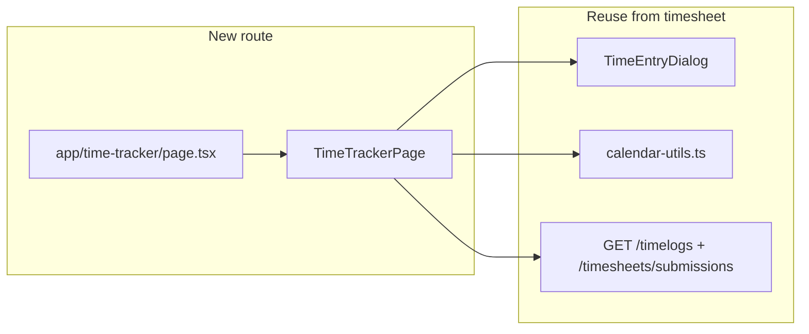
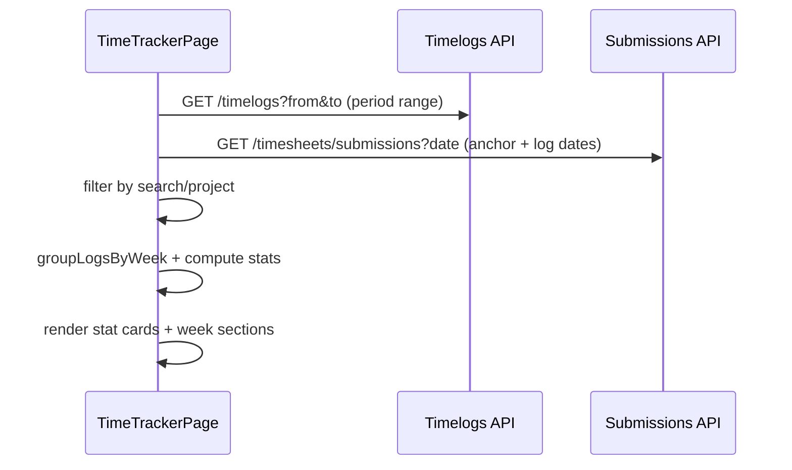

# Time Tracker — Week-Grouped List

## Goal

Ship a **new member route** at `/time-tracker` ("Time Tracker" in nav) that matches the Figma layout: header + filters, four stat cards, and entries grouped **one section per week** (no day sub-headers). The existing [`/timesheet`](<apps/client/src/app/(workspace)/timesheet/page.tsx>) calendar views stay unchanged.



## Current state vs target

| Area          | Today                                                                                                                | Target                                         |
| ------------- | -------------------------------------------------------------------------------------------------------------------- | ---------------------------------------------- |
| Route         | `/timesheet` only (day/week/month/list)                                                                              | New `/time-tracker`                            |
| List grouping | Flat table, unbounded fetch ([`timesheet-page.tsx` L737–800](apps/client/src/features/timesheet/timesheet-page.tsx)) | Week sections with header totals               |
| Summary       | Single `MyWeekSummary` card (toggle)                                                                                 | Four always-visible stat cards                 |
| Filters       | Calendar prev/next per view                                                                                          | Period preset dropdown + project + search      |
| Entry status  | Billable yes/no                                                                                                      | Approved / Pending / Billable badges (derived) |

## File layout (new)

```
apps/client/src/app/(workspace)/time-tracker/page.tsx       # thin route wrapper
apps/client/src/app/(workspace)/time-tracker/loading.tsx    # skeleton
apps/client/src/features/time-tracker/
  time-tracker-page.tsx          # orchestration (fetch, filters, CRUD)
  time-tracker-stat-cards.tsx    # 4 summary cards
  time-tracker-toolbar.tsx       # search, project, period, + Add Entry
  time-tracker-week-list.tsx     # week sections + table
  time-tracker-entry-row.tsx     # row: project, task, description, hours, status, actions
  time-tracker-period.ts         # period presets + timezone-aware range
  group-logs-by-week.ts          # pure grouping + week totals
  group-logs-by-week.spec.ts
  time-tracker-period.spec.ts
```

**Nav:** add `{ href: "/time-tracker", label: "Time Tracker", Icon: Clock }` in [`workspace-shell.tsx`](apps/client/src/components/workspace-shell.tsx) (between Timer and Timesheet to mirror Figma order).

## Reuse (do not duplicate)

- **CRUD:** [`TimeEntryDialog`](apps/client/src/features/timesheet/time-entry-dialog.tsx), delete confirm, overlap checks from timesheet page
- **Locking / approval:** existing `submissionByKey` + `isEntryLocked` pattern from [`timesheet-page.tsx`](apps/client/src/features/timesheet/timesheet-page.tsx)
- **Date math:** [`calendar-utils.ts`](apps/client/src/features/timesheet/calendar-utils.ts) — `startOfWeekWithPreference`, `formatWeekRange`, `formatDuration`, `calendarDateKey`, `localMidnightUtcInZone`, `clipLogToDay` (for correct duration when entries span midnight)
- **Labels/colors:** `formatTaskLabel`, `colorForTask`, `useProjectsStore`
- **API:** `GET /timelogs?from&to`, `GET /timesheets/submissions?date`, `GET /users/me` (timezone + weekStart)

## Core logic

### 1. Period presets (timezone-aware)

Extend beyond [`dashboard-period-presets.ts`](packages/web-shared/src/utils/dashboard-period-presets.ts) with a **client-local** helper in `time-tracker-period.ts` that respects `timezone` and `weekStart` from user prefs:

| Preset     | Range                                        |
| ---------- | -------------------------------------------- |
| Today      | Local today midnight → next midnight         |
| Yesterday  | Previous local day                           |
| This Week  | Current week per `startOfWeekWithPreference` |
| Last Week  | Prior 7-day block                            |
| This Month | Local month bounds                           |

Default preset: **This Week** (matches Figma). Changing preset updates `visibleRange` and refetches logs.

### 2. Week grouping (`group-logs-by-week.ts`)

```typescript
// Pseudocode — implement with calendarDateKey + startOfWeekWithPreference
for (const log of filteredLogs) {
  const logDay = /* date in user timezone from log.startTime */;
  const weekStart = startOfWeekWithPreference(logDay, weekStartPref);
  const key = calendarDateKey(weekStart, timezone);
  // bucket logs by key
}
// Sort weeks descending (newest first)
// Per week: totalSec, billableSec via clipLogToDay or durationSec when fully in week
```

Week section header (Figma style): calendar icon + `Week of {formatWeekRange(weekStart)}` + right-aligned `Total: Xh` / `Billable: Yh`.

### 3. Client-side filters (toolbar)

- **Search:** case-insensitive match on task name, project name, description
- **Project:** `Select` over `projects` (All Projects default)
- **Filters button:** optional phase-2 sheet for billable-only / status — MVP can be a no-op or simple billable toggle

Filtered logs feed both stat cards and week list.

### 4. Stat cards (four cards, scoped to current period)

| Card                     | Source (MVP, client-side)                                                   |
| ------------------------ | --------------------------------------------------------------------------- |
| This Week / period hours | `sum(durationSec)` of filtered logs                                         |
| Billable                 | sum where `isBillable`                                                      |
| Pending Approval         | sum hours (or count) where entry maps to `SUBMITTED` period for its project |
| Entries                  | `filteredLogs.length`                                                       |

**Week-over-week trend** (`↑ 8% vs last week`): optional polish — fetch prior-week logs in parallel when preset is This Week, compute delta client-side. Defer if scope is tight.

**Stat card UI:** promote [`DashboardStatCard`](apps/admin/src/components/dashboard-stat-card.tsx) into `@kloqra/ui` (with existing spec moved alongside) so client and admin share the component. Wrap each in a `Card` for the Figma grid (`grid gap-4 md:grid-cols-2 lg:grid-cols-4`).

### 5. Entry row status badges

`TimeLogDto` has no per-entry status ([`timelog.dto.ts`](packages/contracts/src/dto/timelog.dto.ts)). Derive display status:

- Project has `timesheetApprovalEnabled === false` → show **Billable** badge only (if billable)
- Else map entry date + project to matching `TimesheetPeriodDto`:
  - `APPROVED` → green **Approved**
  - `SUBMITTED` → yellow **Pending**
  - `DRAFT` / `REJECTED` → muted **Draft** (or hide)
- Always show **Billable** pill when `isBillable` (blue, per Figma)

Actions: kebab `DropdownMenu` with Edit / Delete (disabled when locked), reusing timesheet handlers.

### 6. Table columns (per Figma)

Date (entry day), Project, Task (outline badge), Description, Hours, Status, Actions — replace the flat list columns currently in timesheet list view.

## Data flow



**Pagination note:** for `This Month`, a single fetch with `from`/`to` is sufficient (under 1000-entry API limit). If BA later wants "all time", add cursor pagination — out of MVP scope.

## Contracts / API changes

**None required for MVP.** All stats and grouping are client-side from existing DTOs.

Optional follow-up (not in initial PR): extend `myWeekSummarySchema` with `entryCount`, `pendingHours`, `priorWeekDeltaPercent` and fix API `myWeekSummary` to respect user `weekStart` (today it hardcodes Sunday in [`reporting.service.ts`](apps/api/src/modules/reporting/application/reporting.service.ts) L37).

## Tests

Per [`chronomint-test-delivery`](.cursor/skills/chronomint-test-delivery/SKILL.md):

| Test                                                     | File                                                                          |
| -------------------------------------------------------- | ----------------------------------------------------------------------------- |
| Week grouping + totals                                   | `group-logs-by-week.spec.ts`                                                  |
| Period preset ranges (Mon/Sun week start, timezone edge) | `time-tracker-period.spec.ts`                                                 |
| Stat card render                                         | move/port `dashboard-stat-card.spec.tsx` to `packages/ui`                     |
| E2E smoke                                                | `apps/client/e2e/time-tracker.spec.ts` — navigate, see week header, add entry |

## Implementation order

1. **Utilities** — `time-tracker-period.ts`, `group-logs-by-week.ts` + unit specs
2. **UI primitives** — move `DashboardStatCard` to `@kloqra/ui`
3. **Feature components** — toolbar, stat cards, week list, entry row
4. **Page orchestration** — wire fetch, filters, dialog, delete (copy patterns from timesheet page)
5. **Route + nav** — `/time-tracker` page + `workspace-shell` nav item
6. **E2E** — basic flow test

## Out of scope (this PR)

- Changing `/timesheet` calendar or flat list view
- New backend endpoints or contract changes
- Advanced filter sheet (beyond search + project + period)
- Admin time-tracker view

## Risks / decisions

- **Figma "Week of Jun 7" per day:** you chose **week-only** sections; when "This Week" is selected, expect **one** week section. Multi-week presets (This Month) show multiple week headers.
- **`MyWeekSummary` API week start mismatch:** Time Tracker will use user prefs via `calendar-utils`, not `GET /reporting/me`, for period boundaries and grouping consistency with the calendar timesheet.
