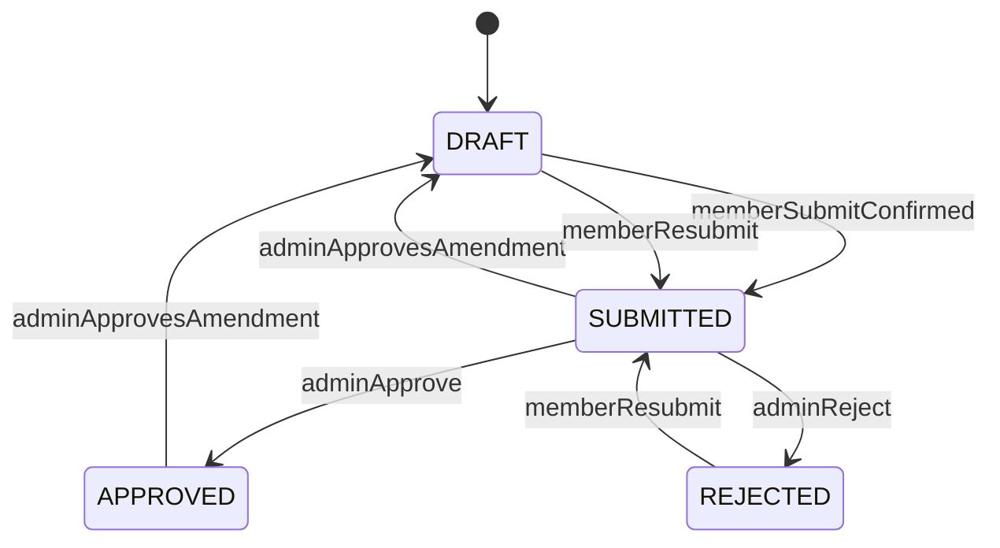
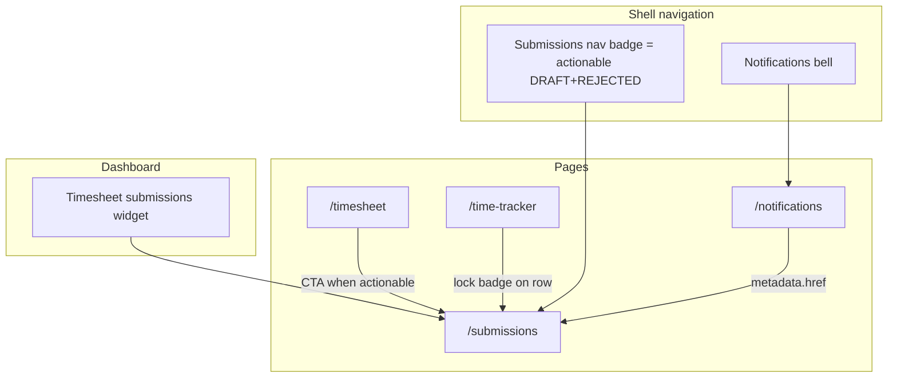
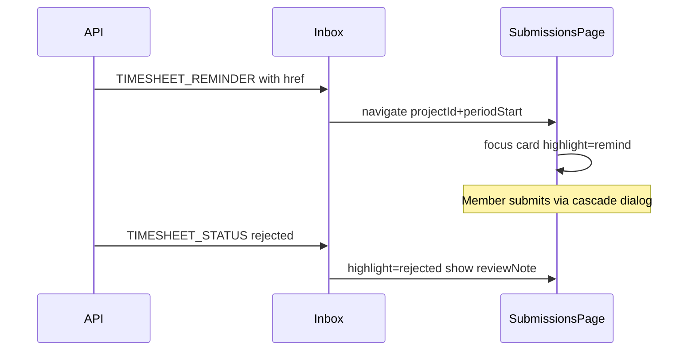
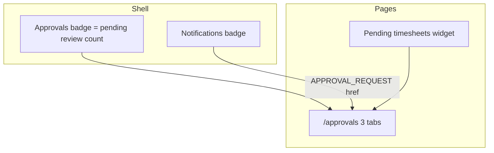
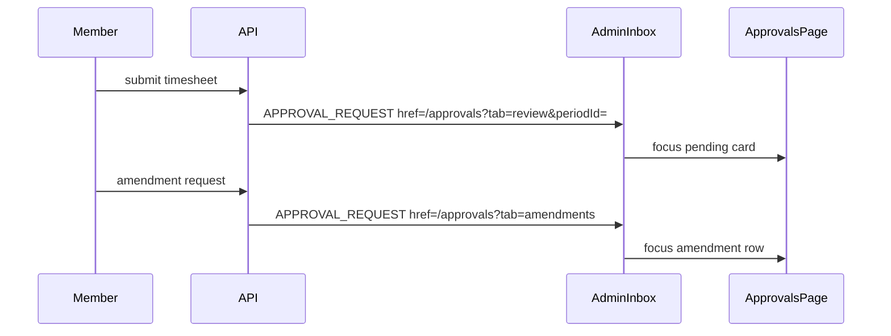

# Timesheet Submissions & Amendment Workflow (Production-Hardened)

## Product decisions (confirmed + hardened)

| Topic           | Decision                                                                     |
| --------------- | ---------------------------------------------------------------------------- |
| Member submit   | Always **manual** — no cron auto-submit                                      |
| Submit scope    | **Single period only** — cascade batch removed (see approval policy plan)    |
| Cascade UX      | **Preview → confirm modal → submit** (one period; no batch list)             |
| Reminders       | Cron (per user + project + period) + admin manual remind (24h dedupe)        |
| Amendment       | Member requests on `SUBMITTED` / `APPROVED`; admin approve → `DRAFT`         |
| Reject vs amend | Reject = admin correction; Amendment = member unlock request                 |
| Admin edits     | No lock bypass — amendment workflow only                                     |
| Member IA       | **Submissions** (`/submissions`); admin keeps **Approvals** (`/approvals`)   |

_(Operational policy, state machine, cascade rules, API, and concurrency guards unchanged from prior revision — see sections below.)_

---

## Operational policy (non-negotiable)

### Reject vs amendment

| Scenario                         | Actor  | Action                                  |
| -------------------------------- | ------ | --------------------------------------- |
| Admin finds errors during review | Admin  | **Reject** with `reviewNote`            |
| Member mistake after approve     | Member | **Amendment request**                   |
| Member change while pending      | Member | **Amendment request** (or admin reject) |
| Admin denies amendment           | Admin  | **Deny** with `adminNote`               |

### Concurrency & status guards

Optimistic `WHERE status = expected` → `409 CONFLICT`. Block submit/approve when open `PENDING` amendment exists on affected period(s).

### Admin lock policy

Revise [`docs/specs/timelogs.md`](docs/specs/timelogs.md): all roles blocked on `SUBMITTED`/`APPROVED` until reject or approved amendment.

---

## Target state machine



---

## Notification system wiring

Notifications use [`buildNotificationTemplate`](packages/contracts/src/notification-templates.ts) → persisted `Notification` rows → inbox via [`NotificationsPage`](packages/web-shared/src/features/notifications/notifications-page.tsx) and [`NotificationDropdown`](packages/web-shared/src/components/notification-dropdown.tsx). Rows link via `metadata.href`; detail rows render from `metadata.details`.

### Event → notification matrix

| Event                         | Template ID                     | Type                 | Preference key       | Recipient        | `metadata.href`                                 | Primary CTA      |
| ----------------------------- | ------------------------------- | -------------------- | -------------------- | ---------------- | ----------------------------------------------- | ---------------- |
| Cron remind (due period)      | `timesheet.reminder`            | `TIMESHEET_REMINDER` | `timesheetReminders` | Member           | `/submissions?projectId={id}&periodStart={iso}` | Open submissions |
| Admin manual remind           | `timesheet.reminder.manual`     | `TIMESHEET_REMINDER` | `timesheetReminders` | Member           | same + `highlight=remind`                       | Submit timesheet |
| Member submit (single)        | `timesheet.submitted`           | `APPROVAL_REQUEST`   | `approvalRequest`    | Workspace admins | `/approvals?tab=review&periodId={id}`           | Review timesheet |
| Member submit (cascade batch) | `timesheet.submitted.batch`     | `APPROVAL_REQUEST`   | `approvalRequest`    | Workspace admins | `/approvals?tab=review&batch={primaryPeriodId}` | Review batch     |
| Admin approve                 | `timesheet.approved`            | `TIMESHEET_STATUS`   | `timesheetStatus`    | Member           | `/submissions?projectId={id}&periodStart={iso}` | View submission  |
| Admin reject                  | `timesheet.rejected`            | `TIMESHEET_STATUS`   | `timesheetStatus`    | Member           | `/submissions?projectId={id}&periodStart={iso}` | Fix & resubmit   |
| Member amendment request      | `timesheet.amendment.requested` | `APPROVAL_REQUEST`   | `approvalRequest`    | Workspace admins | `/approvals?tab=amendments&amendmentId={id}`    | Review request   |
| Amendment approved            | `timesheet.amendment.approved`  | `TIMESHEET_STATUS`   | `timesheetStatus`    | Member           | `/submissions?projectId={id}&periodStart={iso}` | Edit & resubmit  |
| Amendment denied              | `timesheet.amendment.denied`    | `TIMESHEET_STATUS`   | `timesheetStatus`    | Member           | `/submissions?projectId={id}&periodStart={iso}` | View status      |

**Template body requirements (all timesheet templates):** include `workspaceName`, `projectName`, `periodLabel` in `body` and `metadata.details` rows: Workspace, Project, Period; manual remind adds optional Admin message row.

**Dedupe metadata keys:** `{ type, projectId, periodStart }` for cron; `{ type, projectId, periodStart, manual: true }` for admin remind (24h window).

**Icon map** — extend [`notification-dropdown.tsx`](packages/web-shared/src/components/notification-dropdown.tsx) / [`notifications-page.tsx`](packages/web-shared/src/features/notifications/notifications-page.tsx): map `APPROVAL_REQUEST` + amendment titles to `ClipboardCheck`; keep `TIMESHEET_REMINDER` → `Clock`.

**Account settings** — add rows in [`notifications-section.tsx`](packages/web-shared/src/features/account/settings/sections/notifications-section.tsx) only if new preference keys are introduced (reuse existing `timesheetReminders`, `timesheetStatus`, `approvalRequest`).

### Deep-link contract (both apps)

Query params parsed by page on mount:

| Param         | Used by               | Behavior                                                |
| ------------- | --------------------- | ------------------------------------------------------- |
| `projectId`   | Member `/submissions` | Scroll/focus matching project card                      |
| `periodStart` | Member `/submissions` | Set period navigator anchor                             |
| `highlight`   | Member                | Pulse card (`remind`, `rejected`, `amendment-approved`) |
| `tab`         | Admin `/approvals`    | `review` \| `missing` \| `amendments`                   |
| `periodId`    | Admin                 | Open/focus pending review card                          |
| `amendmentId` | Admin                 | Open/focus amendment row                                |
| `batch`       | Admin                 | Expand linked cascade group                             |

Implement shared helper: `packages/web-shared/src/features/submissions/submission-deep-link.ts` (parse + build URLs for client/admin).

---

## Member UI/UX (`apps/client`)

### Information architecture



| Surface         | Route / file                                                                                                      | Role                                            |
| --------------- | ----------------------------------------------------------------------------------------------------------------- | ----------------------------------------------- |
| Primary hub     | `/submissions` → [`submissions-page.tsx`](apps/client/src/features/submissions/submissions-page.tsx)              | Submit, track status, request amendments        |
| Nav + badge     | [`workspace-shell.tsx`](apps/client/src/components/workspace-shell.tsx)                                           | Label **Submissions**; badge = actionable count |
| Legacy redirect | `/approvals` → `/submissions`                                                                                     | Bookmark compat                                 |
| Timesheet CTA   | [`timesheet-page.tsx`](apps/client/src/features/timesheet/timesheet-page.tsx)                                     | Sticky banner when actionable > 0               |
| Dashboard       | [`timesheet-submissions-widget.tsx`](apps/client/src/features/dashboard/widgets/timesheet-submissions-widget.tsx) | Read-only status + link                         |
| Entry lock UX   | [`time-tracker-entry-row.tsx`](apps/client/src/features/time-tracker/time-tracker-entry-row.tsx)                  | Badge + tooltip → submissions                   |
| Inbox           | `/notifications` (web-shared)                                                                                     | Deep link to focused card                       |

### Submissions page layout

```
┌─────────────────────────────────────────────────────────────┐
│ AppBar: Submissions                                         │
│ "Submit timesheets for review and track status by project."│
├─────────────────────────────────────────────────────────────┤
│ [Today] [‹] [›]  Week/Month label     2 ready · 1 pending │
├─────────────────────────────────────────────────────────────┤
│ ┌──────────────┐ ┌──────────────┐ ┌──────────────┐          │
│ │ Project card │ │ Project card │ │ ...          │          │
│ │ status badge │ │              │ │              │          │
│ │ period label │ │              │ │              │          │
│ │ [Submit]     │ │ [Request edit│ │              │          │
│ └──────────────┘ └──────────────┘ └──────────────┘          │
└─────────────────────────────────────────────────────────────┘
```

**Period navigator:** per-card or global anchor stepping by `approvalPeriod` (daily ±1d, weekly ±7d, monthly ±1mo). Prefer **global anchor** (current behavior) plus card shows its resolved period for that anchor.

**Empty state:** “No submission-required projects” — member not on any approval-enabled project team.

**Summary strip copy:** `{readyCount} ready to submit · {pendingCount} pending review · {amendmentPendingCount} edit requests pending`

### Project card states (`SubmissionStatusCard` — refactor from [`timesheet-status-card.tsx`](apps/client/src/features/timesheet/timesheet-status-card.tsx))

| Status              | Card body                               | Primary action                                       | Secondary                            |
| ------------------- | --------------------------------------- | ---------------------------------------------------- | ------------------------------------ |
| `DRAFT`             | Optional note field                     | **Submit for review** → opens cascade preview dialog | Link to timesheet filtered to period |
| `REJECTED`          | Admin `reviewNote` callout (warning)    | **Fix & resubmit** → cascade preview                 | View entries                         |
| `SUBMITTED`         | Locked message + member note            | **Request edit** (dialog, reason required)           | —                                    |
| `APPROVED`          | Approved callout + reviewer info        | **Request edit** (if no pending amendment)           | —                                    |
| Amendment `PENDING` | “Edit request under review” info banner | Disabled submit/edit                                 | Show submitted reason                |

**Blocked submit:** if preview returns `blockedReason` (earlier `REJECTED` period), show inline alert on card with link to that period.

### Cascade preview dialog (`SubmitCascadeDialog` in `packages/ui`)

1. Member clicks **Submit for review**
2. `GET /timesheets/submit-preview`
3. Modal sections:
   - **Primary period** — label + hours
   - **Also submitting** (if cascaded) — table: period label, hours (logged-time only)
   - Warning: “Entries in these periods will be locked until approved or unlocked.”
4. Actions: Cancel | **Submit {n} period(s)** → `POST` with `confirmCascade: true`
5. Success toast + refresh cards; nav badge updates

### Amendment request dialog (`AmendmentRequestDialog` in `packages/ui`)

- Title: “Request to edit submitted timesheet”
- Fields: reason (required, max 500), read-only project + period summary
- Submit → `POST /timesheets/:periodId/amendments`
- Success: card shows “Edit request pending” badge; toast confirms admins notified

### Cross-page consistency

- Rename all copy: “Send to Approvals” → **Submit for review**; nav **Submissions**
- [`TimesheetApprovalStatusBadge`](packages/ui/src/components/timesheet-approval-status-badge.tsx): add optional `amendmentPending?: boolean` → “Edit pending” overlay or distinct badge
- Onboarding tour: update target `nav-submissions`, step copy ([`onboarding-tour-steps.ts`](apps/client/src/features/onboarding/onboarding-tour-steps.ts))
- Locked entry edit attempt: toast with link “Go to Submissions to request an edit”

### Member notification → UI flow



---

## Admin UI/UX (`apps/admin`)

### Information architecture



| Surface      | File                                                                                                       | Role                                                                                  |
| ------------ | ---------------------------------------------------------------------------------------------------------- | ------------------------------------------------------------------------------------- |
| Primary hub  | [`approvals-page.tsx`](apps/admin/src/features/approvals/approvals-page.tsx)                               | Tabbed queue                                                                          |
| Pending card | [`pending-timesheet-card.tsx`](apps/admin/src/features/approvals/pending-timesheet-card.tsx)               | Review + audit trail                                                                  |
| Dashboard    | [`pending-timesheets-widget.tsx`](apps/admin/src/features/dashboard/widgets/pending-timesheets-widget.tsx) | Quick approve/reject → full page                                                      |
| Nav badges   | [`admin-shell.tsx`](apps/admin/src/components/admin-shell.tsx)                                             | `pending review` count; optional secondary poll for amendment count in tab badge only |

### Approvals page — 3 tabs

Use [`Tabs`](packages/ui) under AppBar; URL sync via `?tab=review|missing|amendments`.

#### Tab 1: Pending review (default)

- Grid of existing [`PendingTimesheetCard`](apps/admin/src/features/approvals/pending-timesheet-card.tsx) (enhanced)
- **Cascade batch indicator:** badge “Part of batch submit” when `submittedAt` matches sibling periods same user+project; expandable list of linked period labels + hours
- **Amendment guard:** if open amendment on period, disable Approve/Reject; tooltip “Resolve amendment request first”
- Actions: Reject / Approve with optional review comment (existing)
- **Policy callout** (collapsible): reject vs amendment table

#### Tab 2: Missing submissions

- Table from `GET /timesheets/missing`: Member | Project | Period | Hours logged | Last reminded | Actions
- **Remind** button → [`RemindMemberDialog`](apps/admin/src/features/approvals/remind-member-dialog.tsx):
  - Pre-filled workspace, project, period, member
  - Optional message (max 300) appended to notification
  - Confirm → `POST /timesheets/remind`; toast; disable 24h if deduped (show “Reminded today”)
- Empty state: “Everyone has submitted for the selected period”

#### Tab 3: Amendment requests

- List/cards: Member | Project | Period | Reason | Requested at | Actions
- **Approve unlock** → confirm dialog → period returns to member as editable
- **Deny** → optional admin note
- Link **View period activity** (reuse audit trail fetch from pending card)
- Policy helper: “Use Reject on Pending review tab if you initiated the correction request”

### Admin notification → UI flow



### Nav badge strategy

- **Sidebar Approvals badge:** count of `GET /timesheets/pending` items only (action required: review)
- **Tab badges inside page:** Missing count, Amendments count (loaded on tab mount — avoids overloading shell)
- Fix pending fetch to use `{ items }` in [`admin-shell.tsx`](apps/admin/src/components/admin-shell.tsx) and [`use-pending-timesheets.ts`](apps/admin/src/features/approvals/use-pending-timesheets.ts)

### Dashboard widget

- Keep quick approve/reject for single-period items
- Footer **Open Approvals** → `/approvals?tab=review`
- Do not add remind/amendment to widget (full page only)

---

## Shared UI components (`packages/ui`)

| Component                      | Used by                                                                     |
| ------------------------------ | --------------------------------------------------------------------------- |
| `SubmitCascadeDialog`          | Member submission card                                                      |
| `AmendmentRequestDialog`       | Member submission card                                                      |
| `TimesheetApprovalStatusBadge` | + `amendmentPending` prop; both apps                                        |
| `SubmissionPeriodLabel`        | Consistent daily/weekly/monthly labels (extract from duplicated formatters) |

Specs: [`packages/ui/src/components/*.spec.tsx`](packages/ui/src/components/) beside each.

---

## API / contracts summary

_(Unchanged core: preview, cascade, amendments, missing, remind, guards, prisma model.)_

**New template IDs:** `timesheet.reminder.manual`, `timesheet.submitted.batch`, `timesheet.amendment.requested`, `timesheet.amendment.approved`, `timesheet.amendment.denied`

**Extend contexts** with `workspaceName`, `projectName`, `projectId`, `periodStart`, `periodId`, `amendmentId`, `cascadedPeriodLabels[]`, `adminMessage?`.

**Routes:** see prior section + `GET submit-preview`, amendment CRUD, `GET missing`, `POST remind`.

---

## Tests (UX + notifications)

| Layer      | Focus                                                                               |
| ---------- | ----------------------------------------------------------------------------------- |
| Contracts  | Template render includes details rows + hrefs; batch + manual remind contexts       |
| API e2e    | Notification emitted with expected metadata on submit/remind/amendment              |
| Client RTL | Cascade dialog steps; deep link focuses card; amendment pending disables submit     |
| Admin RTL  | Tab routing from query; remind dialog dedupe message; amendment blocks approve      |
| Playwright | Notification click lands on correct tab/card; member submit → admin inbox → approve |
| web-shared | Deep-link parser unit tests                                                         |

---

## Delivery order

1. Contracts + notification templates + deep-link helper
2. API + notification dispatch
3. `packages/ui` dialogs + badge
4. Member Submissions UX + notification hrefs
5. Admin Approvals 3-tab UX + notification hrefs
6. Tests + docs + pre-PR checks

---

## Out of scope

- Per-project approvers; admin lock bypass; cron auto-submit; notification digests; email template redesign beyond existing Brevo pipeline.
