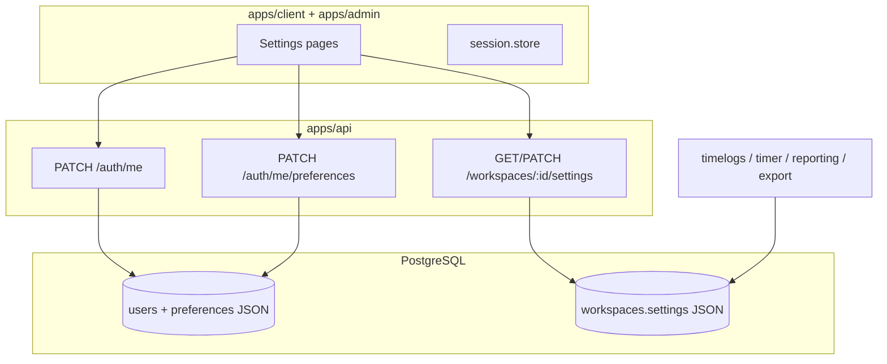
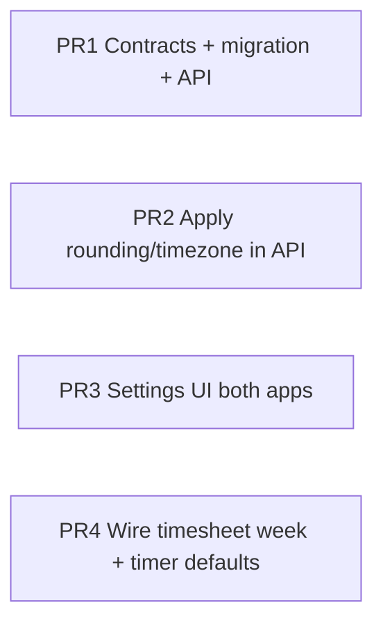

# User & workspace settings plan

## Current state

| Layer                  | Exists today                                                                                                                            | Gap                                                                                                                                    |
| ---------------------- | --------------------------------------------------------------------------------------------------------------------------------------- | -------------------------------------------------------------------------------------------------------------------------------------- |
| **User account**       | `User.name`, `email`, `defaultHourlyRate` in DB; read via [`GET /auth/me`](apps/api/src/modules/auth/interface/http/auth.controller.ts) | No update password/profile APIs; no settings UI                                                                                        |
| **User preferences**   | Theme toggle in [`workspace-shell.tsx`](apps/client/src/components/workspace-shell.tsx) (client-only, not persisted)                    | No `User.preferences` column or API                                                                                                    |
| **Workspace settings** | `Workspace.settings` JSONB in [`schema.prisma`](apps/api/prisma/schema.prisma)                                                          | Never read/written in API; roadmap lists timezone/week/rounding ([`PRODUCT_ROADMAP.md`](docs/architecture/PRODUCT_ROADMAP.md) Phase B) |
| **Notifications**      | None                                                                                                                                    | Roadmap Phase D for email; v1 = store prefs + stub UI                                                                                  |



---

## Settings catalog (what you can offer)

### 1. User account (both apps, all roles)

- Display name (`name`)
- Email (read-only in v1 unless you add verification flow)
- Change password (`currentPassword` + `newPassword`, bcrypt like [`auth.service.ts`](apps/api/src/modules/auth/application/auth.service.ts))
- Optional later: avatar URL, 2FA

### 2. User preferences (per user, syncs across devices)

| Preference                            | Client | Admin    | Storage                                                      |
| ------------------------------------- | ------ | -------- | ------------------------------------------------------------ |
| Theme (`light` / `dark` / `system`)   | Yes    | Yes      | `User.preferences` + `next-themes`                           |
| Last timer project/task               | Yes    | —        | preferences                                                  |
| Default billable on new entries       | Yes    | Optional | preferences                                                  |
| Timesheet default view (week vs list) | Yes    | —        | preferences                                                  |
| Export column presets                 | —      | Yes      | preferences (replaces roadmap `localStorage` v1 for presets) |
| Notification toggles                  | Yes    | Yes      | preferences (no sender in v1)                                |

### 3. Workspace settings (admin edit; all members read)

Aligned with roadmap **Workspace settings**:

| Setting                                    | Effect                                                                     |
| ------------------------------------------ | -------------------------------------------------------------------------- |
| `timezone` (IANA, e.g. `America/New_York`) | Day boundaries for timesheet week, reporting buckets, export `date` column |
| `weekStartsOn` (`monday` \| `sunday`)      | Timesheet week navigation (client + admin)                                 |
| `roundingMinutes` (`0` \| `15` \| `30`)    | Round `durationSec` on timer stop and manual create (billing consistency)  |
| `currency` (ISO code, default `USD`)       | Billing summary + export labels                                            |
| `features.membersCanSeeRates`              | Gate whether client shows hourly rate on entries                           |
| `features.emailNotificationsEnabled`       | Master switch before any future mailer runs                                |

Members **read** workspace settings (for timesheet week + rounding display); only **ADMIN** may PATCH.

### 4. Notifications (v1 = preferences only)

Store booleans in `user.preferences.notifications`:

- Weekly summary email (off by default)
- “Missing time” reminder (off by default)
- Preferred reminder weekdays

UI: toggles + copy (“Coming soon — preferences are saved”). No queue/worker in this epic; when Phase D lands, read the same JSON.

---

## Data model & contracts

### Prisma migration

Add to `User`:

```prisma
preferences Json @default("{}") @map("preferences")
```

Keep `Workspace.settings` as-is; define shape in contracts only (no migration).

### New Zod SSOT — [`packages/contracts`](packages/contracts)

Create [`packages/contracts/src/dto/settings.dto.ts`](packages/contracts/src/dto/settings.dto.ts):

- `userPreferencesSchema` with defaults via `.default()` / `mergeUserPreferences(partial)`
- `workspaceSettingsSchema` with same pattern
- `updateProfileSchema` — `{ name: string.min(1).max(120) }`
- `changePasswordSchema` — `{ currentPassword, newPassword }`
- `updateUserPreferencesSchema` — deep-partial of preferences
- `updateWorkspaceSettingsSchema` — deep-partial (admin)

Extend [`authSessionSchema`](packages/contracts/src/dto/auth.dto.ts) optionally with `preferences` on `GET /auth/me` to avoid extra round-trip on boot.

Add routes in [`packages/contracts/src/routes.ts`](packages/contracts/src/routes.ts):

```ts
AUTH: {
  // existing...
  UPDATE_ME: "/auth/me",
  CHANGE_PASSWORD: "/auth/me/password",
  PREFERENCES: "/auth/me/preferences"
},
WORKSPACES: {
  // existing...
  SETTINGS: (id: string) => `/workspaces/${id}/settings`
}
```

---

## API (NestJS)

Extend **auth module** (or small `settings` module if you prefer isolation):

| Method  | Route                  | Guard | Behavior                              |
| ------- | ---------------------- | ----- | ------------------------------------- |
| `PATCH` | `/auth/me`             | JWT   | Update `name`                         |
| `PATCH` | `/auth/me/password`    | JWT   | Verify current hash, set new          |
| `GET`   | `/auth/me/preferences` | JWT   | Return merged defaults + stored JSON  |
| `PATCH` | `/auth/me/preferences` | JWT   | Deep-merge partial into `preferences` |

Extend **workspace module** — [`workspace.service.ts`](apps/api/src/modules/workspace/application/workspace.service.ts):

| Method  | Route                      | Guard                | Behavior                             |
| ------- | -------------------------- | -------------------- | ------------------------------------ |
| `GET`   | `/workspaces/:id/settings` | JWT, workspace match | Return merged settings               |
| `PATCH` | `/workspaces/:id/settings` | JWT + `ADMIN`        | Deep-merge into `workspace.settings` |

Include `settings` (merged) in `GET /auth/me` response for active workspace so shells can initialize timesheet week without another call.

### Apply workspace rules in domain services

Shared helper e.g. `apps/api/src/common/settings/workspace-settings.util.ts`:

- `getWorkspaceSettings(prisma, workspaceId)` — load + merge defaults
- `roundDurationSec(sec, roundingMinutes)` — used by:
  - [`timer.service.ts`](apps/api/src/modules/timer/application/timer.service.ts) on stop
  - [`timelogs.service.ts`](apps/api/src/modules/timelogs/application/timelogs.service.ts) on create/update
- `toWorkspaceDate(iso, timezone)` — used by:
  - [`time-aggregation.service.ts`](apps/api/src/modules/reporting/application/time-aggregation.service.ts)
  - [`export.service.ts`](apps/api/src/modules/export/application/export.service.ts) for `date` column

Start with **rounding + timezone on new writes and exports**; refactor reporting dashboard week chips in a follow-up PR if needed to avoid a huge diff.

---

## Frontend

### Routes & navigation

| App    | Route                                                                                                | Sections                                                      |
| ------ | ---------------------------------------------------------------------------------------------------- | ------------------------------------------------------------- |
| Client | `/settings`                                                                                          | Account · Preferences · Notifications                         |
| Admin  | `/settings` (new) or tabs on [`workspace/page.tsx`](<apps/admin/src/app/(admin)/workspace/page.tsx>) | **Workspace** (admin) · Account · Preferences · Notifications |

Add “Settings” link to [`workspace-shell.tsx`](apps/client/src/components/workspace-shell.tsx) and [`admin-shell.tsx`](apps/admin/src/components/admin-shell.tsx); remove ad-hoc theme button from sidebar footer (move into Preferences).

### UI patterns

- Reuse `@kloqra/ui` `Card`, `Label`, `Input`, `Select`, `Switch` (add Switch to `packages/ui` if missing)
- Forms call API → `setSession` / toast on success
- Theme: on load, `GET /auth/me` preferences override `next-themes`; on change, `PATCH` preferences + `setTheme`
- Admin export presets: migrate from any `localStorage` keys in export wizard to `preferences.export.presets` when user saves a preset

### Client timesheet / timer

- Read `workspaceSettings.weekStartsOn` + `timezone` for week boundary component
- Read `user.preferences.timer` to pre-select last project/task on timer page
- Respect `features.membersCanSeeRates` before showing rate UI

---

## Phased delivery (recommended PR order)



1. **Foundation** — migration, DTOs, routes, auth/workspace PATCH/GET, tests for merge + password change
2. **Behavior** — rounding on timer/timelogs; timezone on export/reporting date fields
3. **UI** — settings pages (account + prefs + notification stubs); admin workspace form
4. **Integration** — timesheet week start, timer last selection, export presets sync, `membersCanSeeRates` gate

---

## Security & validation notes

- Password change: rate-limit optional later; never return `passwordHash`
- Workspace PATCH: enforce `id === JWT workspaceId` and `role === ADMIN` (same pattern as invite in [`workspace.controller.ts`](apps/api/src/modules/workspace/interface/http/workspace.controller.ts))
- Validate timezone strings with `Intl` or allowlist common IANA zones via Zod refine
- Deep-merge preferences server-side so clients cannot wipe nested keys with `{}`

---

## Out of scope for this epic

- Email delivery / cron (read prefs only)
- Email change with verification
- Per-project overrides for rounding/timezone
- Timesheet submit/approve (Phase C — separate `features` flag reserved)
- Multi-workspace preference profiles (one JSON per user is enough; workspace rules stay on workspace)

---

## Testing

- API unit tests: preference merge, password change (wrong current → 401), admin-only workspace PATCH
- Integration: timer stop with `roundingMinutes: 15` produces rounded `durationSec`
- Optional e2e: client settings page updates name and theme persists after reload
