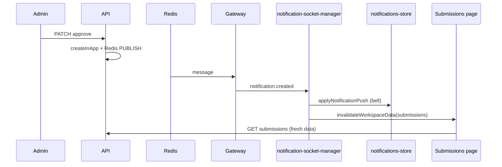

# WebSocket & Socket.IO — Kloqra notifications guide

Reference for **live notification delivery** and **page data refresh**. Complements [live_sync_after_admin_updates_e8f3d2eb.plan.md](./live_sync_after_admin_updates_e8f3d2eb.plan.md) and [docs/specs/notifications-realtime.md](../../docs/specs/notifications-realtime.md).

---

## Coverage — what is addressed vs not

**Design rule:** live sync only when stale UI can cause a **wrong action** or **blocked workflow**. Cosmetic/admin-only config stays refresh-on-navigate; the API is always source of truth.

### Addressed (shipped)

| Scenario | Bell (notification) | Live UI refetch | Scopes |
| -------- | ------------------- | --------------- | ------ |
| Admin approves / rejects timesheet | Yes | Submissions + timesheet pages | `submissions`, `timesheet` |
| Member submits timesheet / requests amendment | Yes | Admin pending approvals | `pending_approvals` |
| Admin toggles project approval on/off or period | Yes (`project.approvalSettingsChanged`) | Submissions, timesheet, project list | `submissions`, `timesheet`, `projects` |
| Admin deactivates project | Yes (`project.deactivated`) | Project list + task pickers | `projects`, `tasks` |
| Admin assigns / unassigns member to **project** | Yes | Project list + task pickers | `projects`, `tasks` |
| Admin assigns / unassigns member to **task** | Yes | Tasks page, project tasks tab, timer, dashboard pickers | `projects`, `tasks` |
| Socket reconnect after blip | — | Broad catch-up refetch (all scopes) | all |
| Logout / token refresh | — | Socket disconnect / reconnect | — |

**Where task refetch is wired (client):**

| Surface | Mechanism |
| ------- | --------- |
| All member pages (timer, timesheet, time tracker) | Shell `useClientWorkspaceDataSync` → `setTasks` in projects store |
| Tasks page | `usePaginatedList` with `refreshOnStaleScopes: ['tasks']` |
| Project → Tasks tab | Same |
| Timer | `useWorkspaceStaleRefetch` → `reloadCatalog` |
| Dashboard | `useWorkspaceStaleRefetch` → task catalog + scoped filter tasks |

### Not addressed (intentionally left as-is)

| Scenario | Why we skip live sync | What users experience |
| -------- | --------------------- | --------------------- |
| **Workspace settings** (timezone, week start, rounding, daily/weekly targets) | Rare admin action; API enforces rules on save; broadcasting to all members needs new template + fan-out | Open timesheet may show old week labels until reload or reconnect |
| **Project cosmetic** (name, color, budget, client) | Does not block logging time or submissions | Old label/color until navigation |
| **Jira / billing / integrations** | Admin-only surfaces | N/A for members |
| **Categories / bulk import** | Loaded on demand in forms | Stale until next form open |
| **Member role change** | Bell notifies; nav/permission refresh is edge-case | May need full reload after demotion (acceptable for now) |

**Do not build** a general “settings changed” broadcast unless product reports real pain — reconnect catch-up and navigation already cover most cases.

---

## Environment variables — do we need new ones?

**No.** WebSocket notifications reuse existing config:

| Variable | Where | Used for |
| -------- | ----- | -------- |
| `NEXT_PUBLIC_API_BASE_URL` | client / admin | Socket connects to `{base}/notifications` |
| `NEXT_PUBLIC_AUTH_SCOPE` | client / admin | `client` or `admin` in handshake JWT scope |
| `FRONTEND_ORIGIN` | API | WebSocket CORS (same as REST) |
| `REDIS_URL` or `REDIS_USE_MEMORY=true` | API | Pub/sub between API replicas (already used for timers/presence) |

Nothing like `NEXT_PUBLIC_WS_URL` — the socket shares the API host.

**Production:** ensure your proxy (Railway, etc.) allows **WebSocket upgrade** on the API domain. No extra env — just don’t strip `Upgrade` headers.

---

## Before vs now (simple)

### Before (polling only)

- Bell badge polled `GET /notifications/unread-count` every **60 seconds**.
- Submissions / timesheet / approvals pages loaded once and **never refetched** when someone else acted.
- Admin approves → member sees nothing until manual refresh or up to **60s** on the bell only (page still wrong).
- Notifications and page data were **decoupled** — bell could update while the table stayed stale.

### Now (WebSocket push + targeted refetch)

- **One persistent Socket.IO connection** per logged-in tab (`/notifications` namespace).
- Admin (or any) action → API creates notification → **Redis publish** → gateway **pushes instantly** to that user’s browser.
- Browser updates **bell + dropdown** immediately and fires **scoped refetch** (submissions, timesheet, approvals, projects, **tasks**).
- **No unread poll while socket is live** — push is the primary path.
- **60s poll only when socket is down** (safety net for the bell).
- **Reconnect catch-up** — after a disconnect/reconnect, refetch all workspace scopes once (`submissions`, `timesheet`, `projects`, `tasks`, `pending_approvals`). Redis does not replay missed events.
- Logout **force-disconnects** the socket; token refresh **reconnects** with the new JWT.

---

## Who triggers, who listens, how the UI updates

### 1. Trigger (server — something happened)

Any code path that calls `NotificationsService.createInApp()` (usually via `NotificationsDispatchService.notify()`):

| Who | Example action | Template |
| --- | -------------- | -------- |
| Admin | Approve timesheet | `timesheet.approved` |
| Admin | Reject timesheet | `timesheet.rejected` |
| Member | Submit timesheet | `timesheet.submitted` |
| Admin | Change approval settings | `project.approvalSettingsChanged` |
| Admin | Assign / unassign project or task | `project.assigned`, `task.assigned`, etc. |
| Admin | Deactivate project | `project.deactivated` |
| … | amendment, reminders, etc. | other templates |

Flow on the API:

1. Write notification row to Postgres.
2. `NotificationsRealtimeService.publishNotificationCreated(userId, payload)` → **Redis PUBLISH** `notifications:user:{userId}`.

### 2. Relay (server — socket last mile)

**Listener:** `NotificationsGateway` on whichever API replica holds the member’s open socket.

- Subscribes to Redis channel for that user (ref-counted per user across tabs).
- Emits Socket.IO event **`notification.created`** to room **`user:{userId}`**.

### 3. Receive (browser — client + admin apps)

**Listener:** `notification-socket-manager` (singleton) + `useNotificationSocket` in workspace shell.

| Step | What happens |
| ---- | ------------ |
| Connect | `io(apiBase + '/notifications', { auth: { token, scope } })` |
| On push | Validate payload → `applyNotificationPush` (bell count + recent list) |
| On push | `scopesForNotificationType(type)` → `invalidateWorkspaceData(workspaceId, scopes)` |
| On reconnect | Refresh unread + broad invalidation (missed events while offline) |

### 4. Page update (browser — data refetch)

**Listener:** `WORKSPACE_DATA_STALE_EVENT` (`kloqra:workspace-data-stale`) on each app:

| App | Listener | Refetches |
| --- | -------- | --------- |
| Client shell | `useClientWorkspaceDataSync` | submissions store, **projects list, tasks catalog** |
| Client pages | submissions / timesheet page | own `refreshAll` / `refreshSubmissions` on stale event |
| Client pages | tasks page, project tasks tab | paginated task list via `refreshOnStaleScopes` |
| Client pages | timer, dashboard | `useWorkspaceStaleRefetch` → project + task pickers |
| Admin shell | `useAdminWorkspaceDataSync` | pending timesheets store |
| Admin approvals | `useRegisterApprovalsRefresh` | amendments + reviewed lists |

**Important:** the socket does **not** send full timesheet JSON. It sends a **small notification** + **which caches to invalidate**. Pages still **REST-fetch** fresh data (source of truth stays HTTP).



---

## HTTP polling vs WebSocket (what we removed vs kept)

### Removed as primary path

- Relying on **60s poll** for live UX (poll **off** while socket connected).
- **Tab-focus refetch** on submissions/timesheet (replaced by push + reconnect catch-up).

### Kept on purpose (not “legacy primary” — safety only)

| Mechanism | When it runs | Why keep it |
| --------- | ------------ | ----------- |
| **60s unread poll** | Socket **disconnected** only | Bell stays roughly correct if WS fails |
| **Socket.IO long-polling transport** | Proxy blocks WebSocket | Built into Socket.IO; not our app code |
| **Focus refresh on bell** | User returns to tab | Sync unread if another tab marked read |
| **REST on invalidate** | Every push | DB is always source of truth |

---

## What is a WebSocket?

Persistent, two-way connection. After an HTTP “upgrade”, the server can **push** without the client asking.

| | HTTP REST | WebSocket |
|---|-----------|-----------|
| Pattern | Request → response | Open line; server can speak first |
| Kloqra use | All CRUD | Notification push only |

---

## What is Socket.IO?

Library on top of WebSockets (with auto-reconnect and optional long-polling fallback).

| Layer | Package |
| ----- | ------- |
| API | `@nestjs/websockets` + `@nestjs/platform-socket.io` |
| Browser | `socket.io-client` via `notification-socket-manager.ts` |

We use namespace **`/notifications`**, rooms **`user:{userId}`**, event **`notification.created`**.

---

## Why Redis between create and emit

Multiple API containers on Railway: the HTTP request may hit **replica B** while the member’s socket lives on **replica A**. Redis pub/sub delivers the event to the replica that has the connection.

Local dev: `REDIS_USE_MEMORY=true` works on a single process.

Same idea as team presence (SSE + Redis), different wire to the browser.

---

## Key files

| Concern | Path |
| ------- | ---- |
| Event contract | `packages/contracts/src/notification-realtime.ts` |
| Redis publish | `apps/api/.../notifications-realtime.service.ts` |
| WebSocket gateway | `apps/api/.../notifications.gateway.ts` |
| Publish hook | `apps/api/.../notifications.service.ts` → `createInApp` |
| Socket singleton | `packages/web-shared/.../notification-socket-manager.ts` |
| Shell hook | `packages/web-shared/.../use-notification-socket.ts` |
| Scope map | `packages/web-shared/.../workspace-data-sync.ts` |
| Stale refetch hook | `packages/web-shared/.../use-workspace-stale-refetch.ts` |
| Paginated stale option | `packages/web-shared/.../use-paginated-list.ts` → `refreshOnStaleScopes` |
| Client wiring | `apps/client/.../workspace-shell.tsx`, `lib/workspace-data-sync.ts` |
| Admin wiring | `apps/admin/.../admin-shell.tsx`, `lib/workspace-data-sync.ts` |

---

## Authentication on connect

Token in handshake (cookies aren’t reliable for cross-origin WS):

```typescript
io(`${getApiBase()}/notifications`, {
  auth: { token: getAccessToken(), scope: NEXT_PUBLIC_AUTH_SCOPE },
  transports: ["websocket", "polling"],
  reconnection: true
});
```

Gateway verifies JWT + revocation → joins `user:{userId}`. Expired token → disconnect.

**Lifecycle:** `subscribeSessionUpdates` reconnects on token refresh; `logoutSession` calls `forceDisconnectNotificationSocket()`.

---

## Invalidation scopes (what refetches)

| Notification types (examples) | Scopes |
| ----------------------------- | ------ |
| Approved, rejected, reminders, approval settings | `submissions`, `timesheet`, (+ `projects` for settings) |
| Submitted, amendment requested | `pending_approvals` (admin) |
| Project / task assign, unassign, deactivate | `projects`, **`tasks`** |

Map: `scopesForNotificationType()` in `workspace-data-sync.ts`.

Contract enum: `submissions` | `timesheet` | `projects` | `tasks` | `pending_approvals` in `packages/contracts/src/notification-realtime.ts`.

---

## WebSocket vs SSE in this repo

| Feature | Transport |
| ------- | --------- |
| Notifications | Socket.IO `/notifications` |
| Admin presence | SSE `/presence/stream` |

---

## Manual verify (after deploy)

1. Restart API (WebSocket gateway + `IoAdapter`).
2. Redis available; proxy allows WSS.
3. **Workflow:** member on `/submissions`, admin approves → instant bell + table update.
4. **Approval settings:** admin toggles approval → member gets notification + submissions refresh.
5. **Tasks:** member on `/timer` or `/tasks`, admin assigns task → bell + task appears in picker/list without refresh.

---

## Debugging

1. API running with `IoAdapter` in `main.ts`.
2. Redis up (or memory mode).
3. DevTools → Network → **WS** → `…/notifications`.
4. Green dot on bell = socket connected.

| Symptom | Likely cause |
| ------- | ------------ |
| Bell updates every ~60s only | Socket down; disconnect poll working |
| Nothing updates | Redis down, or in-app notifications disabled in user prefs |
| Works locally, not prod | Proxy blocking WSS, or `FRONTEND_ORIGIN` mismatch |

---

## Mental model (TL;DR)

```text
TRIGGER   Admin/member action → createInApp → Redis PUBLISH
RELAY     Gateway (API) → Socket.IO emit to user:{userId}
LISTEN    notification-socket-manager (browser tab)
UPDATE    Bell store + invalidateWorkspaceData → pages REST-refetch
SAFETY    60s poll only if socket dead; reconnect refetch after blip
```

REST = source of truth. WebSocket = “hey, go refresh these screens.”
