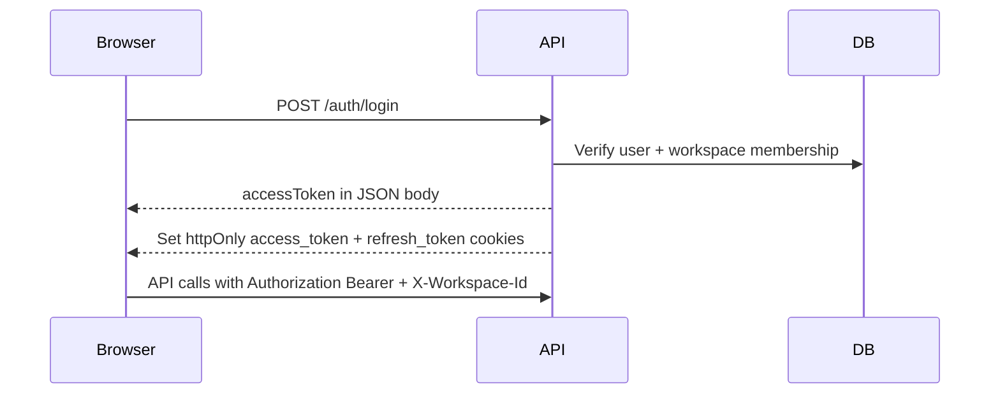

# Authentication and authorization

## Overview

Kloqra uses JWT access tokens plus httpOnly refresh cookies. All workspace-scoped API routes require authentication and an active workspace context.

## Login flow

### Register / login response

- **Body:** `accessToken`, `user`, `workspaceId`, `workspaceName`, `workspaceRole`
- **Cookies:** `access_token` (short-lived), `refresh_token` (7 days)

Each frontend stores `accessToken` in **scoped** `localStorage` keys (`cm-client-*` / `cm-admin-*` via `NEXT_PUBLIC_AUTH_SCOPE`) and sends `Authorization: Bearer <token>`. The API guard prefers the Bearer header over cookies when both are present.

**Two apps (client + admin):** Auth cookies are scoped per app via `X-Auth-Scope` (`client` / `admin`): `access_token_client`, `refresh_token_admin`, etc. Admin and client can stay logged in on the same browser without overwriting each other's refresh cookie. Legacy unscoped `access_token` / `refresh_token` cookies are still read until cleared.

## Refresh

`POST /auth/refresh` reads the scoped refresh cookie for the caller's `X-Auth-Scope`, issues a new access token, and updates the matching access cookie. The refresh JWT includes `workspaceId` so refresh does not jump to an arbitrary workspace when the user has multiple memberships.

## Multiple devices / tabs

| Scenario                                                                             | Behavior                                                                                                            |
| ------------------------------------------------------------------------------------ | ------------------------------------------------------------------------------------------------------------------- |
| Same user, **admin + client**, same browser                                          | Allowed — separate scoped cookies and `localStorage` keys per app.                                                  |
| Same user, **two devices** (e.g. laptop + phone)                                     | Allowed — stateless JWTs; each device keeps its own Bearer token and workspace in `localStorage`.                   |
| **Stale `X-Workspace-Id`** (switch workspace on device A, device B still has old id) | API returns **403** with workspace mismatch — sign in again or switch workspace on that device.                     |
| **One running timer** per user per workspace                                         | Second device gets `TIMER_ALREADY_ACTIVE` (409) — by design; stop timer on one device or use one device for timing. |

Parallel logins do **not** invalidate other devices unless you add a server-side session store (not implemented today). Full matrix: [MULTI_DEVICE_SESSIONS.md](./MULTI_DEVICE_SESSIONS.md).

## Workspace context

`JwtAuthGuard` resolves workspace from the JWT `workspaceId` claim. If `X-Workspace-Id` is sent and **differs** from the token, the request is rejected (stale tab / other device switched workspace). If the header is omitted, the token workspace is used.

Missing workspace → `WORKSPACE_REQUIRED` error.

## Switch workspace

`POST /auth/switch-workspace` (authenticated) changes the active workspace and re-issues tokens for users with multiple memberships.

## Logout

`DELETE /auth/logout` clears scoped (`access_token_{scope}`, `refresh_token_{scope}`) and legacy cookies for the calling app only. Other devices and the other app remain signed in.

See [MULTI_DEVICE_SESSIONS.md](./MULTI_DEVICE_SESSIONS.md) for the full multi-device model.

## Role-based access

Workspace roles: `ADMIN` | `MEMBER`.

| Area                              | ADMIN                       | MEMBER                     |
| --------------------------------- | --------------------------- | -------------------------- |
| Create/edit/delete projects       | Yes                         | No                         |
| Team invites                      | Yes                         | No                         |
| Billing rates                     | Yes                         | No                         |
| Reporting dashboard               | Yes                         | No                         |
| Admin export wizard               | Yes                         | No                         |
| Timer, own timelogs               | Yes                         | Yes                        |
| Member export (`POST /export/me`) | Yes                         | Yes                        |
| List projects                     | All in workspace            | Only where on project team |
| Timelogs list                     | All users (optional filter) | Own logs only              |

Enforced via `@Roles("ADMIN")` and `RolesGuard` on controllers, plus service-level checks (e.g. timelogs ownership).

## App separation

| App              | Expected role                                                     |
| ---------------- | ----------------------------------------------------------------- |
| Client (`:3000`) | `MEMBER` (admins may use it but admin features live in admin app) |
| Admin (`:3002`)  | `ADMIN` — member accounts should use the client app               |

## Production hardening

- Set cookie `secure: true` behind HTTPS.
- Use strong `JWT_ACCESS_SECRET` and `JWT_REFRESH_SECRET` (see [SECURITY.md](../development/SECURITY.md)).
- Restrict `FRONTEND_ORIGIN` to known domains.

Implementation: [auth.controller.ts](../../apps/api/src/modules/auth/interface/http/auth.controller.ts), [jwt-auth.guard.ts](../../apps/api/src/common/guards/jwt-auth.guard.ts).
