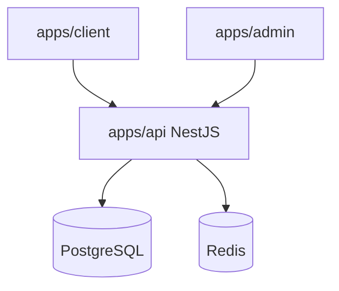

# Kloqra Architecture Context

## System context

## Monorepo layout

- `apps/api` — sole write path to database
- `apps/client` — member timer, timesheet, dashboard, time tracker
- `apps/admin` — dashboards, billing, exports, team live, approvals
- `packages/contracts` — Zod SSOT for all DTOs
- `packages/ui` — themed primitives, tables, modals, loaders
- `packages/web-shared` — API client, profile/settings, list hooks

## Module boundaries (API)

Each feature under `apps/api/src/modules/<name>/`:

- `domain/` — pure entities
- `application/` — use cases
- `infrastructure/` — Prisma/Redis adapters
- `interface/http/` — controllers

No cross-imports between feature modules.

### Shipped modules

| Module          | Docs                                            |
| --------------- | ----------------------------------------------- |
| auth, workspace | [auth-workspace.md](../specs/auth-workspace.md) |
| projects        | [projects.md](../specs/projects.md)             |
| tasks           | (see projects / timelogs specs)                 |
| timelogs        | [timelogs.md](../specs/timelogs.md)             |
| timer           | [timer.md](../specs/timer.md)                   |
| billing         | [billing.md](../specs/billing.md)               |
| reporting       | [reporting.md](../specs/reporting.md)           |
| presence        | [presence.md](../specs/presence.md)             |
| export          | [export.md](../specs/export.md)                 |
| users           | [user-profile.md](../specs/user-profile.md)     |

Frontend patterns: [FRONTEND-UI.md](../development/FRONTEND-UI.md).

API route catalog: [api/ROUTES.md](../api/ROUTES.md).

## Auth flow

1. Register/login → JWT access + httpOnly refresh cookies
2. Client stores access token in `localStorage` for `Authorization` header
3. All workspace routes require `X-Workspace-Id` header

## Timer flow

See [TIMER_SEQUENCE.md](./TIMER_SEQUENCE.md).

## Product roadmap

Near-term admin/client features (approvals, budgets, invoicing, etc.): [PRODUCT_ROADMAP.md](./PRODUCT_ROADMAP.md).

Export design and report catalog: [export.md](../specs/export.md).

## Deferred (Phase 3+ platform)

See [FUTURE_SCOPE.md](./FUTURE_SCOPE.md).
