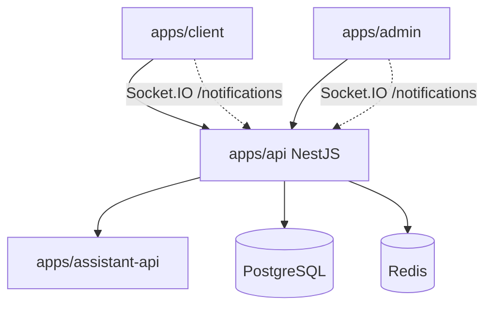

# Kloqra Architecture Context

## System context

## Monorepo layout

- `apps/api` — sole write path to database; BullMQ workers for exports and bulk jobs
- `apps/client` — member timer, timesheet, time tracker, submissions, dashboard
- `apps/admin` — dashboards, billing, exports, team live, approvals
- `apps/assistant-api` — internal FastAPI service for member help chat (OpenAI)
- `packages/contracts` — Zod SSOT for all DTOs
- `packages/ui` — themed primitives, tables, modals, loaders
- `packages/web-shared` — API client, profile/settings, list hooks, realtime sync

## Module boundaries (API)

Each feature under `apps/api/src/modules/<name>/`:

- `domain/` — pure entities
- `application/` — use cases
- `infrastructure/` — Prisma/Redis adapters
- `interface/http/` — controllers
- `interface/ws/` — WebSocket gateways (notifications)

No cross-imports between feature modules.

### Shipped modules

| Module           | Docs                                                                            |
| ---------------- | ------------------------------------------------------------------------------- |
| auth, workspace  | [auth-workspace.md](../specs/auth-workspace.md)                                 |
| users            | [user-profile.md](../specs/user-profile.md)                                     |
| projects, tasks  | [projects.md](../specs/projects.md)                                             |
| categories       | [categories.md](../specs/categories.md)                                         |
| timelogs         | [timelogs.md](../specs/timelogs.md), [submissions.md](../specs/submissions.md)  |
| timer            | [timer.md](../specs/timer.md)                                                   |
| billing          | [billing.md](../specs/billing.md)                                               |
| reporting        | [reporting.md](../specs/reporting.md)                                           |
| presence         | [presence.md](../specs/presence.md)                                             |
| export           | [export.md](../specs/export.md)                                                 |
| notifications    | [notifications-realtime.md](../specs/notifications-realtime.md)                 |
| assistant        | [assistant.md](../specs/assistant.md)                                           |
| jira             | [projects.md](../specs/projects.md) (Jira integration)                          |
| public-reporting | [api/public-reporting-client-guide.md](../api/public-reporting-client-guide.md) |

**Infrastructure:** `queues/` (BullMQ), `health/`.  
**Partitioning:** [DATABASE_PARTITIONING.md](./DATABASE_PARTITIONING.md).

Frontend patterns: [FRONTEND-UI.md](../development/FRONTEND-UI.md).

API route catalog: [api/ROUTES.md](../api/ROUTES.md).

## Auth flow

1. Register/login → JWT access + httpOnly refresh cookies
2. Client stores access token in `localStorage` for `Authorization` header
3. All workspace routes require `X-Workspace-Id` header

## Realtime flow

REST remains source of truth. On workflow events, the API publishes to Redis → Socket.IO `/notifications` → browser invalidates scoped caches → pages refetch via HTTP. See [notifications-realtime.md](../specs/notifications-realtime.md).

## Timer flow

See [TIMER_SEQUENCE.md](./TIMER_SEQUENCE.md).

## Product roadmap

Shipped vs planned features: [PRODUCT_ROADMAP.md](./PRODUCT_ROADMAP.md).  
Long-term horizons: [KLOQRA_FUTURE_PLAN.md](./KLOQRA_FUTURE_PLAN.md).

Export design and report catalog: [export.md](../specs/export.md).

## Deferred (Phase 3+ platform)

See [FUTURE_SCOPE.md](./FUTURE_SCOPE.md).
