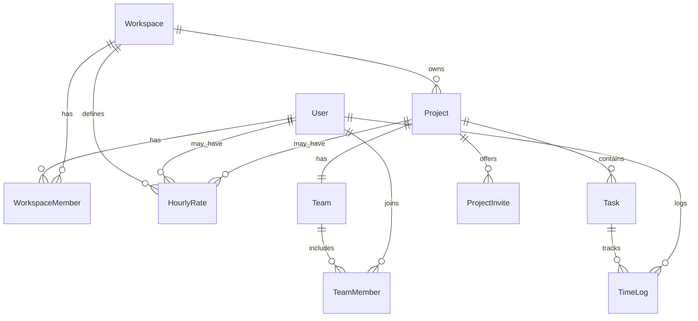

# Data model (Prisma)

Source of truth: [apps/api/prisma/schema.prisma](../../apps/api/prisma/schema.prisma).

## Entity relationship

## Tables

### users

| Field               | Notes                              |
| ------------------- | ---------------------------------- |
| `email`             | Unique login                       |
| `passwordHash`      | bcrypt                             |
| `defaultHourlyRate` | Fallback when no project/user rate |

### workspaces

| Field      | Notes                                                                            |
| ---------- | -------------------------------------------------------------------------------- |
| `slug`     | Unique; used in export filenames                                                 |
| `settings` | JSON, default `{}`. Reserved for timezone, rounding, feature flags (see roadmap) |

### workspace_members

| Field                          | Notes                                 |
| ------------------------------ | ------------------------------------- |
| `role`                         | `ADMIN` or `MEMBER` (string in DB)    |
| Unique `(workspaceId, userId)` | One membership per user per workspace |

### projects

| Field                        | Notes                                |
| ---------------------------- | ------------------------------------ |
| `clientName`                 | Optional; shown in exports           |
| `budgetHours`                | Optional; for future budget features |
| `isActive`                   | Soft disable                         |
| Unique `(workspaceId, name)` |                                      |

### teams / team_members

- Each **project** has exactly one **team**.
- **Team members** are users allowed to log time on that project.
- See [DOMAIN_MODEL.md](./DOMAIN_MODEL.md) for invite flow.

### project_invites

| Field        | Notes                   |
| ------------ | ----------------------- |
| `token`      | Unique invite URL token |
| `expiresAt`  | Invite expiry           |
| `acceptedAt` | Set when member joins   |

### tasks

| Field             | Notes                                          |
| ----------------- | ---------------------------------------------- |
| `billableDefault` | Default `isBillable` for new logs on this task |

### time_logs

| Field         | Notes                                        |
| ------------- | -------------------------------------------- |
| `durationSec` | Derived from start/end on write              |
| `source`      | `timer` or `manual` (string; no DB enum yet) |
| `isBillable`  | Per-entry billable flag                      |

Indexes: `(userId, startTime)`, `(taskId, startTime)`.

### hourly_rates

Scoped by `workspaceId`; optional `userId` and/or `projectId`.

| Scope                    | Resolution priority                        |
| ------------------------ | ------------------------------------------ |
| Project rate             | Highest (if `projectId` set and effective) |
| User rate                | Next                                       |
| `User.defaultHourlyRate` | Fallback                                   |

`effectiveFrom` supports rate history (latest matching row wins).

## String enums (application-level)

Not enforced as PostgreSQL enums today; validated in Zod/contracts:

| Concept            | Values                                                     |
| ------------------ | ---------------------------------------------------------- |
| Workspace role     | `ADMIN`, `MEMBER`                                          |
| Time log source    | `timer`, `manual`                                          |
| Export report type | `time_entries`, `daily_summary`, `by_project`, `by_member` |
| Export format      | `csv`, `xlsx`, `pdf`                                       |
| Billable filter    | `all`, `billable`, `non_billable`                          |

## JSON fields

### Workspace.settings

Reserved for future workspace configuration (timezone, week start, rounding). Currently defaults to `{}` and is not read by the API in v1.

## Cascade deletes

Deleting a workspace cascades to projects, teams, tasks, rates, and memberships. Deleting a project cascades to its team, tasks, and invites.
