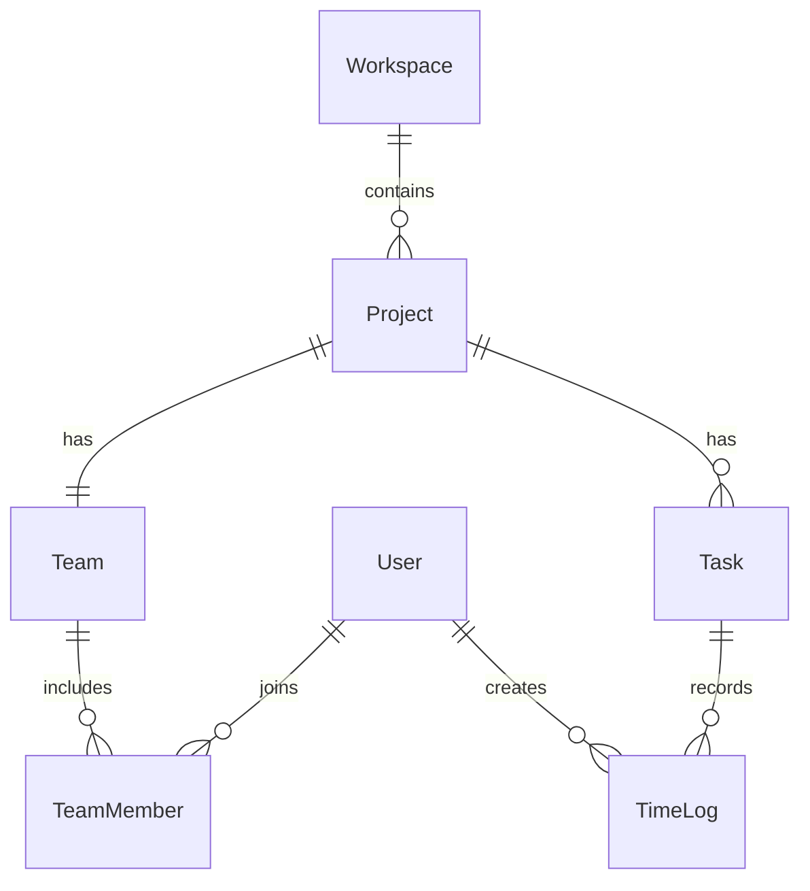

# Kloqra domain model

## Hierarchy

```
Workspace
  └── Project (one per client engagement / work stream)
        └── Team (exactly one team per project)
              └── TeamMember (users who may log time on this project)
        └── Task
              └── TimeLog (manual or timer source)
```



Prisma details: [DATA_MODEL.md](./DATA_MODEL.md).

## Roles

| Layer           | Who                                             | What they do                                                                                 |
| --------------- | ----------------------------------------------- | -------------------------------------------------------------------------------------------- |
| **Tenant**      | Organization owner (`OWNER`)                    | Billing, create workspaces, assign workspace admins — see [TENANT_RBAC.md](./TENANT_RBAC.md) |
| **Workspace**   | `WorkspaceMember` with role `ADMIN` or `MEMBER` | Admins manage the org; members are staff who can be invited to project teams                 |
| **Project**     | Team `PROJECT_MANAGER` (PM) or `MEMBER`         | PM scoped to assigned projects (F17)                                                         |
| **Project**     | Created by workspace **admins** only            | Named work stream (e.g. "Acme Website")                                                      |
| **Team**        | Auto-created with each project                  | Container for who works on that project                                                      |
| **Team member** | Added via **invite link** (or seed)             | Can see project, tasks, timer, timesheet for that project only                               |

Workspace admins see all projects. Workspace members only see projects where they are on the **team**.

## Invites

1. Admin creates a project → empty **team** is created.
2. Admin generates a **team invite link** (`POST /projects/:id/team/invites`).
3. Member opens link, signs in, accepts → added as `TeamMember`.
4. Member must already belong to the workspace (register/login as workspace member).

## API (contracts)

- `GET /projects` — list projects you can access
- `GET /projects/:id/team` — team + members (admin)
- `POST /projects/:id/team/invites` — create invite link (admin)
- `GET /team-invites/:token` — preview invite
- `POST /team-invites/:token/accept` — join team
