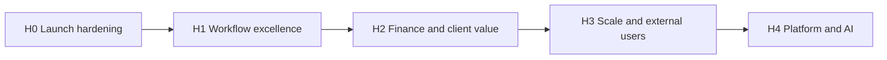

# Kloqra — Future Plan (2026–2027)

Master roadmap for product, engineering, and production. Supersedes the phased tables in [PRODUCT_ROADMAP.md](./PRODUCT_ROADMAP.md) for **what comes next**; keep PRODUCT_ROADMAP updated when items ship.

**Last updated:** June 2026  
**Current baseline:** Phases 1–2 shipped, level-up sprints largely complete, realtime notifications live on `dev`.

---

## 1. Vision

**Kloqra is the time analytics engine for agencies and product teams** — capture time with low friction, enforce accountability through approvals, and turn hours into billing-ready insight without replacing accounting software.

### North-star outcomes

| Stakeholder      | Success looks like                                                                               |
| ---------------- | ------------------------------------------------------------------------------------------------ |
| **Member**       | Log time in &lt;10s; always know submission status; never fight stale UI during work             |
| **Admin**        | See burn, utilization, and approvals in one place; export or invoice without spreadsheet surgery |
| **Agency owner** | Multi-project profitability, client-ready reports, optional client visibility                    |
| **Engineering**  | Contract-first changes; CI gates; safe deploys; observable production                            |

### Guiding principles

1. **Manual ledger before automation** — time logs and approvals are source of truth; integrations overlay.
2. **Contract-first** — `packages/contracts` before API or UI.
3. **REST is truth, push is hint** — WebSocket/notifications invalidate; pages refetch HTTP.
4. **Member privacy** — members never see org-wide revenue or peer rankings by default.
5. **Small shippable epics** — one phase per PR where possible.

---

## 2. Where we are today

### Shipped (production baseline)

| Domain            | Highlights                                                                                                             |
| ----------------- | ---------------------------------------------------------------------------------------------------------------------- |
| **Core loop**     | Timer (pause/resume), timesheet, time tracker, recurring entries, tasks, projects, categories + bulk import            |
| **Workflow**      | Per-project timesheet approval, `/submissions` + `/approvals`, amendments, WAIVED policy, hours-only drafts            |
| **Admin ops**     | Dashboard widgets, team live (SSE), billing rates, exports (wizard, async jobs, schedules, presets)                    |
| **Data platform** | PostgreSQL range partitioning on `time_logs` and audit events ([DATABASE_PARTITIONING.md](./DATABASE_PARTITIONING.md)) |
| **Integrations**  | Jira Cloud (OAuth, issue link), public reporting API                                                                   |
| **Platform**      | Auth + refresh rotation, workspace RBAC, impersonation, assistant                                                      |
| **Realtime**      | Socket.IO notifications, scoped cache invalidation (submissions, timesheet, projects, tasks)                           |
| **Quality**       | CI (quality → unit → integration → e2e), deploy runbooks, Sentry hooks, bundle budgets                                 |

### Maturity snapshot (~7.5/10 prod-ready)

**Strong:** architecture, feature depth, test culture, deploy pipeline.  
**Gaps before broad public launch:** edge rate limiting coverage, prod WebSocket verification playbook, alerting/SLOs, some intentional UI staleness on rare admin settings changes.

---

## 3. Roadmap horizons

---

## H0 — Launch hardening (0–6 weeks)

**Goal:** Safe for pilot customers on production URLs.

| Initiative          | Deliverables                                                                                                              | Owner |
| ------------------- | ------------------------------------------------------------------------------------------------------------------------- | ----- |
| **Production gate** | Rate limits on auth, export, heavy list endpoints; verify Throttler coverage vs [SECURITY.md](../development/SECURITY.md) | BE    |
| **Realtime ops**    | Runbook: WSS + Redis on Railway; manual verify matrix (approve, assign task, approval toggle)                             | Ops   |
| **Alerting**        | Sentry DSN in prod; error-rate alert; optional uptime on `/health`                                                        | Ops   |
| **Merge train**     | `dev` → `main` with full CI + deploy smoke                                                                                | All   |
| **Docs sync**       | Keep PRODUCT_ROADMAP, ROUTES.md, and specs aligned with shipped work (ongoing)                                            | LSA   |

**Exit criteria:** 2+ pilot workspaces; zero P0 auth/data bugs for 2 weeks; realtime works on prod without manual refresh for workflow events.

---

## H1 — Workflow excellence (6–14 weeks)

**Goal:** Close accountability loops and remove remaining friction in daily use.

### Product

| Feature                         | App            | Description                                                          | Priority |
| ------------------------------- | -------------- | -------------------------------------------------------------------- | -------- |
| **Budget burn-down widget**     | Admin          | Chart + alerts vs `budgetHours` (export `budget_vs_actual` exists)   | P0       |
| **Budget / idle notifications** | Admin + API    | `budget.near` / `budget.over`; missing-time digest polish            | P0       |
| **Project detail hub**          | Admin          | Per-project dashboard, team, tasks, “export this project”            | P1       |
| **Member quick actions**        | Client         | Duplicate yesterday, pin favorite project/task                       | P1       |
| **Personal goals**              | Client         | Daily target widget (workspace setting already supports targets)     | P2       |
| **Role-change session refresh** | Client + Admin | On `member.roleChanged`, refresh nav/permissions without full reload | P2       |

### Engineering

| Initiative                      | Notes                                                                                 |
| ------------------------------- | ------------------------------------------------------------------------------------- |
| **Audit log (v1)**              | Immutable log: approve/reject, role change, export download, billing edit             |
| **E2E expansion**               | Realtime flows: admin approve → member submissions update; task assign → timer picker |
| **Pagination at scale**         | Cursor pagination on timelogs list; composite indexes                                 |
| **Workspace settings contract** | Zod SSOT for `Workspace.settings` (timezone, weekStart, rounding)                     |

### Realtime (scoped — do not over-build)

| Do                                         | Defer                                |
| ------------------------------------------ | ------------------------------------ |
| Keep workflow + membership sync            | Workspace settings broadcast         |
| Task/project assign live refresh (shipped) | Cosmetic project rename live sync    |
| Reconnect catch-up                         | Full settings fan-out to all members |

---

## H2 — Finance & client value (3–6 months)

**Goal:** Admins run projects profitably; optional client-facing transparency.

### Product

| Feature                        | App    | Description                                                  |
| ------------------------------ | ------ | ------------------------------------------------------------ |
| **Utilization report**         | Admin  | Member × week: logged vs expected hours                      |
| **Invoice generation (v1)**    | Admin  | Draft invoice from billable export; PDF template             |
| **Period compare**             | Admin  | This month vs last: Δ hours / Δ revenue                      |
| **Task-level rollup**          | Admin  | Hours by task for SOW / retro                                |
| **Scheduled export email**     | Admin  | SMTP delivery for `ExportSchedule` (level-up: partial)       |
| **Read-only own rate**         | Client | Show billable rate on entry if admin enables transparency    |
| **Multi-currency / tax lines** | Admin  | GST/VAT columns; currency per project (research spike first) |

### API / contracts

- `GET /reporting/projects/:id` — project-scoped dashboard
- Export preset IDs in `POST /export`
- Webhook design spike (payload schema only; no delivery yet)

---

## H3 — Scale & external users (6–12 months)

**Goal:** Agencies with multiple clients; higher data volume; mobile capture.

| Feature                    | Description                                                                                |
| -------------------------- | ------------------------------------------------------------------------------------------ |
| **Client portal**          | External login: read-only hours/amounts for their projects (≠ workspace MEMBER)            |
| **Cross-workspace export** | Agencies managing multiple workspaces                                                      |
| **PWA / mobile timer**     | Installable client; offline queue (phase 2)                                                |
| **Email / push reminders** | “No time logged Tuesday”; digest preferences                                               |
| **Database partitioning**  | Follow [DATABASE_PARTITIONING.md](./DATABASE_PARTITIONING.md) when timelog volume warrants |
| **Read replicas**          | Reporting/export read path off primary                                                     |

### Non-goals (H3)

- Replacing QuickBooks/Xero (export-first integration only)
- Cross-workspace billing consolidation

---

## H4 — Platform & intelligence (12+ months)

From [FUTURE_SCOPE.md](./FUTURE_SCOPE.md) — only after H1–H2 stable.

| Theme            | Ideas                                                                                |
| ---------------- | ------------------------------------------------------------------------------------ |
| **Integrations** | Outbound webhooks; deeper Jira bi-directional sync; IDE plugins                      |
| **AI**           | Smart categorization (async worker); natural-language timesheet assistant extensions |
| **Idle time**    | Browser extension arbitrator (high privacy/design cost)                              |
| **Marketplace**  | Public API partners, Zapier/Make connectors                                          |

---

## 4. Engineering roadmap (parallel track)

Runs alongside product horizons.

| Area              | H0–H1                                                                 | H2–H3                                      |
| ----------------- | --------------------------------------------------------------------- | ------------------------------------------ |
| **Testing**       | Realtime e2e; coverage on timesheet-amendments, notifications gateway | Load tests on export + reporting           |
| **Observability** | Sentry + health; requestId in logs                                    | Metrics (latency, queue depth); dashboards |
| **Security**      | Rate limits; pen-test checklist; CSRF audit                           | Audit log; SOC2 prep if enterprise sales   |
| **Performance**   | Cache reporting 60s TTL; list query indexes                           | Read replica routing                       |
| **DevEx**         | OpenAPI completeness; agent TASK_BOARD for H1                         | Feature flags in `Workspace.settings`      |

---

## 5. App-specific backlogs

### Client (`apps/client`) — members

| Priority | Item                                                              |
| -------- | ----------------------------------------------------------------- |
| P0       | Submission status clarity; realtime workflow (shipped — maintain) |
| P1       | Quick actions, personal goals, mobile-friendly timer              |
| P2       | PWA, offline queue, push reminders                                |
| Never    | Team rankings, org revenue, billing config, admin export wizard   |

### Admin (`apps/admin`) — operators

| Priority | Item                                                   |
| -------- | ------------------------------------------------------ |
| P0       | Budget burn-down, project detail hub                   |
| P1       | Utilization, invoice v1, scheduled email exports       |
| P2       | Admin time logging (internal projects), period compare |
| Never    | Member-only simplified UX duplicated unnecessarily     |

---

## 6. Success metrics

| Metric                                    | H0 target | H1 target    |
| ----------------------------------------- | --------- | ------------ |
| Pilot workspaces                          | 3+        | 10+          |
| Weekly active loggers / workspace         | —         | 70% of seats |
| Submission → approval median time         | —         | &lt;24h      |
| P0 prod incidents / month                 | 0         | ≤1           |
| E2e pass rate on `main`                   | 100%      | 100%         |
| Socket connected % (members with session) | 80%       | 90%          |

---

## 7. Risks & mitigations

| Risk                                | Mitigation                                      |
| ----------------------------------- | ----------------------------------------------- |
| Realtime fails silently in prod     | Runbook + synthetic check; 60s poll safety net  |
| Export overload on large workspaces | Queue + row limits; cursor pagination           |
| Scope creep on client portal        | Separate auth model spike before build          |
| Stale PRODUCT_ROADMAP confuses team | This doc + monthly ROC update                   |
| Agent/automation drift              | TASK_BOARD.json epics per horizon; MIP handoffs |

---

## 8. Epic queue (suggested TASK_BOARD phase 3)

| ID    | Title                                                        | Horizon |
| ----- | ------------------------------------------------------------ | ------- |
| P3-01 | Production hardening (rate limits, alerts, realtime runbook) | H0      |
| P3-02 | Budget burn-down widget + budget notifications               | H1      |
| P3-03 | Admin project detail hub                                     | H1      |
| P3-04 | Audit log v1                                                 | H1      |
| P3-05 | Utilization report + invoice v1                              | H2      |
| P3-06 | Scheduled export email delivery                              | H2      |
| P3-08 | Client portal spike + MVP                                    | H3      |
| P3-09 | PWA timer + offline queue                                    | H3      |
| P3-10 | Webhooks + integration platform                              | H4      |

---

## 9. How to use this document

1. **Pick horizon** — don’t start H3 while H0 exit criteria aren’t met.
2. **Write spec** — `docs/specs/<feature>.md` before contracts.
3. **Ship** — contracts → tests → API → FE → ROC + TASK_BOARD.
4. **Update** — move rows to PRODUCT_ROADMAP “Shipped” when done.

### Related docs

| Doc                                                             | Purpose                         |
| --------------------------------------------------------------- | ------------------------------- |
| [PRODUCT_ROADMAP.md](./PRODUCT_ROADMAP.md)                      | Shipped vs planned feature list |
| [FUTURE_SCOPE.md](./FUTURE_SCOPE.md)                            | Long-horizon platform ideas     |
| [notifications-realtime.md](../specs/notifications-realtime.md) | Live sync spec                  |
| [deploy.md](../runbooks/deploy.md)                              | Production deploy               |
| [SECURITY.md](../development/SECURITY.md)                       | Security checklist              |

---

## 10. Explicitly out of scope (all horizons unless reprioritized)

- AI smart-categorization before audit log and utilization ship
- Full accounting ERP replacement
- Cross-workspace billing consolidation
- Idle browser extension before mobile PWA
- Live sync for every admin settings field (cosmetic/rare changes)

---

_This plan is the single source of truth for Kloqra direction. Revise quarterly or after each horizon exit review._
