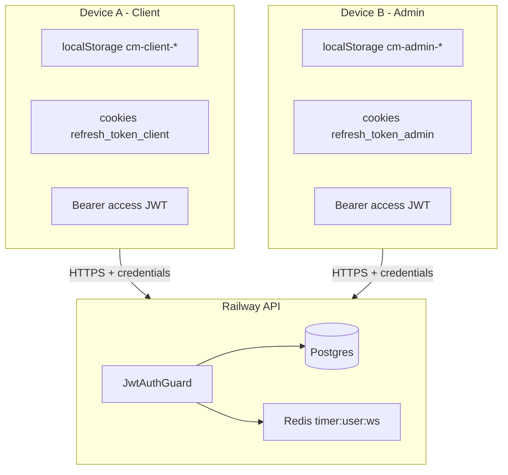

# Multi-device and parallel session handling

Kloqra allows the same user to be signed in on **multiple devices** and in **both apps** (client + admin) at the same time. This document defines the model, edge cases, and implementation rules.

## Design stance

| Principle                      | Choice                                                                       |
| ------------------------------ | ---------------------------------------------------------------------------- |
| Session model                  | **Stateless JWT** (no server-side session table)                             |
| Parallel devices               | **Allowed** — logout on device A does not revoke device B                    |
| Parallel apps (client + admin) | **Allowed** — isolated cookies + `localStorage` per `NEXT_PUBLIC_AUTH_SCOPE` |
| Workspace authority            | **JWT `workspaceId` claim** — not stale `localStorage`                       |
| Running timer                  | **One per user per workspace** (Redis) — shared across devices               |

We do **not** implement global sign-out, device limits, or refresh-token rotation in the database (optional future work).

---

## Architecture

Each device holds its **own** access token (short-lived) and refresh cookie (scoped by app). The API validates tokens independently per request.

---

## Credential layers

| Layer                            | Scope                                  | Lifetime                    | Cleared on logout (this device) |
| -------------------------------- | -------------------------------------- | --------------------------- | ------------------------------- |
| Bearer `accessToken`             | Per app (`cm-client-*` / `cm-admin-*`) | ~15m (`JWT_ACCESS_EXPIRES`) | Yes — `localStorage`            |
| httpOnly `access_token_{scope}`  | API host, per app                      | ~15m                        | Yes — `DELETE /auth/logout`     |
| httpOnly `refresh_token_{scope}` | API host, per app                      | ~7d (`JWT_REFRESH_EXPIRES`) | Yes — logout                    |
| `X-Workspace-Id` header          | Per request                            | N/A                         | Must match JWT or omitted       |
| `X-Auth-Scope` header            | Per request (`client` / `admin`)       | N/A                         | Selects cookie names            |

---

## Scenarios matrix

### Login and logout

| Action           | Device A        | Device B                                                  |
| ---------------- | --------------- | --------------------------------------------------------- |
| Login on A       | New tokens on A | Unchanged                                                 |
| Logout on A      | Cleared on A    | **Still logged in** until B's tokens expire or B logs out |
| Login on A again | New tokens on A | Still independent                                         |

### Admin + client (same browser)

| Action       | Admin                     | Client                     |
| ------------ | ------------------------- | -------------------------- |
| Login admin  | `refresh_token_admin` set | Unchanged                  |
| Login client | Unchanged                 | `refresh_token_client` set |
| Logout admin | Admin cookies cleared     | Client session remains     |

Requires **`X-Auth-Scope`** on all API calls and scoped cookie names (see [AUTH.md](./AUTH.md)).

### Workspace switch (multi-workspace user)

| Action                                   | Effect on other devices                                                                              |
| ---------------------------------------- | ---------------------------------------------------------------------------------------------------- |
| Switch workspace on A                    | A gets new JWT with new `workspaceId`                                                                |
| B still has old JWT + old `localStorage` | Next request with mismatched `X-Workspace-Id` → **403** until B switches workspace or signs in again |

**Client rule:** Treat JWT as source of truth; sync `localStorage` from token or from `/auth/me` after login/switch.

### Timer (shared state)

| Action                | Effect                                   |
| --------------------- | ---------------------------------------- |
| Start timer on phone  | Redis `timer:{workspaceId}:{userId}` set |
| Start timer on laptop | **409** `TIMER_ALREADY_ACTIVE`           |
| Stop on phone         | Laptop poll/SSE can show timer stopped   |

Timer is **workspace-scoped user state**, not per device. UI should call `GET /timer/active` on focus and handle 409 with a clear message.

---

## API behavior

### `JwtAuthGuard`

1. Resolve Bearer token (header preferred) or scoped `access_token_{scope}` cookie.
2. Verify JWT → `userId`, `workspaceId`, `role`.
3. If `X-Workspace-Id` is present and **≠** token `workspaceId` → **403 Forbidden** (stale device/tab).
4. If header omitted → use token `workspaceId`.

### Refresh (`POST /auth/refresh`)

- Reads scoped refresh cookie.
- Refresh JWT includes `workspaceId` (not `findFirst` membership).
- Re-issues access token for that workspace.

### Logout (`DELETE /auth/logout`)

- Clears scoped + legacy cookies for the request's `X-Auth-Scope`.
- Does **not** maintain a revocation list; other devices unaffected.

---

## Frontend rules

1. Send **`X-Auth-Scope`** on every API call (`NEXT_PUBLIC_AUTH_SCOPE`).
2. Send **`X-Workspace-Id`** only when it matches the access token workspace (`getEffectiveWorkspaceId()` in `@kloqra/web-shared`).
3. On **403** workspace mismatch → clear local session, redirect to login.
4. On **401** → attempt silent refresh once, then login.
5. Bootstrap: `GET /auth/me` **without** forcing a stale workspace header; persist response to `localStorage`.
6. Timer: on **409**, show “Timer already running (possibly on another device)” and refresh `GET /timer/active`.

---

## Operational errors (user-facing)

| Code                             | HTTP | Meaning                        | User action                               |
| -------------------------------- | ---- | ------------------------------ | ----------------------------------------- |
| `UNAUTHORIZED`                   | 401  | Missing/invalid access token   | Log in again                              |
| `FORBIDDEN` (workspace mismatch) | 403  | Tab/device workspace ≠ token   | Switch workspace or log in                |
| `TIMER_ALREADY_ACTIVE`           | 409  | Timer running for this user/ws | Stop on other device or open Active timer |
| `TIMER_NOT_ACTIVE`               | 400  | Stop when nothing running      | Refresh timer page                        |

---

## Future enhancements (not implemented)

| Feature                                                | Use case                                       |
| ------------------------------------------------------ | ---------------------------------------------- |
| `UserSession` table + `jti` on refresh token           | Logout all devices; revoke stolen refresh      |
| Refresh token rotation                                 | Detect refresh reuse                           |
| Per-device timer keys `timer:{ws}:{userId}:{deviceId}` | Independent timers per device (product change) |
| Push / SSE notify workspace switch                     | Auto-sync tabs on same device                  |

---

## Related docs

- [AUTH.md](./AUTH.md) — login, CORS, roles
- [ENVIRONMENT.md](../development/ENVIRONMENT.md) — env vars
- [local-troubleshooting.md](../runbooks/local-troubleshooting.md) — client vs admin cookies locally
