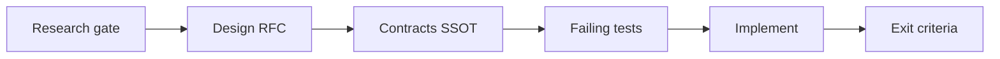
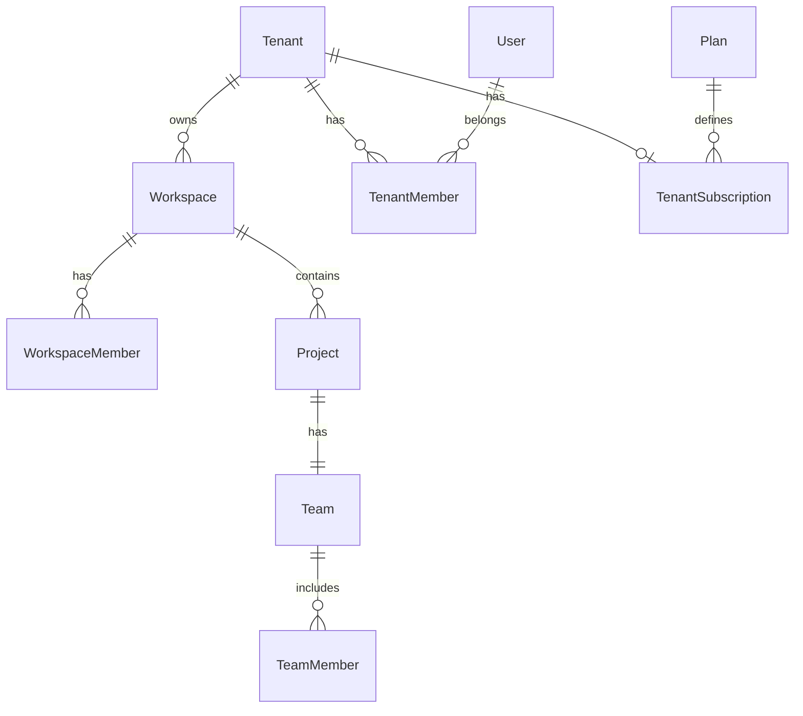
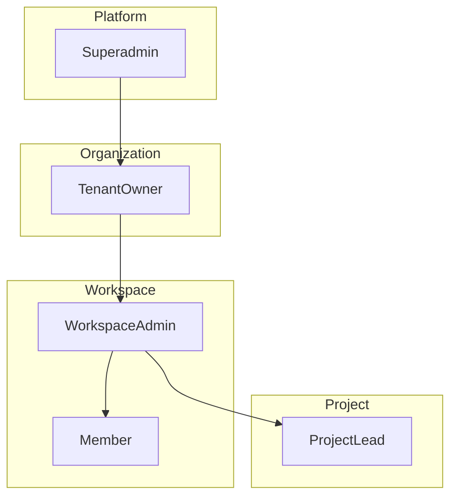
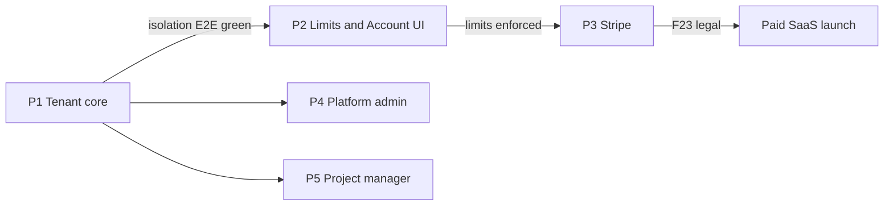
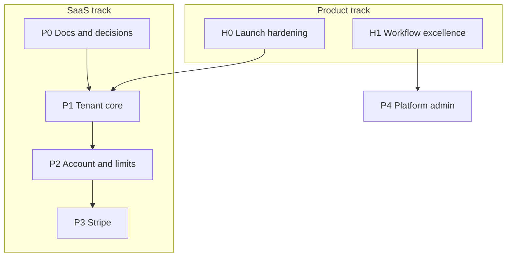
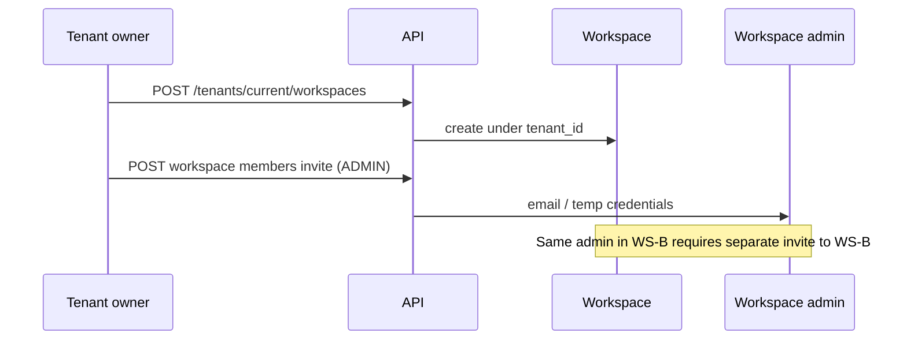
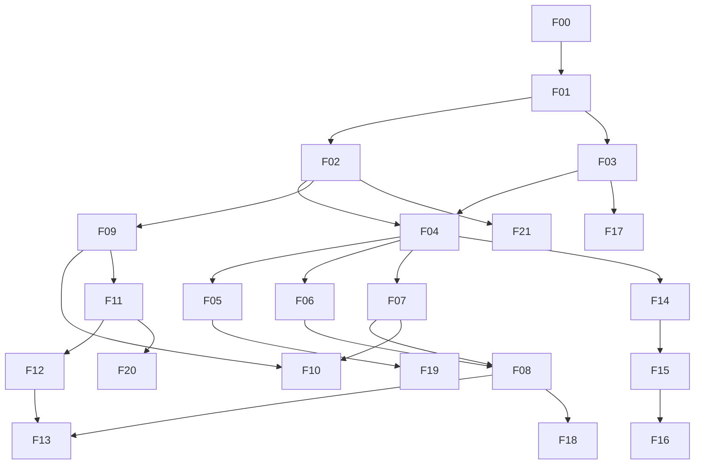

# Kloqra B2B SaaS Platform — Master Plan

> **Status:** Research & design (pre-implementation)  
> **Last updated:** June 2026  
> **Relationship:** Parallel track to [KLOQRA_FUTURE_PLAN.md](./KLOQRA_FUTURE_PLAN.md) (H0–H4 product horizons). Complete **H0 launch hardening** for current pilots before SaaS billing goes live.

This document is the **single source of truth** for transforming Kloqra into a multi-tenant B2B SaaS product. **Do not implement epics until that epic’s research gate is signed off.**

Agent index: [.cursor/plans/saas_platform_master.plan.md](../../.cursor/plans/saas_platform_master.plan.md)

---

## 1. Why plan before code

| Risk without plan                             | Mitigation                                          |
| --------------------------------------------- | --------------------------------------------------- |
| “Client” means two different things           | Locked glossary (§2)                                |
| Workspace isolation breaks when adding tenant | Tenant checks on every switch + CI isolation tests  |
| Stripe bolted on late                         | Plan limits schema before webhooks                  |
| PM role overlaps workspace admin              | Project-scoped PROJECT_MANAGER role, written matrix |
| Four apps when two suffice                    | App strategy locked (§5)                            |

**Workflow per epic:**



Follow [feature delivery order](../agent/AGENTS.md): contracts → tests → API → UI → pre-PR checks.

---

## 2. Glossary (locked vocabulary)

| Term                    | Meaning                                                                  | DB / API name (proposed)                  |
| ----------------------- | ------------------------------------------------------------------------ | ----------------------------------------- |
| **Tenant**              | **Organization owner account** — the org that purchases Kloqra           | `tenants`                                 |
| **Tenant owner**        | Primary org owner; billing, creates workspaces, assigns workspace admins | `tenant_members.role = OWNER`             |
| **Workspace**           | Operational unit inside a tenant (team/client partition)                 | `workspaces` (add `tenant_id`)            |
| **Workspace admin**     | Runs one workspace (today’s `ADMIN`)                                     | `workspace_members.role = ADMIN`          |
| **Project client**      | End customer a project is for (e.g. Fabrikam)                            | `project.client_name` — **not** tenant    |
| **Member**              | Staff logging time                                                       | `workspace_members.role = MEMBER`         |
| **Project manager**     | PM scoped to assigned projects                                           | `team_members.role = PROJECT_MANAGER`     |
| **Platform superadmin** | Kloqra staff                                                             | `platform_users` or `users.platform_role` |

**Never use “client” for tenant in code or UI.**

---

## 3. Target architecture

### 3.1 Entity hierarchy



### 3.2 Role layers

```
Platform superadmin     →  apps/platform-admin (new, internal)
Tenant owner / admin    →  apps/admin → Account section
Workspace admin         →  apps/admin → Workspace mode (today)
Project manager            →  apps/admin → filtered by project
Member                  →  apps/client
```

### 3.2 Three “billing” concepts (keep separate)

| Concept                     | Direction                       | Status today                                |
| --------------------------- | ------------------------------- | ------------------------------------------- |
| **SaaS subscription**       | Tenant → Kloqra                 | Not built                                   |
| **Workspace billing rates** | Tenant → their clients (hourly) | Shipped ([billing.md](../specs/billing.md)) |
| **Client invoices (H2)**    | Tenant → their clients (PDF)    | Roadmap                                     |

### 3.3 Role architecture (summary)

Full matrices, diagrams, UI map → **[TENANT_RBAC.md](./TENANT_RBAC.md)**. Domain entities → **[TENANT_DOMAIN_MODEL.md](./TENANT_DOMAIN_MODEL.md)**.



| Role            | App               | Contract enum            |
| --------------- | ----------------- | ------------------------ |
| Superadmin      | `platform-admin`  | `SUPERADMIN`             |
| Tenant owner    | `admin` Account   | `OWNER`                  |
| Workspace admin | `admin` Workspace | `ADMIN` (workspace)      |
| Project manager | `admin` filtered  | `PROJECT_MANAGER` (team) |
| Member          | `client`          | `MEMBER` (workspace)     |

---

## 4. Current baseline (gap summary)

| Area             | Shipped                           | Gap                                 |
| ---------------- | --------------------------------- | ----------------------------------- |
| Tenant entity    | No                                | Full greenfield                     |
| Roles            | `ADMIN` \| `MEMBER` per workspace | Platform + tenant + project manager |
| Signup           | Self-register **disabled**        | Tenant provisioning flow            |
| Payments         | None (no Stripe)                  | Full subscription stack             |
| Workspace create | Any auth user `POST /workspaces`  | Tenant-scoped + plan limits         |
| Isolation        | `workspaceId` in JWT/guards       | `tenantId` verification on switch   |
| Apps             | client, admin, api                | platform-admin + Account UI         |

---

## 5. App strategy

| App                   | Audience                             | Action                                              |
| --------------------- | ------------------------------------ | --------------------------------------------------- |
| `apps/client`         | Members                              | No structural change                                |
| `apps/admin`          | Workspace admins, tenant owners, PMs | Add **Account** layer                               |
| `apps/platform-admin` | Kloqra superadmin                    | **New** — internal deploy only                      |
| `apps/api`            | All                                  | New modules: `tenants`, `platform`, `subscriptions` |

**No fourth customer-facing app.**

---

## 6. Phase overview

| Phase  | Theme                | Epics                     | Ship when                     |
| ------ | -------------------- | ------------------------- | ----------------------------- |
| **P0** | Decisions & research | F00                       | Before any SaaS code          |
| **P1** | Tenant core          | F01–F07                   | Pilots on tenant model (free) |
| **P2** | Account UI & limits  | F08–F10                   | Enforce caps without Stripe   |
| **P3** | Payments             | F11–F13                   | Paid signup live              |
| **P4** | Platform admin       | F14–F15, F16 (audit only) | Internal ops ready            |
| **P5** | Project manager      | F17                       | PM workflow                   |
| **P6** | Scale & compliance   | F18–F24                   | Enterprise-ready              |

**Rule:** One epic ≈ one PR series. Do not start P3 until P1 isolation tests are green.

---

## 7. Global decision log

Status: `OPEN` | `DECIDED` | `DEFERRED`

| ID  | Question                        | Status       | Decision                                                                                                                               |
| --- | ------------------------------- | ------------ | -------------------------------------------------------------------------------------------------------------------------------------- |
| D01 | Tenant table name               | **DECIDED**  | `tenants` — UI label **Organization**                                                                                                  |
| D02 | Pricing model                   | **DECIDED**  | Based on **number of workspaces** + **number of members** (seats)                                                                      |
| D03 | Self-serve signup               | **DECIDED**  | Enabled via `SELF_SERVE_SIGNUP_ENABLED` env flag (F20); superadmin provisioning remains for enterprise; off in prod until F23          |
| D04 | Trial                           | **DECIDED**  | **1 month**; card requirement TBD at Stripe epic                                                                                       |
| D05 | Tenant owner workspace ops      | **DECIDED**  | Owner **creates workspaces** and **assigns a workspace admin** per workspace                                                           |
| D06 | PM model                        | **DECIDED**  | Project-scoped `PROJECT_MANAGER` on team; **same PM may lead multiple projects**                                                       |
| D07 | Payment provider                | **DECIDED**  | **Stripe**; detailed pricing SKUs deferred                                                                                             |
| D08 | One user, multiple tenants      | **DECIDED**  | **Block** — one user belongs to **one tenant only** (cross-tenant is out of scope)                                                     |
| D09 | Pilot migration                 | **DECIDED**  | One tenant per customer org; **N workspaces per tenant**; F21 audit fails on cross-tenant user conflict                                |
| D10 | USD only v1                     | **OPEN**     | Decide at F11                                                                                                                          |
| D11 | Workspaces per plan (tier caps) | **DEFERRED** | Internal research later — schema supports `maxWorkspaces`; numbers TBD                                                                 |
| D12 | Payment failure behavior        | **DECIDED**  | **Block new time entries** (timer start + manual log create) until payment succeeds; read-only access TBD                              |
| D13 | Superadmin impersonation        | **DECIDED**  | **Not required** — no tenant/workspace impersonation for platform staff                                                                |
| D14 | Workspace admin sharing         | **DECIDED**  | Same person may be admin in **multiple workspaces** within one tenant; **provisioned per workspace** (no auto-grant to all workspaces) |
| D15 | Member multi-workspace          | **DECIDED**  | One member may belong to **multiple workspaces** within the **same tenant**; provisioning **per workspace**                            |
| D16 | Superadmin tenant create        | **DECIDED**  | Superadmin creates **temporary tenant + owner account**; owner completes org details on first login                                    |

### 7.1 Locked rules (implementation contract)

These follow from the decisions above and must not be violated in code:

1. **`users` ↔ `tenants`:** at most one `tenant_members` row per user (enforce `UNIQUE(user_id)` on `tenant_members`).
2. **Workspace membership** is independent per workspace — inviting admin or member to Workspace B does not add them to Workspace A.
3. **Tenant owner** uses Account UI to create workspace → assign workspace admin (invite or pick existing tenant user).
4. **PM (`PROJECT_MANAGER`):** permissions resolved per project via `team_members`; union of led projects drives admin nav filter.
5. **Payment `past_due` / `suspended`:** reject `POST` timer start, manual timelog create, and bulk import mutations until subscription active (exact read-only rules in F12 research).
6. **Platform superadmin:** tenant CRUD + suspend only — **no impersonation** (F16 scoped to audit of platform actions only).

---

## 7.2 Production-grade validation

**Verdict:** The **architecture is production-grade**; the **product is pilot-grade** until P1–P3 ship with isolation tests and billing. This section is the sign-off checklist — use it before each phase gate and before public paid launch.

### What is already sound (design validation)

| Design choice                           | Why it meets prod bar                      |
| --------------------------------------- | ------------------------------------------ |
| Tenant → many workspaces                | Standard B2B / agency model                |
| Workspace as operational data boundary  | Extends today’s `workspaceId` isolation    |
| Workspace admin scoped per workspace    | Least privilege across client workspaces   |
| Per-workspace provisioning              | No accidental cross-workspace access       |
| One user, one tenant                    | Simpler security; fewer IDOR classes       |
| PM = project-scoped `PROJECT_MANAGER`   | Correct granularity; multi-project allowed |
| Tenant owner ≠ auto-admin everywhere    | Account vs operations separation           |
| Separate `platform-admin` app           | Operator console isolation                 |
| No superadmin impersonation             | Trust/compliance friendly                  |
| Stripe + limits on workspaces + seats   | Normal B2B pricing shape                   |
| Payment failure blocks new time entries | Strong lever without data loss             |
| Docs-first (this plan + TENANT_RBAC)    | Prevents role drift in implementation      |

### Readiness scorecard (track over time)

| Dimension                    | Target | As of plan (pre-implementation)                                                                               |
| ---------------------------- | ------ | ------------------------------------------------------------------------------------------------------------- |
| Architecture / tenancy model | ≥ 8/10 | **8.5/10** — locked decisions §7                                                                              |
| Security model (documented)  | ≥ 8/10 | **8/10** — deny rules §7.1                                                                                    |
| Implemented in codebase      | ≥ 8/10 | **6/10** — tenant schema, JWT guard, isolation E2E, tenant membership API (F04–F06); billing/Stripe not built |
| Operational readiness        | ≥ 7/10 | **4/10** — H0 hardening open                                                                                  |
| Commercial readiness         | ≥ 7/10 | **3/10** — no subscriptions yet                                                                               |

Update this table when P1, P2, P3 complete.

### Must-have before multi-tenant pilots (P1 exit)

- [x] `tenant_id` on all workspaces; migration runbook executed (F21, D09)
- [x] `UNIQUE(user_id)` on `tenant_members` enforced (D08)
- [x] Workspace switch verifies `workspace.tenantId === user.tenantId` (F04)
- [x] `apps/api/test/tenant-isolation.e2e.ts` green in CI (F05)
- [x] Cross-tenant IDOR tests (guessed UUIDs → 403/404)
- [x] Per-workspace admin: no access without explicit `workspace_members` row (D14)
- [x] [TENANT_RBAC.md](./TENANT_RBAC.md) signed off (F03)
- [x] Tenant owner workspace create + assign admin API (`POST /tenants/current/workspaces`, `POST /workspaces/:id/admins/assign`) (F07)
- [x] Workspace names unique per tenant; `apps/api/test/workspace-lifecycle.e2e.ts` green (F07)

### Must-have before plan limits without payment (P2 exit)

- [x] Tenant owner Account UI: create workspace, assign admin (F08)
- [x] `maxWorkspaces` and `maxSeats` enforced (F10) — tier numbers (D11) may follow
- [x] Seat count definition documented (distinct users across tenant workspaces)

### Must-have before paid SaaS (P3 exit)

- [ ] Stripe webhooks idempotent + reconciliation cron (F11–F12)
- [ ] Subscription states: `trial` (30d), `active`, `past_due`, `suspended`, `canceled`
- [ ] `past_due` blocks timer start + manual timelog create (D12) with owner billing CTA
- [ ] Legal minimum: ToS, Privacy, DPA (F23) — drafts in `docs/legal/`; counsel sign-off pending in `SIGNOFF.md`
- [ ] Payment-failure UX: in-app banner + email to tenant owner

### Must-have before PM role (P5 exit)

- [x] Permission matrix enforced in services, not only `@Roles("ADMIN")` (F17)
- [ ] E2E: PROJECT_MANAGER approves assigned project only; denied on other projects

### Should-have for mature B2B (P4–P6)

- [x] Platform audit log for tenant create/suspend/plan override (F16)
- [ ] Sentry (or equivalent) tags errors with `tenantId`
- [ ] Tenant rollup dashboard for owner (F18)
- [ ] H0 launch hardening complete ([KLOQRA_FUTURE_PLAN.md](./KLOQRA_FUTURE_PLAN.md) H0)

### Known risks (not blockers — mitigate in build)

| Risk                                              | Mitigation                                                       |
| ------------------------------------------------- | ---------------------------------------------------------------- |
| PM refactor touches many `@Roles("ADMIN")` routes | F03 matrix first; project checks in `ProjectAccessService`       |
| Per-workspace invites feel heavy                  | Clear UI copy; bulk invite per workspace                         |
| One user = one tenant                             | Document: second agency = second email                           |
| Hard block on payment failure frustrates users    | Grace period + read-only view (F12 research); owner billing path |
| Owner not in every workspace                      | Account rollup (F18) or explicit invite to ops workspaces        |

### What would make this **not** prod-grade

Do **not** ship if any of these are true:

1. Tenant isolation E2E missing or failing
2. Stripe live without webhook idempotency tests
3. PM or tenant owner permissions added without matrix updates
4. Superadmin impersonation added without explicit security review (currently **out of scope**, D13)
5. Paid launch without legal sign-off (F23)

### Phase gate summary



### Demo / stakeholder one-liner

> Kloqra adds an org layer (tenant) above workspaces with per-workspace admins and project-scoped PMs — the same patterns as mature B2B SaaS. The time-tracking core is already strong; we add commercial and org controls with isolation testing before billing.

---

## 7.3 Development plan & continuity

**You cannot — and should not — build this in a single go.** Ship **thin vertical slices** per epic; keep the current product running on `main`/`dev` while SaaS layers in behind flags and migrations.

### Dual-track roadmap

Run **two tracks** in parallel; SaaS does not pause core product work.

| Track             | Source                                                 | Focus                            | Priority                                  |
| ----------------- | ------------------------------------------------------ | -------------------------------- | ----------------------------------------- |
| **Product**       | [KLOQRA_FUTURE_PLAN.md](./KLOQRA_FUTURE_PLAN.md) H0–H2 | Pilots, hardening, budget, audit | **P0** — keeps today’s customers safe     |
| **SaaS platform** | This doc P0–P6                                         | Tenant, Account UI, Stripe, PM   | **P1** after F00; P3 only after F05 green |

**Rule:** Merge H0 fixes anytime. **Do not merge paid billing (P3)** until §7.2 P3 checklist is complete.



### Shippable increments (what “done” looks like per phase)

Each phase must leave **production in a valid state** — not a half-migrated mess.

| Phase  | User-visible outcome                                    | Core app still works?                       |
| ------ | ------------------------------------------------------- | ------------------------------------------- |
| **P0** | Docs only (`TENANT_RBAC`, decisions)                    | Yes — zero code change                      |
| **P1** | DB has tenants; pilots backfilled; cross-tenant blocked | Yes — same UX; `tenant_id` invisible if 1:1 |
| **P2** | Owner sees Account; plan limits block over-cap invites  | Yes — free/pilot plan for all               |
| **P3** | Paid plans; payment failure blocks new time entries     | Yes — with billing banners                  |
| **P4** | Internal platform-admin for Kloqra staff                | Yes — customers unchanged                   |
| **P5** | PM role on assigned projects                            | Yes — admins unchanged                      |
| **P6** | Rollups, compliance polish                              | Yes                                         |

### Epic sizing — one epic ≈ one PR series

| Epic size  | Target          | Example                                             |
| ---------- | --------------- | --------------------------------------------------- |
| **Small**  | 1 PR            | F21 migration script, F16 audit events              |
| **Medium** | 2–4 PRs         | F02 schema, F06 tenant API, F08 Account shell       |
| **Large**  | 5–8 PRs         | F04 auth, F17 PM (many controllers)                 |
| **XL**     | Split sub-epics | F11–F12 Stripe (webhooks separate from checkout UI) |

**Never** open a PR titled “SaaS platform v1”. PR titles: `SaaS-F04: add tenantId to JWT and switch-workspace guard`.

### Recommended P1 build order (continuity-safe)

1. **F01 + F03** (docs only, parallel) — domain RFC + `TENANT_RBAC.md`
2. **F02 + F21** — schema + backfill (`tenant_id` nullable → NOT NULL in follow-up PR)
3. **F04** — auth guards (highest risk — full test pass)
4. **F05** — isolation E2E (**gate** — stop if red)
5. **F06 + F07** — tenant API + workspace create restrictions
6. Ship **P1 milestone** — update §7.2 scorecard

Within P1, **F03 can run parallel to F02** (docs while BE migrates).

### Backward compatibility during migration

| Technique                                                         | When    |
| ----------------------------------------------------------------- | ------- |
| `workspaces.tenant_id` nullable first PR, backfill, then NOT NULL | F02/F21 |
| Default tenant per workspace 1:1 for pilots                       | F21     |
| Existing login flow unchanged until F04 ships tenant in JWT       | F04     |
| `POST /workspaces` keeps working until F07 tightens               | F07     |
| Pilot plan with high limits until F10                             | F09–F10 |

### Continuity artifacts (every epic)

| Artifact                                                                         | Action                                     |
| -------------------------------------------------------------------------------- | ------------------------------------------ |
| [TASK_BOARD.json](../../TASK_BOARD.json)                                         | Add `SaaS-F0X`; set `in_progress` → `done` |
| [SAAS_PLATFORM_PLAN.md](./SAAS_PLATFORM_PLAN.md)                                 | Check research gate boxes; note blockers   |
| [saas_platform_master.plan.md](../../.cursor/plans/saas_platform_master.plan.md) | Mark todo completed                        |
| `packages/contracts`                                                             | SSOT before API                            |
| `docs/specs/<feature>.md`                                                        | Promote when epic ships                    |
| §7.2 scorecard                                                                   | Bump when phase exits                      |

When F00 completes, append `SaaS-F01`, `SaaS-F02`, … to TASK_BOARD. Only **one** SaaS epic `in_progress` unless docs-only (F01/F03 parallel with F02).

### Branch & merge strategy

| Practice          | Detail                                          |
| ----------------- | ----------------------------------------------- |
| Branch            | `saas/f04-tenant-jwt` from `dev`                |
| Merge target      | `dev` first; `main` after CI + pilot smoke      |
| Long-lived branch | **Avoid** mega `saas-platform` branch           |
| Conflicts         | Rebase weekly; coordinate SaaS auth PRs with H0 |

### Session handoff template

**Start:**

```markdown
## SaaS continuity handoff

- Last completed: SaaS-F0X (PR link)
- Current epic: SaaS-F0Y
- Research gate: [ ] done
- Open: D09, D10, D11
- Read: SAAS_PLATFORM_PLAN.md §F0Y, TENANT_RBAC.md
```

**End:**

```markdown
<SYNC_BLOCK status="DONE|BLOCKED" task_id="SaaS-F0X">

- Files / tests / Next epic / TASK_BOARD updated
  </SYNC_BLOCK>
```

### Stop points

| Signal                    | Action                       |
| ------------------------- | ---------------------------- |
| F05 isolation E2E failing | Stop SaaS merges until fixed |
| H0 P0 prod bug            | Pause SaaS; fix H0 first     |
| Pilot demo in 2 weeks     | Freeze SaaS API; docs only   |
| &lt; 1 FTE                | P0 docs only; defer F02      |

### Parallel work (safe vs unsafe)

| Safe                                | Unsafe                             |
| ----------------------------------- | ---------------------------------- |
| F01 + F03 docs                      | F04 auth + F17 PM together         |
| F08 UI + F10 limits API (after F06) | F11 Stripe + F02 schema churn      |
| H0 + F01 docs                       | Two PRs touching `auth.service.ts` |

### Calendar estimate (1 FTE, conservative)

| Milestone           | Weeks | Cumulative |
| ------------------- | ----- | ---------- |
| P0 docs             | 1–2   | 2          |
| P1 tenant core      | 4–8   | 10         |
| P2 Account + limits | 2–4   | 14         |
| P3 Stripe           | 3–5   | 19         |
| P4–P5 platform + PM | 4–7   | 26         |

2 FTE (BE + FE): P1 and P2 overlap saves ~30%.

---

# Feature epics (research → build)

Each epic has:

- **Research gate** — must be `DONE` before contracts
- **Dependencies** — prior epics
- **Deliverables** — artifacts to produce
- **Exit criteria** — definition of done

---

## F00 — Program kickoff & stakeholder alignment

**Phase:** P0  
**Goal:** Agree scope, pricing hypothesis, and phase order.

### Research gate

- [ ] Confirm SaaS track does not block H0 pilot hardening
- [ ] Identify first 3 pilot tenants (names, workspace count, pricing expectation)
- [ ] Legal review scheduled (ToS, Privacy, DPA) — timeline only
- [ ] Decide build vs buy for Stripe Customer Portal
- [x] Core product decisions D01–D08, D11–D16 locked (§7)

### Deliverables

- Signed phase order (this doc)
- ~~D01–D10 owners assigned~~ → D09, D10, D11 remain open
- `TASK_BOARD.json` epics added — **SaaS-F00 … SaaS-F24** (execution order in board)

### Exit criteria

- Product + engineering agree: P1 scope only (no Stripe in P1)

---

## F01 — Domain model & terminology RFC

**Phase:** P1  
**Dependencies:** F00  
**Goal:** Frozen entity diagram and glossary for all later epics.

### Research gate

- [ ] Confirm tenant vs project-client naming in all UI copy
- [x] Cross-tenant users **blocked** (D08) — document: one email = one org; no tenant picker at login
- [ ] Map every existing `workspaceId` query path — no tenant bypass
- [ ] Review [DOMAIN_MODEL.md](./DOMAIN_MODEL.md) diff
- [ ] Document per-workspace provisioning model (D14, D15)

### Design decisions

- `TenantMember` roles: `OWNER` (required once per tenant); optional `ADMIN` for billing/delegates
- `tenant_members`: **`UNIQUE(user_id)`** — user cannot join two tenants
- Workspace remains data isolation boundary for time logs
- Workspace admin/member: **per-workspace** `workspace_members` rows (shared person = multiple rows, one per workspace)
- Status enum: `active`, `suspended`, `churned`, `pending_setup` (temporary superadmin-created account)

### Deliverables

- `docs/architecture/TENANT_DOMAIN_MODEL.md` (child RFC) — **shipped**
- Mermaid ER diagram in contracts or architecture
- Updated glossary in this doc if terms change

### Exit criteria

- [x] LSA review complete; no open naming conflicts

---

## F02 — Tenant & membership schema (Prisma)

**Phase:** P1  
**Dependencies:** F01  
**Goal:** Database foundation for tenants.

### Research gate

- [x] Migration strategy for existing workspaces (D09) — org-scoped tenant; multi-workspace allowed; F21 conflict audit
- [x] Soft-delete vs hard-delete for tenant — `status` enum only (`churned`); no `deleted_at`
- [x] Unique constraints: tenant slug global unique; `tenant_members.user_id` unique (D08); invite email deferred to F06/F07
- [x] Index plan: `workspaces(tenant_id)`, `tenant_members(tenant_id)`; `user_id` unique covers lookup

### Schema (proposed)

```
tenants(id, name, slug, status, settings jsonb, created_at, ...)
tenant_members(id, tenant_id, user_id, role, is_active, ...)
  UNIQUE(user_id)  -- one tenant per user (D08)
workspaces.tenant_id NOT NULL FK → tenants.id
```

Superadmin-created tenants start as `status = pending_setup`; owner completes profile on first login (D16).

### Deliverables

- Prisma migration (`tenants`, `tenant_members`, nullable `workspaces.tenant_id`) — **shipped**
- `packages/contracts` tenant DTOs + optional `settings` — **shipped**
- Seed: 1 demo tenant, 3 workspaces, owner + tenant admin memberships
- F21: backfill script + NOT NULL follow-up migration

### Tests

- Migration rolls forward/back on copy of prod snapshot
- FK integrity: cannot orphan workspace

### Exit criteria

- [x] `pnpm prisma migrate` clean; seed demonstrates multi-workspace tenant

---

## F03 — RBAC permission matrix

**Phase:** P1  
**Dependencies:** F01  
**Goal:** Every API route mapped to roles — no implicit permissions.

### Research gate

- [ ] List all `@Roles("ADMIN")` controllers (grep audit)
- [ ] Decide PM permissions per route (defer PROJECT_MANAGER to F17 but reserve rows)
- [ ] Tenant owner: which routes are account-level vs workspace-level
- [ ] Platform superadmin: explicit allow-list only

### Deliverables

- `docs/architecture/TENANT_RBAC.md` — matrix: Route × Platform × Tenant × Workspace × Project manager × Member
- `packages/contracts` role enums — **shipped** in `tenant-rbac.ts`
- Deny-by-default statement for unknown roles

### Exit criteria

- [x] Zero `TBD` cells for P1 routes; PM cells may say `F17`
- [x] LSA review: `tenant-rbac.spec.ts` green

---

## F04 — Auth, JWT & guards

**Phase:** P1  
**Dependencies:** F02, F03  
**Goal:** Tokens and guards understand tenant context.

### Research gate

- [x] JWT claims: `tenantId` on access token; `tenantRole` on session DTO (optional)
- [x] `POST /auth/switch-workspace`: verify `workspace.tenantId === user.tenantId`
- [x] Login: **no multi-tenant picker** — user has exactly one tenant (D08)
- [ ] Platform superadmin: separate issuer or `typ: "platform"` claim (F14)
- [ ] Refresh token: include tenant context (deferred — workspaceId sufficient for rotation v1)

### Deliverables

- `TenantGuard`, `PlatformGuard` (or extended `JwtAuthGuard`)
- Contracts: session DTO includes `tenantId`, `tenantRole`
- Update [AUTH.md](./AUTH.md), [MULTI_DEVICE_SESSIONS.md](./MULTI_DEVICE_SESSIONS.md)

### Tests

- Switch workspace to other tenant’s ID → 403
- Stale `X-Workspace-Id` still 403 (existing behavior preserved)

### Exit criteria

- All workspace routes reject cross-tenant switch
- Auth spec + e2e green

---

## F05 — Data isolation & security

**Phase:** P1  
**Dependencies:** F04  
**Goal:** Provable tenant isolation — production gate.

### Research gate

- [x] Threat model: IDOR, cross-tenant workspace UUID guess — documented in SECURITY.md; covered by `tenant-isolation.e2e.ts`
- [x] No superadmin impersonation (D13) — platform staff use tenant list/metadata only
- [x] Redis/Socket.IO: workspace-scoped keys sufficient for v1 (documented in SECURITY.md)
- [x] Public API keys: tenant boundary on create — **deferred F19** (prep note in SECURITY.md)
- [x] Sentry: tag `tenantId` on errors — **F22** (`SentryFilter` tags + `subscriptionStatus` extra)

### Deliverables

- [x] `docs/development/SECURITY.md` tenant section
- [x] `apps/api/test/tenant-isolation.e2e.ts`
- [x] CI: existing `integration` job runs all `*.e2e.ts` (no separate job required)

### Exit criteria

- E2E proves Tenant A cannot read Tenant B resources with guessed IDs
- Pen-test checklist item for tenant IDOR marked covered

---

## F06 — Tenant membership & roles API

**Phase:** P1  
**Dependencies:** F02, F03, F04  
**Goal:** CRUD tenant members; assign tenant owner.

### Research gate

- [x] Who can invite tenant admin — **owner only** (`POST /tenants/current/members`)
- [x] Seat counting definition: distinct active users in `tenant_members` ∪ `workspace_members` (overview only; enforce F10)
- [x] Remove last tenant owner — **blocked**

### API (implemented)

| Method | Route                          | Roles                      |
| ------ | ------------------------------ | -------------------------- |
| GET    | `/tenants/current`             | Tenant member              |
| GET    | `/tenants/current/overview`    | Tenant owner               |
| GET    | `/tenants/current/members`     | Tenant owner, tenant admin |
| POST   | `/tenants/current/members`     | Tenant owner               |
| PATCH  | `/tenants/current/members/:id` | Tenant owner               |

### Deliverables

- [x] `apps/api/src/modules/tenants/`
- [x] `docs/specs/tenants.md`
- [x] Service specs + e2e (`tenants.service.spec.ts`, `tenants.e2e.ts`)

### Exit criteria

- [x] Tenant owner can list/invite tenant admins
- [x] Non-member cannot call tenant routes

---

## F07 — Workspace lifecycle (tenant-scoped)

**Phase:** P1  
**Dependencies:** F04, F06  
**Goal:** Workspaces belong to tenant; **tenant owner** creates and staffs them.

### Research gate

- [x] `POST /workspaces` restricted to **tenant owner** (D05)
- [ ] Archive workspace: soft-delete, data retention
- [x] Move workspace between tenants — **forbid** v1 (no API)
- [ ] Default workspace on superadmin tenant create (D16) — optional first workspace
- [x] Assign workspace admin per workspace (D05, D14) — separate invite/provision flow
- [x] Seat counting: unique users across all `workspace_members` in tenant vs `tenant_members` only (align D02)

### Provisioning flow (locked)



### Changes to existing

- `WorkspaceService.create` → require `tenantRole = OWNER`, attach `tenantId`
- `WorkspaceService.listForUser` → filter workspaces by user's tenant
- Superadmin create (F15) may bypass limits during pilot

### Deliverables

- `POST /tenants/current/workspaces` (or scoped `POST /workspaces` with tenant guard)
- `POST /workspaces/:id/admins/assign` — invite or promote existing tenant user to workspace ADMIN
- Updated [auth-workspace.md](../specs/auth-workspace.md)
- E2E: owner creates two workspaces, assigns same admin to both via **two invites**

### Exit criteria

- Every workspace has `tenant_id`
- Workspace admin in WS-A has no access to WS-B until individually provisioned

---

## F08 — Account UI (admin app extension)

**Phase:** P2  
**Dependencies:** F06, F07  
**Goal:** Tenant owner home — workspaces, members, settings.

### Research gate

- [x] Nav structure: Account vs Workspace mode toggle
- [x] Landing page for tenant owner after login
- [x] Workspace switcher shows only tenant’s workspaces
- [x] Mobile layout for account pages

### UI sections

1. **Overview** — plan name (stub), workspace count, member/seat count (D02)
2. **Workspaces** — list, **create**, **assign workspace admin** (per workspace)
3. **Organization** — tenant name, slug, complete setup if `pending_setup` (D16)
4. **Billing** — stub until F13

### Deliverables

- `apps/admin/src/app/(account)/` or `(admin)/account/`
- `@kloqra/web-shared` hooks: `useTenant`, `useTenantWorkspaces`
- Playwright: tenant owner creates workspace + assigns admin

### Exit criteria

- Tenant owner creates workspace and assigns admin without SQL
- Workspace-only admin does not see Account nav
- Member in two workspaces sees both in switcher (same tenant only)

---

## F09 — Plan catalog (no payments)

**Phase:** P2  
**Dependencies:** F02  
**Goal:** Plans and limits exist in DB before Stripe.

### Research gate

- [x] Define tier names (Starter / Pro / Enterprise) — **workspace counts per tier deferred** (D11); Enterprise via `limits_override` on pro
- [x] Limits dimensions: `maxWorkspaces`, `maxSeats` (unique members across tenant workspaces) (D02)
- [x] Limits JSON schema: add `maxProjects`, `features[]` as needed (optional on `planLimitsSchema`; not seeded until F10)
- [x] Free / pilot plan for existing customers (`pilot` slug, generous limits)
- [x] Enterprise = manual `limits_override` on `tenant_subscriptions`
- [x] Trial duration: **30 days** on `tenant_subscriptions` (D04); demo seed uses `active` on pilot

### Schema (proposed)

```
plans(id, name, slug, limits jsonb, is_public, ...)
tenant_subscriptions(tenant_id, plan_id, status, ...)  -- status=active|trial|...
```

### Deliverables

- `packages/contracts/src/plan-catalog.ts`
- Seed plans: `pilot`, `starter`, `pro`
- Admin UI shows current plan (read-only until F13)

### Exit criteria

- [x] Every tenant has a plan row
- [x] Limits readable from API `GET /tenants/current/subscription`

---

## F10 — Plan limit enforcement

**Phase:** P2  
**Dependencies:** F09, F07  
**Goal:** Block actions when over limit (before money involved).

### Research gate

- [x] Soft warn (80%) vs hard block (100%) — hard block only in F10
- [x] Downgrade: grandfather existing workspaces over new cap?
- [x] Enforce on: workspace create, **per-workspace** member invite, bulk invite, tenant admin invite
- [x] Seat count = distinct `user_id` across `tenant_members` ∪ `workspace_members` in tenant (F06/F09)

### Deliverables

- `PlanLimitService` (service-layer enforcement)
- 402 with `ErrorCodes.PLAN_LIMIT_EXCEEDED`
- Tests per limit type

### Exit criteria

- [x] Creating workspace over `maxWorkspaces` fails with clear error
- [x] Bulk invite blocked when seats exceeded

---

## F11 — Stripe integration

**Phase:** P3  
**Dependencies:** F09, D07 decided  
**Goal:** Payment provider wired; webhooks reliable.

### Research gate

- [ ] Stripe account setup (test + prod)
- [ ] Products/prices map to `plans` table
- [ ] Webhook endpoint security (signature, idempotency table)
- [ ] Local dev: Stripe CLI
- [ ] Railway env vars documented

### Deliverables

- `apps/api/src/modules/subscriptions/`
- `docs/specs/subscriptions.md`
- Webhook handlers: `checkout.session.completed`, `customer.subscription.*`, `invoice.payment_failed`
- `docs/development/ENVIRONMENT.md` Stripe vars

### Tests

- Webhook fixture tests (mock Stripe)
- Idempotent replay of same event

### Exit criteria

- Test checkout creates tenant + subscription row in sync
- Failed signature rejected

---

## F12 — Subscription lifecycle

**Phase:** P3  
**Dependencies:** F11  
**Goal:** State machine from trial → active → past_due → canceled; **block new time entries** when unpaid.

### Research gate

- [x] Trial duration: **1 month** (D04); card required — decide at F11
- [ ] Grace period after `invoice.payment_failed` before hard block (0 vs N days)
- [x] **`past_due` / `suspended`:** block **new time entries** — timer start, manual timelog create, recurrence create (D12)
- [ ] Read-only during suspension: allow login, view timesheets, export? (research)
- [ ] Running timers when payment fails — auto-stop or allow stop only?
- [ ] Proration on upgrade/downgrade
- [ ] Stripe Customer Portal vs custom UI

### States

```
trial (30d) → active → past_due → suspended → canceled
                ↑___________|  (payment recovered)
```

### Deliverables

- `TenantStatusService` syncs DB from webhooks
- `SubscriptionWriteGuard` on timer + timelog mutation endpoints
- Cron: reconcile Stripe ↔ DB drift
- In-app banner + email on payment failure

### Exit criteria

- E2E: `past_due` tenant → `POST /timer/start` returns plan/payment error
- E2E: payment recovered → entries allowed again

---

## F13 — Billing UX (tenant owner)

**Phase:** P3  
**Dependencies:** F08, F11, F12  
**Goal:** Tenant owner manages subscription in admin Account.

### Research gate

- [ ] Embed Stripe Customer Portal or custom forms
- [ ] In-app banners: trial ending, payment failed
- [ ] Invoice list: Stripe-hosted vs in-app
- [ ] Upgrade CTA on limit errors (from F10)

### Deliverables

- Account → Billing tab
- Checkout session for upgrade
- Email templates (Brevo): payment failed, trial ending

### Exit criteria

- Tenant owner upgrades plan without superadmin
- Receipt email received on successful payment

---

## F14 — Platform admin app (scaffold)

**Phase:** P4  
**Dependencies:** F04 (platform auth)  
**Goal:** Internal app for Kloqra staff.

### Research gate

- [ ] Deploy URL: internal VPN or IP allowlist?
- [ ] Separate `NEXT_PUBLIC_AUTH_SCOPE=platform`
- [ ] MFA required for platform users?
- [ ] Shared UI package with admin or standalone minimal

### Deliverables

- `apps/platform-admin/` — login, tenant list, tenant detail
- Vercel/Railway deploy runbook (internal)
- No public sitemap / robots disallow

### Exit criteria

- Superadmin logs in; sees tenant list only
- Not deployable on same public URL as customer admin without guard

---

## F15 — Superadmin tenant operations

**Phase:** P4  
**Dependencies:** F14, F06, F09  
**Goal:** Create temporary tenant accounts; suspend; comp plans.

### Research gate

- [x] Create tenant + **temporary owner account**; owner updates org details on first login (D16)
- [ ] Owner invite email: temp password + `must_change_password` + complete organization profile
- [ ] Optional: create first workspace during platform create
- [ ] Manual plan override (`comp`, `enterprise`)
- [ ] Suspend tenant: block logins + time entries
- [ ] Delete tenant: GDPR export first

### API (proposed)

| Method | Route                           | Guard                                                                    |
| ------ | ------------------------------- | ------------------------------------------------------------------------ |
| GET    | `/platform/tenants`             | Platform                                                                 |
| POST   | `/platform/tenants`             | Platform — body: org name, owner email, planId, optional first workspace |
| PATCH  | `/platform/tenants/:id`         | Platform                                                                 |
| POST   | `/platform/tenants/:id/suspend` | Platform                                                                 |

### Exit criteria

- Superadmin creates tenant; owner logs in, completes setup, creates workspace
- Suspended tenant cannot start timer or add entries

---

## F16 — Platform audit log (no impersonation)

**Phase:** P4  
**Dependencies:** F15, H1 audit log ([KLOQRA_FUTURE_PLAN.md](./KLOQRA_FUTURE_PLAN.md))  
**Goal:** Audit platform staff actions only — **no tenant/workspace impersonation** (D13).

### Research gate

- [x] Impersonation **out of scope** (D13)
- [x] Audit events: tenant create, suspend, plan override, platform login
- [x] Retention period for platform audit logs
- [x] Support playbook without impersonation: ask tenant owner to screen-share or export

### Deliverables

- Extend audit log for `platform.*` events
- `docs/runbooks/superadmin-support.md` (no impersonation path)

### Exit criteria

- Every `POST /platform/tenants*` action logged with actor + payload summary
- No impersonation endpoints exist

---

## F17 — Project manager (PM) role

**Phase:** P5  
**Dependencies:** F03 matrix  
**Goal:** Project-scoped management without full workspace admin.

### Research gate

- [x] `team_members.role`: `PROJECT_MANAGER` | `MEMBER` (D06)
- [x] **Same user may be PROJECT_MANAGER on multiple projects** within a workspace (D06)
- [x] PROJECT_MANAGER can: tasks, team invites, approve timesheets **for that project only**
- [x] PROJECT_MANAGER cannot: billing, workspace categories, all-projects export, create projects
- [x] Admin app nav filtered by union of led `projectId`s
- [x] Resolve PROJECT_MANAGER permissions per request from `team_members` (no PROJECT_MANAGER in JWT v1)

### Deliverables

- Prisma migration `team_members.role`
- Update `ProjectAccessService` + approval controllers
- `docs/specs/project-lead.md`
- E2E: PROJECT_MANAGER approves own project; denied on other project

### Exit criteria

- Permission matrix rows for PROJECT_MANAGER all green in tests
- No regression for workspace ADMIN

---

## F18 — Tenant rollup dashboard (read-only)

**Phase:** P6  
**Dependencies:** F08, F07  
**Goal:** Account overview metrics across workspaces.

### Research gate

- [ ] Aggregates: total hours, billable amount, active members (per tenant)
- [ ] Query cost: materialized view vs on-demand
- [ ] Tenant owner only; not workspace admin
- [ ] Align with H3 cross-workspace export — shared or separate?

### Deliverables

- `GET /tenants/current/analytics/summary`
- Account overview widgets
- Cache TTL (reuse report cache patterns)

### Exit criteria

- Owner sees rollup; workspace admin without owner role does not

---

## F19 — Tenant-scoped API keys

**Phase:** P6  
**Dependencies:** F05  
**Goal:** Public reporting keys respect tenant boundary.

### Research gate

- [x] Keys remain workspace-scoped (no tenant-level key type in v1)
- [x] Plan limit: `maxReportingApiKeys` per tenant (pilot 50 / starter 5 / pro 25)
- [x] Revoke all keys on tenant suspend (+ churn)

### Deliverables

- [x] Update [public-reporting-client-guide.md](../api/public-reporting-client-guide.md)
- [x] Plan guard on key create (`PlanLimitService.assertReportingApiKeysAllowed`)

### Exit criteria

- [x] Cannot create key for workspace outside tenant
- [x] Suspended tenant keys invalid; platform suspend deletes credentials

---

## F20 — Self-serve signup & onboarding

**Phase:** P3+ (optional)  
**Dependencies:** F11, F13, D03  
**Goal:** Marketing site → paid tenant without superadmin.

### Research gate

- [x] Signup on marketing domain vs admin app — **admin `/signup`**; marketing deep-links later
- [x] Email verification before workspace create — **yes** (login blocks unverified users)
- [x] Default workspace name — `{organizationName} Workspace`
- [x] Re-enable `POST /auth/register` — **no**; use `POST /auth/signup` with tenant context

### Deliverables

- [x] Signup flow spec — [self-serve-signup.md](../specs/self-serve-signup.md)
- [x] `POST /auth/signup`, `GET /plans/public`, admin `/signup` UI
- [x] Fraud: rate limits on signup (auth throttler)
- [x] E2E: `self-serve-signup.e2e.ts`, `signup.spec.ts`

### Exit criteria

- [x] New user completes signup → verify → org setup → Account with trial subscription
- [x] Signup disabled when env flag off
- [x] Cannot signup with email already in a tenant (D08)

---

## F21 — Pilot data migration

**Phase:** P1 (execute with F02)  
**Dependencies:** D09  
**Goal:** Zero-downtime path for existing pilots.

### Research gate

- [x] Org-scoped tenant mapping (multi-workspace per tenant); optional mapping file
- [x] Users in multiple workspaces → same tenant when grouped; audit blocks cross-tenant conflicts (D08)
- [x] Rollback plan — documented in runbook
- [ ] Communication to pilots — template in [pilot-migration-comms.md](../runbooks/pilot-migration-comms.md); send or waive before prod

### Deliverables

- `scripts/migrate-pilots-to-tenants.ts` — **shipped**
- Runbook in `docs/runbooks/tenant-migration.md` — **shipped**
- Migration `20260623120100_workspaces_tenant_id_not_null` — **shipped**
- [x] Script unit tests — `migrate-pilots-to-tenants.spec.ts`
- [x] Pilot comm template — `pilot-migration-comms.md`

### Exit criteria

- [x] Backfill script + runbook ready; NOT NULL migration follows backfill on existing DBs
- [x] Script covered by tests
- [ ] Staging dry-run executed once (ops checkbox in runbook)
- [ ] Pilot communication sent (or waived in writing)

---

## F22 — Observability & tenant metrics

**Phase:** P6  
**Dependencies:** F02  
**Goal:** Operate SaaS at scale.

### Research gate

- [x] Metrics: MRR, churn, active tenants, seats — `GET /platform/ops/summary`
- [x] Stripe ↔ internal MRR reconciliation — drift count in ops summary
- [x] Queue depth per tenant — **global** queue counts v1; per-tenant deferred
- [x] Dashboards — platform-admin `/ops` + Sentry/Railway logs

### Deliverables

- [x] Sentry `tenantId` / `workspaceId` / `requestId` tags — [`sentry-filter.ts`](../../apps/api/src/common/http/sentry-filter.ts)
- [x] HTTP log enrichment — [`request-logger.middleware.ts`](../../apps/api/src/common/logger/request-logger.middleware.ts)
- [x] [`docs/runbooks/on-call-tenant-triage.md`](../runbooks/on-call-tenant-triage.md)
- [x] [`docs/specs/platform-ops.md`](../specs/platform-ops.md)

### Exit criteria

- [x] On-call can identify tenant + subscription status from Sentry or Railway logs in under 2 minutes
- [x] Platform-admin Ops page shows fleet health
- [x] MRR + reconcile drift visible when Stripe configured

---

## F23 — Legal & compliance pack

**Phase:** P3 (before public paid launch)  
**Dependencies:** F00 legal review  
**Goal:** Sell legally.

### Research gate

- [x] ToS multi-tenant clause
- [x] Privacy policy + DPA template
- [x] Subprocessors: Stripe, Railway, Vercel, Brevo, OpenAI
- [x] GDPR: tenant data export/delete API
- [x] Refund policy

### Exit criteria

- [x] Legal sign-off documented in repo or Notion link (`docs/legal/SIGNOFF.md`)

---

## F24 — SaaS E2E test suite

**Phase:** P1–P6 (grow over time)  
**Dependencies:** F05+  
**Goal:** CI blocks tenant regressions.

### Minimum cases

- [x] Cross-tenant IDOR denied
- [x] User cannot join second tenant (D08)
- [x] Per-workspace admin provision — no cross-workspace access without invite (D14)
- [x] Plan limit blocks workspace create
- [x] `past_due` blocks timer start + manual timelog create (D12)
- [x] Subscription webhook updates status
- [x] Tenant owner Account flow + superadmin temp tenant create (D16)
- [x] PM multi-project PROJECT_MANAGER scope (D06)
- [x] No platform impersonation endpoints (D13)

### Exit criteria

- [x] `tenant-isolation.e2e.ts` + `subscriptions.e2e.ts` in required CI path (see [SAAS_E2E_SUITE.md](../development/SAAS_E2E_SUITE.md))

---

## 8. Dependency graph (build order)



---

## 9. How to run research for one epic

Use this template in a spike PR or Notion page:

```markdown
## Epic F0X — [name]

### Research gate checklist

- [ ] ...

### Decisions made

| ID  | Decision | Date |
| --- | -------- | ---- |

### Open questions

- ...

### Sign-off

- [ ] Product
- [ ] LSA (contracts)
- [ ] BE lead
```

When all boxes checked → promote to `docs/specs/<feature>.md` → contracts → tests → implement.

---

## 10. Relationship to existing roadmap

| Existing                      | SaaS interaction                             |
| ----------------------------- | -------------------------------------------- |
| **H0 hardening**              | Do first; SaaS does not replace              |
| **H1 audit log**              | Required for F16; prioritize                 |
| **H2 invoice**                | Unchanged — tenant’s client invoices         |
| **H3 client portal**          | External viewers; separate from tenant owner |
| **H3 cross-workspace export** | Becomes F18 tenant rollup                    |
| **Workspace billing rates**   | Unchanged — not SaaS subscription            |

Add SaaS epics to `TASK_BOARD.json` when F00 sign-off completes. Use epic IDs `SaaS-F00` … `SaaS-F24` (see [TASK_BOARD.json](../../TASK_BOARD.json)).

---

## 11. Pre-PR checklist (unchanged)

```bash
pnpm format:check && pnpm lint && pnpm typecheck && pnpm test && pnpm build
```

Every SaaS epic ships tests per [TESTING.md](../development/TESTING.md) and [testing-tdd rule](../../.cursor/rules/testing-tdd.mdc).

---

## 12. Next action

1. **Product:** Close **D09** (pilot migration), **D10** (USD), **D11** (workspace counts per tier)
2. **Engineering:** Complete F00 research gate; start **F01 + F03** (docs, parallel)
3. **Continuity:** Add `SaaS-F01`… to `TASK_BOARD.json` when F00 signs off; **one epic in flight**
4. **Do not code** F02+ until F01 research gate is `DONE`

When ready: _"Begin SaaS F01"_ with [§7.3 handoff template](./SAAS_PLATFORM_PLAN.md).
