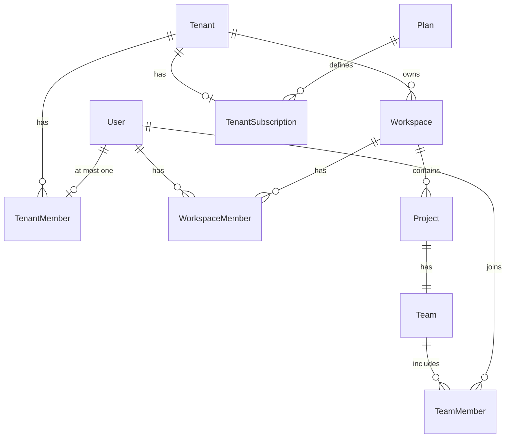

# Tenant domain model (RFC)

> **Status:** Approved for implementation (SaaS-F01)  
> **Parent:** [SAAS_PLATFORM_PLAN.md](./SAAS_PLATFORM_PLAN.md) · **RBAC:** [TENANT_RBAC.md](./TENANT_RBAC.md) · **Contracts:** `@kloqra/contracts` `tenant-rbac.ts`, `dto/tenant.dto.ts`

## Hierarchy (target)

```
Tenant (Organization — purchaser of Kloqra)
  └── Workspace (operational partition — e.g. per client or internal team)
        └── Project (work stream; may name an end "project client")
              └── Team
                    └── TeamMember (role: PROJECT_MANAGER | MEMBER)
        └── Task → TimeLog
```

**Terminology:** UI label **Organization**; DB table `tenants`. Never call the purchaser "client" (that term is reserved for `project.clientName`).

## Entity relationships



## Tables (proposed)

| Table                  | Purpose                 | Key constraints                                                           |
| ---------------------- | ----------------------- | ------------------------------------------------------------------------- |
| `tenants`              | Organization account    | `slug` unique; `status` — **implemented (F02)**                           |
| `tenant_members`       | User ↔ tenant           | **`UNIQUE(user_id)`** — one tenant per user (D08) — **implemented (F02)** |
| `workspaces`           | Ops unit                | `tenant_id` NOT NULL FK — **implemented (F02)**                           |
| `workspace_members`    | Per-workspace role      | Unique `(workspace_id, user_id)`                                          |
| `team_members`         | Per-project access + PM | Add `role` `PROJECT_MANAGER` \| `MEMBER` (F17)                            |
| `plans`                | Catalog                 | `limits` JSON — **implemented (F09)**                                     |
| `tenant_subscriptions` | Billing state           | Stripe ids (F11) — **implemented (F09)**                                  |

Existing `users`, `projects`, `tasks`, `time_logs` unchanged except `workspaces.tenant_id`.

## Lifecycle states

| Entity                        | States                                                 | Notes                                     |
| ----------------------------- | ------------------------------------------------------ | ----------------------------------------- |
| `tenants.status`              | `pending_setup`, `active`, `suspended`, `churned`      | Superadmin create → `pending_setup` (D16) |
| `tenant_subscriptions.status` | `trial`, `active`, `past_due`, `suspended`, `canceled` | Trial 30d (D04)                           |

## Provisioning rules (locked)

1. Superadmin creates tenant + temporary owner → owner completes org profile.
2. Tenant owner creates workspace → assigns workspace admin **per workspace** (separate invite each time).
3. Member may be in **multiple workspaces** within the same tenant; each requires its own `workspace_members` row.
4. Same user may be workspace admin in multiple workspaces; each provisioned individually (D14).
5. PM (`PROJECT_MANAGER`) is on `team_members`; may lead multiple projects (D06).

## Migration (pilots — D09)

**Decided:** One tenant per customer organization; multiple workspaces per tenant. Demo seed uses one tenant with three workspaces. F21 backfill groups pilot workspaces under org tenants; migration **fails** if any user would belong to more than one tenant.

Default script: SaaS-F21.

## API surface (contracts only today)

Routes in `ROUTES.TENANTS` and `ROUTES.PLATFORM` — implemented in SaaS-F06, F07, F15.

## What does not change

- Timer, timesheet, approval, export **business logic** — still `workspaceId`-scoped.
- Workspace **billing rates** (bill end clients) — separate from SaaS subscription.
- `workspace_members.role`: `ADMIN` \| `MEMBER` until F17 extends project layer only.
