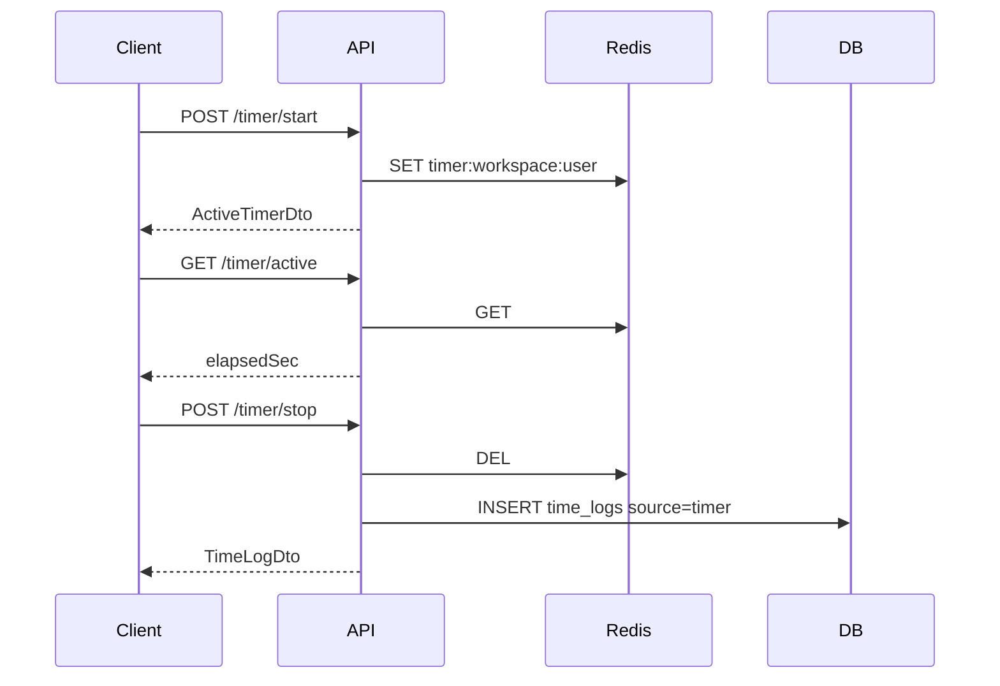

# Timer sequence

```mermaid
sequenceDiagram
  participant Client
  participant API
  participant Redis
  participant DB

  Client->>API: POST /timer/start
  API->>Redis: SET timer:workspace:user
  API-->>Client: ActiveTimerDto

  Client->>API: GET /timer/active
  API->>Redis: GET
  API-->>Client: elapsedSec

  Client->>API: POST /timer/stop
  API->>Redis: DEL
  API->>DB: INSERT time_logs source=timer
  API-->>Client: TimeLogDto
```
