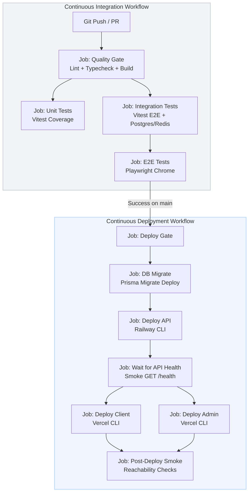
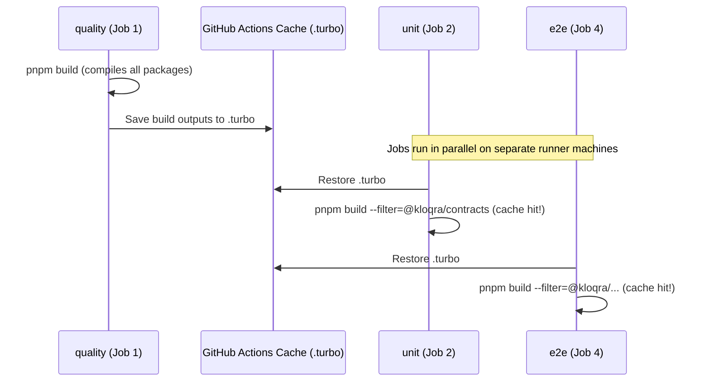

# CI/CD Pipeline Architecture

This document describes the design, triggers, optimization strategies, and build-sharing mechanisms of Kloqra's production-grade CI/CD pipeline.

---

## Pipeline Overview

The deployment pipeline is split into two sequential phases:

1. **Continuous Integration (CI)**: Validates code quality, types, unit tests, integration tests, and E2E browser behavior.
2. **Continuous Deployment (CD)**: Executes database schema migrations, deploys the API to Railway, provisions Vercel frontends, and runs post-deployment smoke tests.



---

## 1. Branch-Specific Deployment Rules (CI Gate)

To prevent untested code from deploying, we enforce a strict **CI Gate**:

- **Direct pushes to Vercel/Railway are blocked**: Auto-deployment from git pushes on the hosting platforms is disabled (using Vercel's Ignored Build Step script `exit 0` and disabling auto-deploy hooks on Railway).
- **Deploy triggers only on main**: The `deploy.yml` workflow is triggered _only_ when the `CI` workflow completes on the `main` branch:
  ```yaml
  on:
    workflow_run:
      workflows: [CI]
      types: [completed]
      branches: [main]
  ```
- **Status enforcement**: The deploy gate checks the CI run outcome and only proceeds if it succeeded:
  ```yaml
  if: >
    github.event.workflow_run.conclusion == 'success' &&
    github.event.workflow_run.head_branch == 'main'
  ```

---

## 2. Shared Build Cache Optimization

Rather than compiling the monorepo packages (`@kloqra/contracts`, `@kloqra/ui`, `@kloqra/web-shared`) repeatedly inside each independent runner VM (which runs parallel jobs), the pipeline leverages shared **Turborepo Caching**:



### Configured Cache Strategy

- **Cache Restoration**: Every job (`quality`, `unit`, `integration`, `e2e`) restores the Turborepo cache folder using the lockfile hash:
  ```yaml
  - name: Cache Turborepo
    uses: actions/cache@v4
    with:
      path: .turbo
      key: ${{ runner.os }}-turbo-${{ hashFiles('pnpm-lock.yaml') }}-${{ github.ref }}
      restore-keys: |
        ${{ runner.os }}-turbo-${{ hashFiles('pnpm-lock.yaml') }}-
        ${{ runner.os }}-turbo-
  ```
- **Turbo Filters vs. Direct Builds**: Instead of running package-specific scripts directly (e.g. `pnpm --filter @kloqra/contracts build`), we use the root build script with turbo filters (e.g. `pnpm build --filter=@kloqra/contracts`). This guarantees Turborepo intercepts the execution, detects the cache hit, and restores the build output directory (`dist/`) in under a second.

---

## 3. Continuous Deployment Job Sequence

When the deploy workflow is triggered, it runs the following jobs in sequence:

### A. Database Migrate (`migrate`)

Applies schema migrations to the target database URL securely:

```bash
pnpm --filter @kloqra/api exec prisma migrate deploy
```

### B. Deploy API (`deploy-api`)

Deploys the backend Docker service using the Railway CLI:

```bash
railway up --service="kloqra-api" --ci --detach
```

### C. Wait for API Health (`wait-api`)

Polls the `/health` endpoint of the newly deployed API service until it returns `HTTP 200 OK` (with a timeout of 10 minutes) before proceeding to client deployments:

```bash
bash scripts/deploy/wait-health.sh "$API_URL"
```

### D. Deploy Frontends (`deploy-client`, `deploy-admin`)

Deploys the Next.js/Vite client and admin frontends to Vercel in parallel using the production deploy flag:

```bash
pnpm exec vercel deploy --prod --cwd apps/client --project "kloqra-client" --yes
```

### E. Post-Deploy Smoke Check (`smoke`)

Asserts that all public APIs and frontend landing pages return healthy HTTP status codes (`200`, `307`, or `308`) and are reachable.
