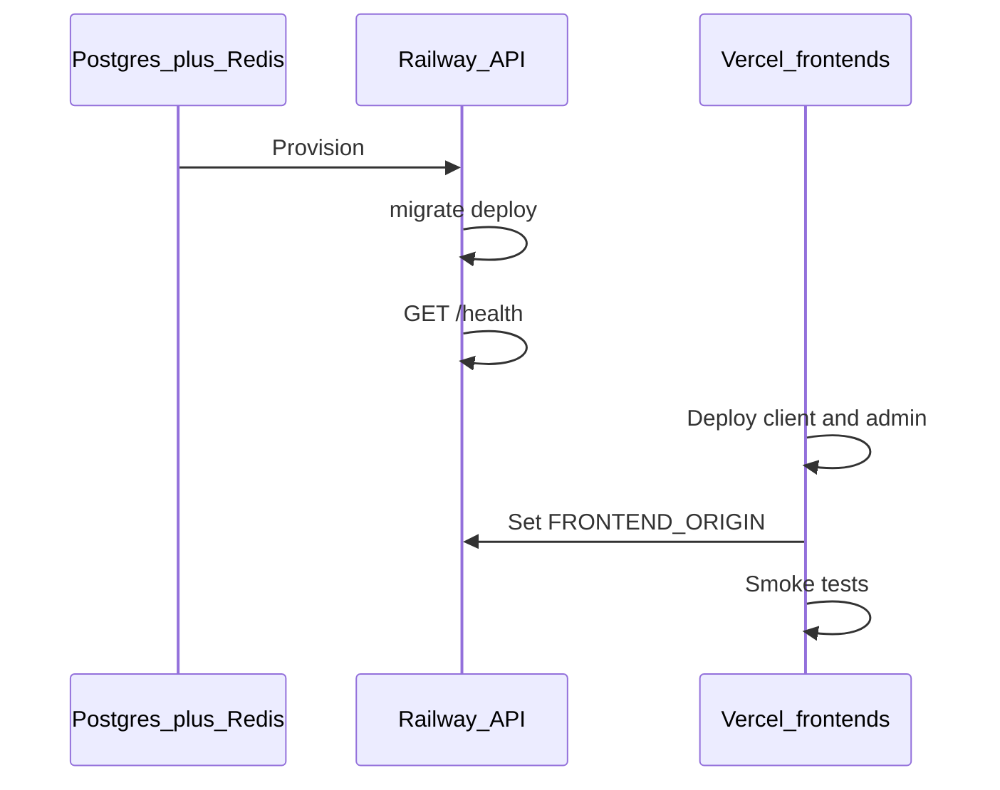

# Deployment runbook

ChronoMint deploys as **three parts** across **staging** and **production**:

| Part                   | Platform                | Config                                                     |
| ---------------------- | ----------------------- | ---------------------------------------------------------- |
| API + Postgres + Redis | [Railway](./railway.md) | [`railway.toml`](../../railway.toml)                       |
| Client                 | [Vercel](./vercel.md)   | [`apps/client/vercel.json`](../../apps/client/vercel.json) |
| Admin                  | [Vercel](./vercel.md)   | [`apps/admin/vercel.json`](../../apps/admin/vercel.json)   |

Env templates: [`deploy/env.staging.example`](../../deploy/env.staging.example), [`deploy/env.production.example`](../../deploy/env.production.example).

---

## Deployment order

1. Provision Postgres + Redis + API (Railway)
2. Run `prisma migrate deploy` — [`scripts/deploy/migrate.sh`](../../scripts/deploy/migrate.sh) or [CI workflow](../../.github/workflows/deploy-api.yml)
3. Smoke `GET /health` — [`scripts/deploy/smoke.sh`](../../scripts/deploy/smoke.sh)
4. Deploy Vercel client + admin with `NEXT_PUBLIC_API_BASE_URL`
5. Set API `FRONTEND_ORIGIN` — [`scripts/deploy/wire-cors.sh`](../../scripts/deploy/wire-cors.sh)
6. Manual smoke: login, timer, presence, export



---

## Staging

| Resource        | Name                                             |
| --------------- | ------------------------------------------------ |
| Railway project | `chronomint-staging`                             |
| Vercel client   | `chronomint-client-staging` (root `apps/client`) |
| Vercel admin    | `chronomint-admin-staging` (root `apps/admin`)   |
| Git branch      | `staging` or `develop`                           |

```bash
bash scripts/deploy/setup-railway.sh staging
bash scripts/deploy/setup-vercel.sh staging https://<staging-api>.up.railway.app
```

Full steps: [railway.md](./railway.md), [vercel.md](./vercel.md).

---

## Production

| Resource        | Name                |
| --------------- | ------------------- |
| Railway project | `chronomint-prod`   |
| Vercel client   | `chronomint-client` |
| Vercel admin    | `chronomint-admin`  |
| Git branch      | `main`              |

Use **new** JWT secrets and a **separate** database — never reuse staging credentials.

Custom domains (example):

- Client: `app.example.com`
- Admin: `admin.example.com`
- API: `api.example.com`

```bash
bash scripts/deploy/setup-railway.sh production
bash scripts/deploy/setup-vercel.sh production https://api.example.com
```

Template: [`deploy/env.production.example`](../../deploy/env.production.example).

---

## Environment checklist

Full reference: [ENVIRONMENT.md](../development/ENVIRONMENT.md).  
Security: [SECURITY.md](../development/SECURITY.md).

| Service | Required variables                                                                                |
| ------- | ------------------------------------------------------------------------------------------------- |
| API     | `DATABASE_URL`, `REDIS_URL`, `JWT_ACCESS_SECRET`, `JWT_REFRESH_SECRET`, `FRONTEND_ORIGIN`, `PORT` |
| Client  | `NEXT_PUBLIC_API_BASE_URL`, `NEXT_PUBLIC_AUTH_SCOPE=client`                                       |
| Admin   | `NEXT_PUBLIC_API_BASE_URL`, `NEXT_PUBLIC_AUTH_SCOPE=admin`, `NEXT_PUBLIC_ADMIN_URL` (optional)    |

Production API must **not** set `REDIS_USE_MEMORY`.

Generate JWT secrets:

```bash
bash scripts/deploy/generate-secrets.sh
```

---

## API (Docker)

Build from **monorepo root**:

```bash
docker build -f apps/api/Dockerfile -t chronomint-api .
```

Health check: `GET /health` — [api/ROUTES.md](../api/ROUTES.md).

---

## CI/CD

| Workflow                                                 | Trigger                                | Purpose                 |
| -------------------------------------------------------- | -------------------------------------- | ----------------------- |
| [ci.yml](../../.github/workflows/ci.yml)                 | All pushes/PRs                         | Lint, test, build       |
| [deploy-api.yml](../../.github/workflows/deploy-api.yml) | Push to `main` / `staging` (API paths) | `prisma migrate deploy` |

Configure GitHub **Environments** `staging` and `production` with secret `DATABASE_URL`. Optional variable `API_URL` enables post-migrate smoke in CI.

Railway and Vercel auto-deploy from GitHub on branch push.

---

## Post-deploy smoke

```bash
bash scripts/deploy/smoke.sh https://api.yourdomain.com
```

Manual checks:

1. Admin login → **Dashboard**
2. Client login → **Start timer**
3. Admin **Team live** shows activity
4. Admin **Export** download works

User walkthroughs: [user-guides](../user-guides/README.md).

---

## Migrations

- Always run `prisma migrate deploy` before or with API rollout.
- Do not roll back migrations without DBA review.
- Schema: [DATA_MODEL.md](../architecture/DATA_MODEL.md).

---

## Rollback

- Revert Vercel deployment for client/admin.
- Roll back API container to previous Railway deployment.
- **Do not** rollback database migrations without a reviewed plan.

---

## Other platforms

| Option      | When                | Reference                          |
| ----------- | ------------------- | ---------------------------------- |
| **Render**  | Railway alternative | [`render.yaml`](../../render.yaml) |
| **Fly.io**  | Edge Docker hosting | [vercel.md](./vercel.md)           |
| **AWS ECS** | Scale / compliance  | See plan in `.cursor/plans/`       |

Frontends stay on Vercel for all options unless you migrate to Amplify.

---

## Local issues before deploy

See [local-troubleshooting.md](./local-troubleshooting.md).

## Changelog

Record production releases in [CHANGELOG.md](../../CHANGELOG.md).
