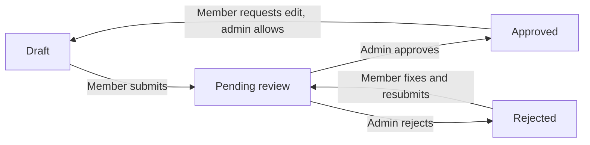

# Timesheet submissions and approval

This guide explains how **timesheet approval** works in your workspace — for **admins** who turn it on and review hours, and for **members** who log time and submit it.

You do not need technical knowledge to follow this. It covers what happens in the product, what each person should do, and what to expect when settings change.

---

## What is timesheet approval?

Normally, members can add, change, or delete their time entries freely.

When **timesheet approval** is turned on for a project, logged hours are grouped into **periods** (a day, a week, or a month). The member **submits** a period for review. While it is waiting or after it is **approved**, those entries are **locked** — nobody can edit them until the workflow allows it again.

Think of it as: _log your time → send a batch for sign-off → get it approved (or sent back to fix)._

Approval is **optional** and **per project**. Other projects in the same workspace can work without it.

| App             | Who uses it         | Main page                        |
| --------------- | ------------------- | -------------------------------- |
| Client (member) | People who log time | **Submissions** (`/submissions`) |
| Admin           | People who review   | **Approvals** (`/approvals`)     |

---

## Key ideas (read this first)

### 1. Approval is per project

Each project can have approval **on** or **off**, independently.

- **Off** — members log time as usual; nothing to submit.
- **On** — members must submit each period that has logged time, and an admin must approve (unless your process stops at submit-only).

Turn it on under **Admin → Projects → [project] → Settings → Timesheet approval**.

### 2. What counts as a “period”?

A period is the chunk of calendar time you submit together:

| Setting     | Example period                           |
| ----------- | ---------------------------------------- |
| **Daily**   | One calendar day                         |
| **Weekly**  | One week (Mon–Sun or Sun–Sat, see below) |
| **Monthly** | One calendar month                       |

**Where the period comes from**

- Each project can pick **daily**, **weekly**, or **monthly**, or use the **workspace default** (set under **Admin → Workspace**).
- **Week boundaries** follow the workspace **“Week starts on”** setting (Monday or Sunday) and the workspace **timezone**. Two people in different timezones still see the same period rules for the workspace.

### 3. Status of a submission

Every project + period goes through simple states:

| Status             | What it means for the member                         |
| ------------------ | ---------------------------------------------------- |
| **Draft**          | Time is logged but not sent for review yet           |
| **Pending review** | Submitted; waiting for admin; entries are **locked** |
| **Approved**       | Admin signed off; entries stay **locked**            |
| **Rejected**       | Admin sent it back; member can **edit and resubmit** |

**Locked** means the member (and admins) cannot change or delete time entries in that project for that period until it is rejected, or an **edit request** is approved (see below).

### 4. One period at a time

When a member clicks **Submit**, only **that** period is sent — not every older week they forgot. Each week (or day/month) is its own submission.

**Important:** If an **earlier** period was **rejected**, the member must fix and resubmit **that** period before they can submit **later** periods on the same project. This keeps the timeline in order.

### 5. Only periods with logged time appear (for drafts)

On **Submissions**, a draft row appears only when the member has **actually logged hours** in that period. Empty weeks do not clutter the list.

Submitted, approved, and rejected periods still show even if hours were later removed (they already entered the workflow).

### 6. No backlog when you change settings

This avoids punishing people when an admin changes the rules mid-stream.

When an admin **turns approval on**, **turns it off**, or **changes the period** (daily ↔ weekly ↔ monthly):

- Open **draft** and **rejected** submissions on that project are **waived** (cleared from the to-do list).
- Members are **not** required to submit old periods from before the change.
- Approval applies **from that point forward** for new logging.

The admin sees a confirmation when saving approval settings that explains this.

---

## For members (client app)

### Where to go

Open **Submissions** in the sidebar (`/submissions`).

### Tabs

| Tab                | Shows                                        |
| ------------------ | -------------------------------------------- |
| **All**            | Everything in your recent history            |
| **Action needed**  | Draft or rejected — you should submit or fix |
| **Pending review** | Waiting on admin                             |
| **Approved**       | Already approved                             |

Use **Action needed** for day-to-day work; the badge on the menu counts items there.

### Filters

- **Date range** — narrow which periods you see.
- **Projects** — focus on one or more approval-enabled projects.

### Typical workflow

1. **Log time** on the **Timer**, **Timesheet**, or **Time tracker** as usual (only on projects where you are on the team).
2. Open **Submissions** and find the row for the project + period.
3. Optionally add a **note** for the reviewer.
4. Click **Submit** (or **Submit day** / **Submit month** depending on the period type).
5. Confirm — the status becomes **Pending review** and that period’s entries lock.

From a row you can **View timesheet** to jump to the calendar for that project and period.

### If admin rejects your submission

1. Read the **review note** on the submission (or in your notification).
2. Fix entries on **Timesheet** or **Time tracker**.
3. Return to **Submissions** and submit again for that period.

Until that rejected period is fixed and resubmitted, you may be blocked from submitting **later** periods on the **same project**.

### If you need to change approved or pending time

You cannot edit locked entries directly. Instead:

1. On **Submissions**, open the approved or pending row.
2. Choose **Request edit** and explain why.
3. Wait for an admin to approve the request on **Approvals → Amendments**.
4. If approved, the period returns to **draft**, entries unlock, you fix them, and submit again.

Only one edit request at a time per period.

### Projects without approval

If a project does not require approval, it will **not** appear on **Submissions**. Log time normally — no submit step.

---

## For admins (admin app)

### Turning approval on for a project

1. **Admin → Projects → [project] → Settings**
2. Check **Require timesheet approval**
3. Choose **Approval period**:
   - **Workspace default** — uses **Admin → Workspace → Default timesheet approval period** (usually weekly)
   - **Daily**, **Weekly**, or **Monthly** — overrides the default for this project only
4. **Save changes**

If you change approval settings, you will be asked to confirm: open drafts and rejections on that project will be waived so members start fresh.

### Workspace defaults (Admin → Workspace)

Set once for the whole workspace:

- **Timezone** — affects how days and weeks are calculated
- **Week starts on** — Monday or Sunday (for weekly periods)
- **Default timesheet approval period** — daily, weekly, or monthly for projects that do not override it

### Reviewing submissions — Approvals page

Open **Approvals** (`/approvals`).

| Tab                         | Purpose                                                                      |
| --------------------------- | ---------------------------------------------------------------------------- |
| **Pending review**          | Approve or reject what members submitted                                     |
| **Missing**                 | Members who logged time in the current period but have **not** submitted yet |
| **Amendments**              | Edit requests on locked periods                                              |
| **Approved** / **Rejected** | History and audit                                                            |

Use filters (project, member, date range) to narrow the list.

**Approve**

- Confirms the hours; entries stay locked.
- Member gets a notification.

**Reject**

- You must leave a **review note** (what to fix).
- Entries unlock for that period so the member can edit and resubmit.
- Member gets a notification.

### Missing submissions

The **Missing** tab lists members with **logged hours** in the current period who have not submitted yet.

You can **Remind** someone — they receive a notification. Reminders for the same project are limited so people are not spammed (roughly once per day per project).

### Edit requests (amendments)

When a member needs to change locked time:

1. They send a request from **Submissions**.
2. You see it under **Approvals → Amendments**.
3. **Approve** — period goes back to draft; they edit and resubmit.
4. **Deny** — period stays locked; add a note explaining why.

Resolve pending edit requests before approving or rejecting the underlying submission.

---

## What gets locked, and who can still change what

| Situation                | Can member edit entries in that period? |
| ------------------------ | --------------------------------------- |
| Draft (not submitted)    | Yes                                     |
| Pending review           | No                                      |
| Approved                 | No (unless edit request approved)       |
| Rejected                 | Yes                                     |
| Project approval **off** | Yes (no approval lock)                  |

**Timer entries:** entries created by stopping the timer cannot be edited like manual entries; they can be deleted when the period is editable. **Manual entries** on the timesheet can be edited when the period is not locked.

**Admins** reviewing on the admin app can see everyone’s time, but approval locks apply to them too on approval-enabled projects — the process is the same for fairness and audit.

---

## Notifications

People are notified at key steps (exact channels depend on account notification settings):

| Event                    | Who is notified  |
| ------------------------ | ---------------- |
| Member submits           | Workspace admins |
| Admin approves / rejects | Member           |
| Admin sends reminder     | Member           |
| Edit request / decision  | Admins or member |

Notifications link back to **Approvals** or **Submissions** where possible.

---

## Common scenarios

### “I turned approval on mid-month — do members submit the whole month?”

**No.** Only periods **after** approval was enabled matter for new submissions. Older open drafts are waived. Members submit going forward when they have logged time in each new period.

### “We switched from weekly to monthly approval”

Same as above: open drafts and rejections are waived. The new period length applies from the change forward. Members are not forced to submit under the old weekly buckets.

### “A member logged time but sees nothing on Submissions”

Check:

- Is approval enabled on that project?
- Are they on the **project team**?
- Did they log time **inside** a period that counts after approval was enabled?
- For **drafts**, is there at least some logged time in that period?

### “Someone submitted an empty period”

Submit is allowed, but **Missing** and **Submissions** lists focus on periods **with hours** for drafts. Reviewers still see submitted rows on **Approvals**.

### “Can one member submit for another?”

No. Each person submits their **own** time on projects they belong to.

### “We disabled approval on a project”

Open drafts and rejections are waived. Entries are no longer locked by approval. Members stop seeing that project on **Submissions**.

---

## Quick reference

| I want to…                          | Where to go (app)                  |
| ----------------------------------- | ---------------------------------- |
| Log time                            | Client → Timer / Timesheet         |
| Submit my hours                     | Client → Submissions               |
| Turn approval on/off                | Admin → Project → Settings         |
| Set workspace week / default period | Admin → Workspace                  |
| Approve or reject                   | Admin → Approvals → Pending review |
| See who has not submitted           | Admin → Approvals → Missing        |
| Allow edits after approval          | Admin → Approvals → Amendments     |

---

## Related guides

- [Member: Timer and timesheet](member/timer-and-timesheet.md) — logging time
- [Admin: Projects and teams](admin/projects-and-teams.md) — projects, teams, and settings
- [Admin: Getting started](admin/getting-started.md) — admin app overview
- [Member: Getting started](member/getting-started.md) — client app overview
